# css

## css 命名

- 包裹类

`container`, `wrapper`, `outer`, `inner`, `box`, `header`, `footer`,`main`, `content`, `aside`, `page`, `section`, `block`

- 状态类

`primary`, `secondary`, `success`, `danger`, `warning`, `info`, `error`, `link`, `light`, `dark`, `disabled`, `active`, `checked`, `loading`

- 尺寸类

`large`, `middle`, `small`, `bigger`, `smaller`

- 组件类

`card`, `list`, `picture`, `carousel`, `swiper`, `menu`, `navs`, `badge`, `hint`, `modal`, `dialog`

- 位置类

`first`, `last`, `current`, `prev`, `next`, `forward`, `back`

- 文本类

`title`, `desc`, `content`, `date`, `author`, `category`, `label`, `tag`

- 人物类

`avatar`, `name`, `age`, `post`, `intro`

## CSS 渐变

CSS 渐变使您可以显示两种或多种指定颜色之间的平滑过渡。CSS 定义了两种渐变类型：

1. 线性渐变（向下/向上/向左/向右/对角线）
2. 径向渐变（由其中心定义）

如需创建线性渐变，您必须定义至少两个色标。色标是您要呈现平滑过渡的颜色。您还可以设置起点和方向（或角度）以及渐变效果。语法：

```css
background-image: linear-gradient(direction, color-stop1, color-stop2, ...);
```

### 从上到下（默认）

```css
#grad {
  background-image: linear-gradient(red, yellow);
}
```

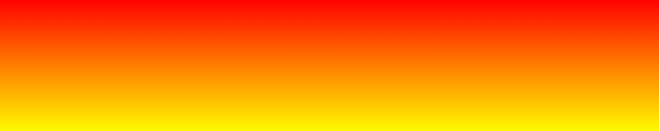

### 从左到右

```css
#grad {
  background-image: linear-gradient(to right, red, yellow);
}
```

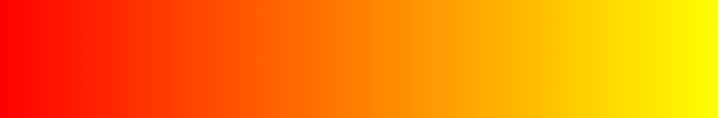

### 对角线

```css
#grad {
  background-image: linear-gradient(to bottom right, #000, yellow);
}
```

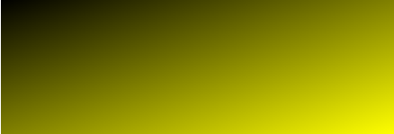

### 使用角度

如果希望对渐变角度做更多的控制，您可以定义一个角度，来取代预定义的方向（向下、向上、向右、向左、向右下等等）。值 `0deg` 等于向上（`to top`）。值 `90deg` 等于向右（`to right`）。值 `180deg` 等于向下（`to bottom`）。

### 透明度

```css
#grad {
  background-image: linear-gradient(
    to right,
    rgba(255, 0, 0, 0),
    rgba(255, 0, 0, 1)
  );
}
```

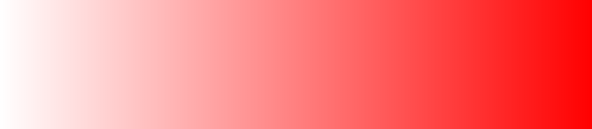

### CSS 径向渐变

径向渐变由其中心定义。如需创建径向渐变，您还必须定义至少两个色标

```css
background-image: radial-gradient(
  shape size at position,
  start-color,
  ...,
  last-color
);
```

默认： shape 为椭圆形，size 为最远角，position 为中心。

例子 1：

```css
#grad {
  background-image: radial-gradient(red, yellow, green);
}
```

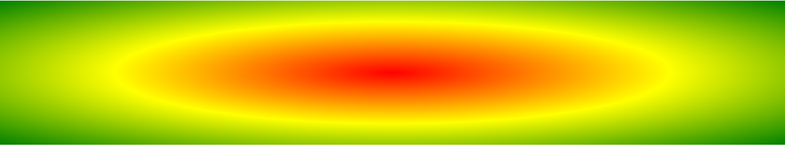

例子 2：

```css
#grad {
  background-image: radial-gradient(red 5%, yellow 15%, green 60%);
}
```

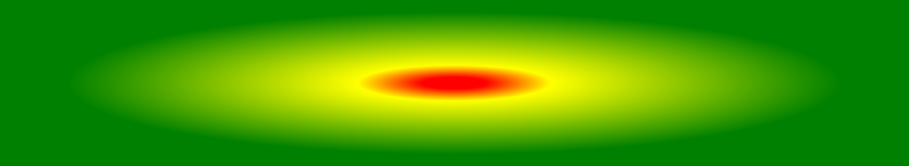

例子 3：

```css
/* shape 参数定义形状。它可接受 circle 或 ellipse 值。默认值为 ellipse（椭圆） */
#grad {
  background-image: radial-gradient(circle, red, yellow, green);
}
```

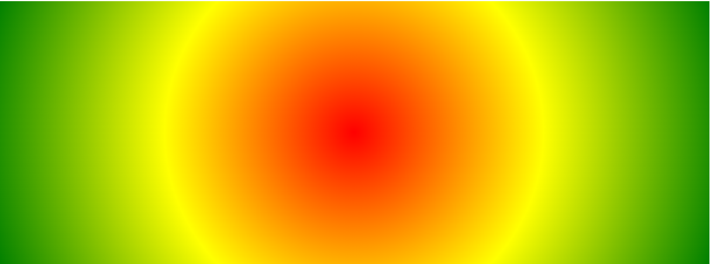

例子 4：

```css
/* repeating-radial-gradient() 函数用于重复径向渐变： */
#grad {
  background-image: repeating-radial-gradient(red, yellow 10%, green 15%);
}
```

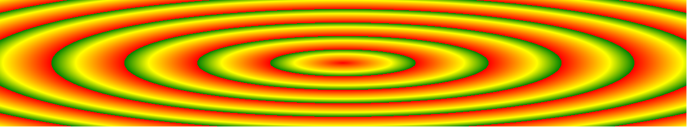

## CSS 阴影效果

### 文字阴影 text-shadow

```css
/* 例子 1： */
h1 {
  text-shadow: 2px 2px;
}

/* 例子 2： */
h1 {
  text-shadow: 2px 2px red;
}

/* 例子 3： */
h1 {
  text-shadow: 2px 2px 5px red;
}

/* 例子 4： */
h1 {
  color: white;
  text-shadow: 2px 2px 4px #000000;
}

/* 例子 5 多个阴影： */
h1 {
  text-shadow: 0 0 3px #ff0000, 0 0 5px #0000ff;
}

/* 例子 6 ： */
h1 {
  color: white;
  text-shadow: 1px 1px 2px black, 0 0 25px blue, 0 0 5px darkblue;
}

/* 例子 7 */
h1 {
  color: yellow;
  text-shadow: -1px 0 black, 0 1px black, 1px 0 black, 0 -1px black;
}
```

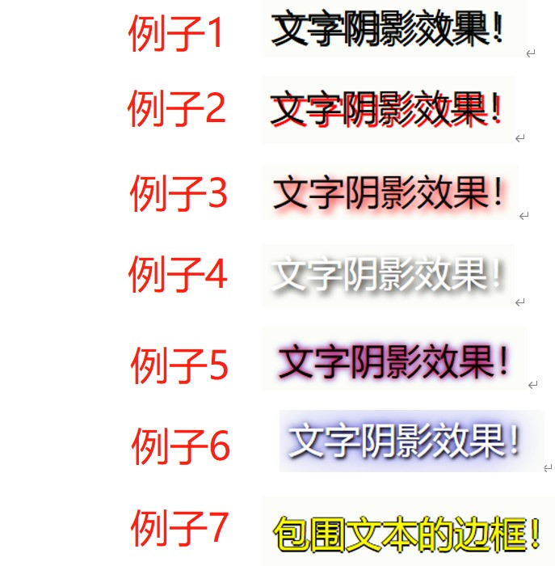

### 边框阴影 box-shadow

```css
/* 例子 1： */
div {
  box-shadow: 10px 10px;
}

/* 例子 2：为阴影添加颜色 */
div {
  box-shadow: 10px 10px grey;
}

/* 例子 3：向阴影添加模糊效果 */
div {
  box-shadow: 10px 10px 5px grey;
}

/* 例子 4：创建纸质卡片效果 */
div.card {
  width: 100px;
  height: 100px;
  box-shadow: 0 4px 8px 0 rgba(0, 0, 0, 0.2), 0 6px 20px 0 rgba(0, 0, 0, 0.19);
}
```

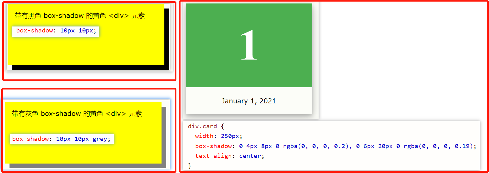

## 媒体查询

<https://www.w3school.com.cn/cssref/pr_mediaquery.asp>

针对不同的媒体使用不同的样式表：

```html
<link
  rel="stylesheet"
  media="screen and (min-width: 900px)"
  href="widescreen.css"
/>
<link
  rel="stylesheet"
  media="screen and (max-width: 600px)"
  href="smallscreen.css"
/>
```

例子：如果视口的宽度为 800 像素或更宽，请使用媒体查询将背景色设置为淡紫色；如果视口的宽度介于 400 至 799 像素之间，则使用媒体查询将背景色设置为浅绿色。如果视口小于 400 像素，则背景色为浅蓝色：

```CSS
body {
  background-color: lightblue;
}

@media screen and (min-width: 400px) {
  body {
    background-color: lightgreen;
  }
}

@media screen and (min-width: 800px) {
  body {
    background-color: lavender;
  }
}
```

## 文本相关

1. 强制文本在一行内显示：white-space: nowrap;
2. 溢出内容为隐藏：overflow：hidden;
3. 溢出省略号：text-overflow：ellipsis;
4. 强制英文单词断行：word-break: break-all;

### word-wrap

`word-wrap: break-word:` 允许单词换行显示：
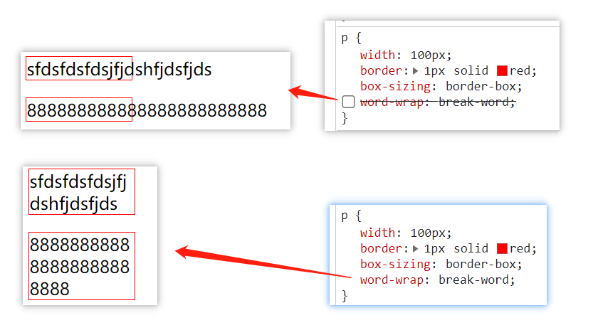

### [word-break](https://www.w3school.com.cn/cssref/pr_word-break.asp)

语法：`word-break: normal|break-all|keep-all;`

- 强制英文单词断行: `word-break: break-all;`(<font color="red">设置 white-space：nowrap 会失效</font>)

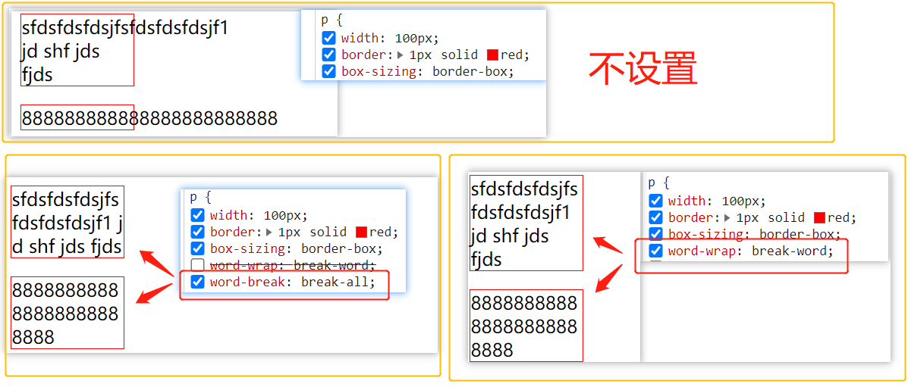

### [white-space](https://www.w3school.com.cn/cssref/pr_text_white-space.asp)

white-space 属性设置如何处理元素内的空白:

- normal 默认。空白会被浏览器忽略。
- nowrap 文本不会换行，文本会在在同一行上继续，直到遇到 \<br\> 标签为止。

### text-overflow

text-overflow 属性规定当文本溢出包含元素时发生的事情。一般配合`overflow: hidden`， 设置文本溢出`...`显示

- clip 修剪文本。 (默认)
- ellipsis 显示省略符号来代表被修剪的文本。

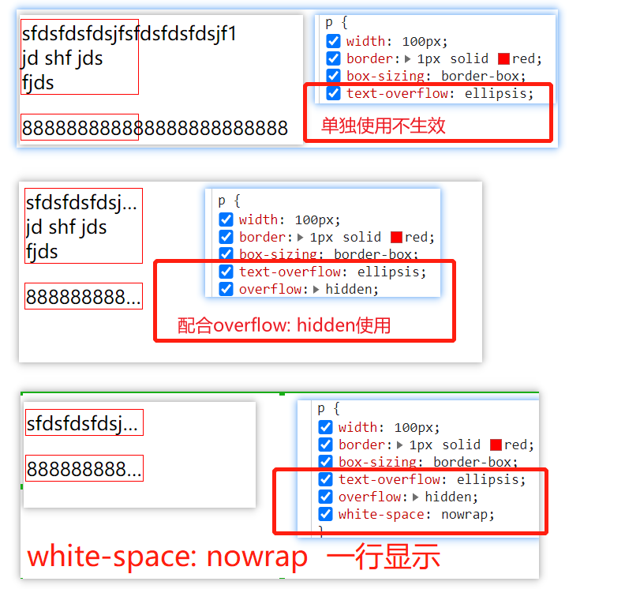

### 文本溢出...

```html
<!-- 非flex布局实现文本溢出...显示 -->
<style>
  .ellipsis {
    width: 60px;
    border: 1px solid;
    overflow: hidden;
    text-overflow: ellipsis;
  }
</style>
<div class="ellipsis">88888888888888888888888888</div>

<!-- flex布局实现文本溢出...显示 -->
<style>
  .p {
    display: flex;
    width: 60px;
  }
  .child {
    flex-grow: 1;
    overflow: hidden;
    text-overflow: ellipsis;
  }
</style>
<div class="p">
  <span class="child">888888888888888888</span>
</div>
```

## tailwindcss

<https://www.tailwindcss.cn/>
