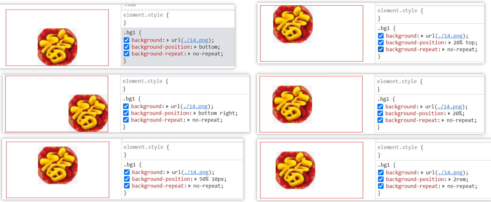
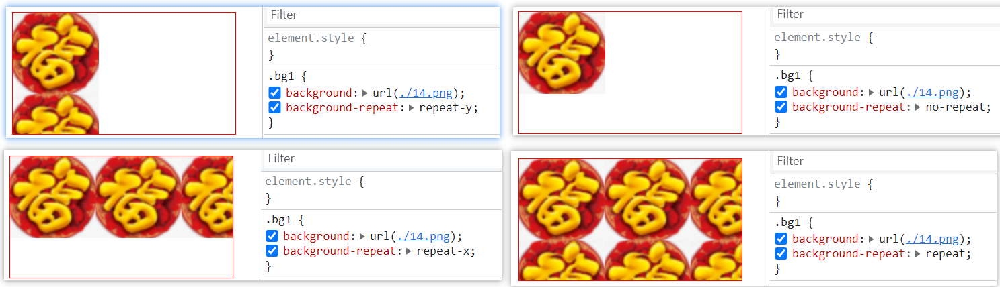
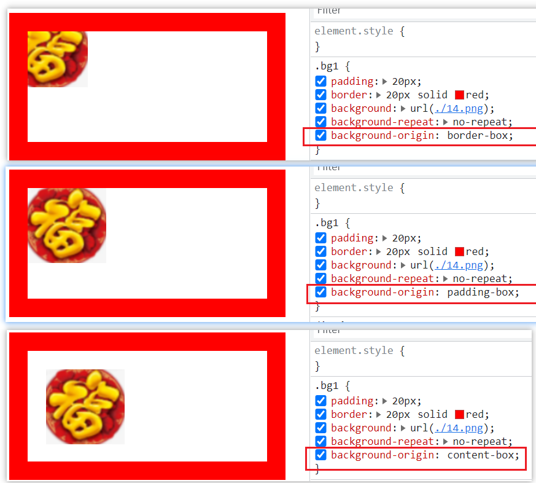
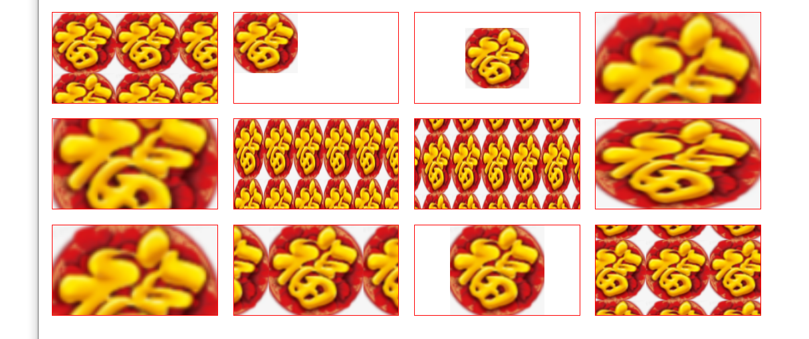

# background

background 简写属性在一个声明中设置所有的背景属性。可以设置如下属性：

- `background-color` 规定要使用的背景颜色
- `background-position` 规定背景图像的位置
- `background-size` 规定背景图片的尺寸
- `background-repeat` 规定如何重复背景图像
- `background-origin` 规定背景图片的定位区域
- `background-clip` 规定背景的绘制区域
- `background-attachment` 规定背景图像是否固定或者随着页面的其余部分滚动
- `background-image` 规定要使用的背景图像

简写：

```css
body {
  background: #00ff00 url(bgimage.gif) no-repeat fixed top;
}
```

## background-position

background-position 属性设置背景图像的起始位置, 默认值：0% 0%

例子：

```css
/* 一般使用 */
background-position: bottom right;
background-position: center top;
background-position: 10px 20px;
background-position: 10% 20%;

/* 组合 */
background-position: 20% top;
background-position: 50% 10px;

/* 省缺值 */
background-position: bottom; /* background-position: bottom center;*/
background-position: 20%; /* background-position: 20% 50%;*/
background-position: 2rem; /* background-position: 2rem 50%;*/
```



提示：您需要把 background-attachment 属性设置为 "fixed"，才能保证该属性在 Firefox 和 Opera 中正常工作)

## background-size

`background-size: length|percentage|cover|contain;`

```css
/* 一般使用 */
background-size: 10px 30px;
background-size: 100% 80%;

/* 组合 */
background-size: 50% 135px;
/* 省缺值 */
background-size: 50% 135px; /* background-size: 50% auto; */

background-size: cover;
background-size: contain;
```

#### cover

把背景图像扩展至足够大，以使背景图像完全覆盖背景区域。背景图像的某些部分也许无法显示在背景定位区域中。

#### contain

把图像图像扩展至最大尺寸，以使其宽度和高度完全适应内容区域。
会完全显示图片。

## background-repeat

```css
background-repeat: repeat; /* 默认 */
background-repeat: repeat-x;
background-repeat: repeat-y;
background-repeat: no-repeat;
```



## background-origin

- padding-box 背景图像相对于内边距框来定位。
- border-box 背景图像相对于边框盒来定位。
- content-box 背景图像相对于内容框来定位。



## background-attachment

background-attachment 属性设置背景图像是否固定或者随着页面的其余部分滚动

- scroll 默认值。背景图像会随着页面其余部分的滚动而移动。
- fixed 当页面的其余部分滚动时，背景图像不会移动。
- inherit 规定应该从父元素继承 background-attachment 属性的设置。

## 例子

```html
<style>
  body {
    display: flex;
    flex-wrap: wrap;
    align-content: flex-start;
  }

  div {
    width: 220px;
    height: 120px;
    border: 1px solid red;
    margin: 10px;
  }

  .bg1 {
    background: url(./14.png);
  }

  .bg2 {
    background: url(./14.png) no-repeat;
  }

  .bg3 {
    background: url(./14.png) no-repeat center center;
  }

  .bg4 {
    background: url(./14.png);
    background-size: 100%;
  }

  .bg5 {
    background: url(./14.png) no-repeat center center;
    background-size: 100%;
  }

  .bg6 {
    background: url(./14.png);
    background-size: 40px 80px;
  }

  .bg7 {
    background: url(./14.png) center center;
    background-size: 40px 80px;
  }

  .bg8 {
    background: url(./14.png);
    background-size: 100% 100%;
  }

  .bg9 {
    background: url(./14.png);
    background-size: cover;
  }

  .bg10 {
    background: url(./14.png) center;
    background-size: contain;
  }

  .bg11 {
    background: url(./14.png) center no-repeat;
    background-size: contain;
  }

  .bg12 {
    background: url(./14.png) center;
    background-size: auto;
  }
</style>
<body>
  <div class="bg1"></div>
  <div class="bg2"></div>
  <div class="bg3"></div>
  <div class="bg4"></div>
  <div class="bg5"></div>
  <div class="bg6"></div>
  <div class="bg7"></div>
  <div class="bg8"></div>
  <div class="bg9"></div>
  <div class="bg10"></div>
  <div class="bg11"></div>
  <div class="bg12"></div>
</body>
```


