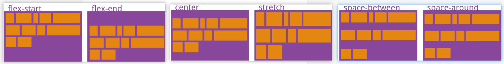

# flex 布局

下面说容器上（display: flex 那个元素）；项目，就是子元素

下面的文档只列举常见的使用方式

## 容器属性 flex-direction 方向

它可能有 4 个值:

- row（默认值）：主轴为水平方向，起点在左端。
- row-reverse：主轴为水平方向，起点在右端。
- column：主轴为垂直方向，起点在上沿。
- column-reverse：主轴为垂直方向，起点在下沿。

```css
.box {
  display: flex;
  flex-direction: column;
}
```

## 容器属性 flex-wrap 换行

默认情况下，项目都排在一条线（又称”轴线”）上。flex-wrap 属性定义，如果一条轴线排不下，如何换行。

- nowrap（默认）：不换行
- wrap：换行，第一行在上方

```css
.box {
  display: flex;
  flex-wrap: wrap;
}
```

## 容器属性 flex-flow

flex-flow 属性是 flex-direction 属性和 flex-wrap 属性的简写形式，默认值为 row nowrap。

```css
.box {
  display: flex;
  /* flex-direction: row; flex-wrap: wrap; */
  flex-flow: row wrap;
}

.box {
  display: flex;
  /* flex-direction: initial; flex-wrap: wrap; */
  flex-flow: wrap;
}
```

## 容器属性 justify-content

justify-content 属性定义了项目在主轴上的对齐方式:

- flex-start（默认值）：左对齐
- flex-end：右对齐
- center： 居中
- space-between：两端对齐，项目之间的间隔都相等
- space-around：每个项目两侧的间隔相等

```css
.box {
  display: flex;
  justify-content: flex-start | flex-end | center | space-between | space-around;
}
```

## 容器属性 align-items

- align-items 属性定义项目在交叉轴上如何对齐:
- flex-start：交叉轴的起点对齐。
- flex-end：交叉轴的终点对齐。
- center：交叉轴的中点对齐。
- baseline: 项目的第一行文字的基线对齐。
- stretch（默认值）：如果项目未设置高度或设为 auto，将占满整个容器的高度。

## 容器属性 align-content

align-content 属性定义了多根轴线的对齐方式。如果项目只有一根轴线，该属性不起作用，一般配合 `flex-wrap: wrap` 使用

- stretch（默认值）：轴线占满整个交叉轴。
- flex-start：与交叉轴的起点对齐。
- flex-end：与交叉轴的终点对齐。
- center：与交叉轴的中点对齐。
- space-between：与交叉轴两端对齐，轴线之间的间隔平均分布。
- space-around：每根轴线两侧的间隔都相等。所以，轴线之间的间隔比轴线与边框的间隔大一倍。



```css
.box {
  display: flex;
  flex-wrap: wrap;
  align-content: flex-start;
}
```

## 项目属性 flex-grow

flex-grow 属性定义项目的放大比例，默认为 0，即如果存在剩余空间，也不放大；一般铺满剩余空间，常见就是 `flex-grow: 1`

```css
.box-item {
  flex-grow: 1;
}
```

- 如果所有项目的 flex-grow 属性都为 1，则它们将等分剩余空间。
- 如果一个项目的 flex-grow 属性为 2，其他项目都为 1，则前者占据的剩余空间将比其他项多一倍。

## 项目属性 flex-shrink

flex-shrink 属性定义了项目的缩小比例，默认为 1，即如果空间不足，该项目将缩小。一般设置 `flex-shrink: 0` 来阻止缩放

```css
.box-item {
  flex-shrink: 0;
}
```

## 项目属性 flex

flex 属性是 `flex-grow`, `flex-shrink` 和 `flex-basis` 的简写，默认值为 `0 1 auto`。后两个属性可选。

## 项目属性 align-self

align-self 属性允许单个项目有与其他项目不一样的对齐方式，可覆盖 align-items 属性。默认值为 auto，表示继承父元素的 align-items 属性，如果没有父元素，则等同于 stretch。

```css
.item {
  align-self: auto | flex-start | flex-end | center | baseline | stretch;
}
```

## 项目属性 flex-basis

flex-basis 属性定义了在分配多余空间之前，项目占据的主轴空间（main size）。浏览器根据这个属性，计算主轴是否有多余空间。它的默认值为 auto，即项目的本来大小， 它可以设为跟 width 或 height 属性一样的值（比如 350px），则项目将占据固定空间。

比较少用到
