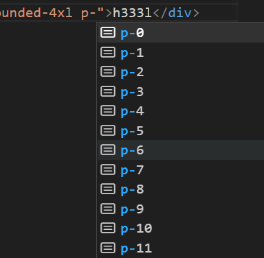
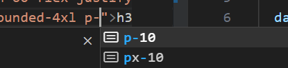

# tailwindcss

<https://www.tailwindcss.cn/>

<a href="/tool/vscode.html#tailwind-css-intellisense">vs code 配置传送门</a>

## 重置变量

下面我们来重置 padding 相关的变量

1. 继承的方式

默认 `p-10: padding: 2.5rem; ` 现在要变为 `p-10: padding: 10rem;`

修改`tailwind.config.js`

```javascript
/** @type {import('tailwindcss').Config} */
export default {
  content: ["./index.html", "./src/**/*.{js,ts,jsx,tsx}"],
  darkMode: false,
  theme: {
    extend: {
      padding: {
        10: "10rem",
      },
      /*
        .text-lg {
          font-size: 1.125rem;
          line-height: 1.75rem;
        }
        重置为:
        .text-lg {
          font-size: 2rem;
          line-height: 1;
        }
      */
      fontSize: {
        lg: ["2rem", "1"],
      },
    },
  },
  plugins: [],
};
```

2. 覆盖的方式

默认情况的智能提示 (ctrl + i)



修改`tailwind.config.js`

```javascript
/** @type {import('tailwindcss').Config} */
export default {
  content: ["./index.html", "./src/**/*.{js,ts,jsx,tsx}"],
  darkMode: false,
  theme: {
    padding: {
      10: "10rem",
    },
    extend: {},
  },
  plugins: [],
};
```

修改后的智能提示 (ctrl + i), 只有`p-10`


