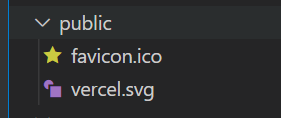
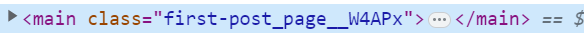
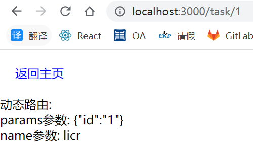

# nextjs

要从头开始使用 React 构建一个完整的 Web 应用程序，需要考虑许多重要的细节：

1. 必须使用打包程序（例如 webpack）打包代码，并使用 Babel 等编译器进行代码转换。
2. 你需要针对生产环境进行优化，例如代码拆分。
3. 你可能需要对一些页面进行预先渲染以提高页面性能和 SEO。你可能还希望使用服务器端渲染或客户端渲染。
4. 你可能必须编写一些服务器端代码才能将 React 应用程序连接到数据存储。

Next.js 为上述所有问题提供了解决方案:

- 直观的、 基于页面 的路由系统（并支持 动态路由）
- 预渲染。支持在页面级的 静态生成 (SSG) 和 服务器端渲染 (SSR)
- 自动代码拆分，提升页面加载速度
- 具有经过优化的预取功能的 客户端路由
- 内置 CSS 和 Sass 的支持，并支持任何 CSS-in-JS 库
- 开发环境支持 快速刷新
- 利用 Serverless Functions 及 API 路由 构建 API 功能
- 完全可扩展

## 快速上手

1. 使用 create-next-app 创建新的 Next.js 应用程序

```javascript
npx create-next-app@latest
# or
yarn create next-app
```

使用 TypeScript:

```javascript
npx create-next-app@latest --typescript
# or
yarn create next-app --typescript
```

2. 运行 `npm run dev` 或 `yarn dev` 来启动开发服务器，访问地址为 http://localhost:3000。

<!-- ## 页面（Pages） -->

## 基本 api

下面列举了开发过程中, 常使用的组件和 api

### 页面路由

页面和路由有对应关系:

1. `pages/index.js` 对应路由 `/`
2. `pages/posts/first-post.js` 对应路由 `/posts/first-post`
3. `pages/xxx/xxx.js` 对应路由 `/xxx/xxx`

### 页面跳转(导航)

```tsx
import Link from "next/link";
<Link href="/posts/first-post">页面跳转</Link>;
```

### 静态资源

Next.js 可以在顶级公共目录下提供静态文件，如图像。public 内部的文件可以从应用程序的根目录引用:



```tsx
import Image from "next/image";
<Image src="/vercel.svg" alt="Vercel Logo" width={100} height={24} />;
```

### 修改页面的 title

```tsx
import Head from "next/head";
<Head>
  <title>page title</title>
</Head>;
```

### 使用 css modules

内置了插件, 直接可以使用 css modules

`pages/posts/first-post.module.css`

```css
.page {
  padding: 30px;
}
```

`pages/posts/first-post.tsx`

```tsx
import styles from "./first-post.module.css";
<main className={styles.page}></main>;
```



### 添加全局样式

1. 添加全局样式 `src/styles/globals.css`

```css
:root {
  --max-width: 1100px;
  --border-radius: 12px;
}

* {
  box-sizing: border-box;
  padding: 0;
  margin: 0;
}

html,
body {
  max-width: 100vw;
  overflow-x: hidden;
}

a {
  color: inherit;
  text-decoration: none;
}
```

2. 添加 `src/pages/_app.tsx`, 导入全局样式 (\_app.tsx 是所有页面通用的)

```tsx
import "@/styles/globals.css";
import type { AppProps } from "next/app";

export default function App({ Component, pageProps }: AppProps) {
  return <Component {...pageProps} />;
}
```

## 页面生成

Next.js 具有两种形式的预渲染：

1. 静态生成（Static Generation）
2. 服务器端渲染（Server-side Rendering）。

这两种方式的不同之处在于为 page（页面）生成 HTML 页面的时机:

1. 静态生成（推荐）：HTML 在构建时生成，并在每次页面请求时重用。
2. 服务器端渲染：在每次页面请求时重新生成 HTML。

Next.js 允许你为每个页面选择预渲染的方式:

- 你可以对大多数页面使用`静态生成`，对其它页面使用`服务器端渲染`
- 你可以将`客户端渲染`与`静态生成`或`服务器端渲染`一起使用。这意味着页面的某些部分可以完全由客户端 JavaScript 呈现

### 静态生成-不带数据

默认情况下，Next.js 使用 “静态生成” 来预渲染页面但不涉及获取数据。如下例所示：

```tsx
function About() {
  return <div>About</div>;
}
export default About;
```

在这种情况下，Next.js 只需在构建时为每个页面生成一个 HTML 文件即可。

### 静态生成-获取外部数据预渲染 getStaticProps

<a class="link" target="_blank" href="https://www.nextjs.cn/docs/basic-features/data-fetching">getStaticProps 文档</a>

要在预渲染时获取此数据，Next.js 允许你从同一文件 export 一个名为 getStaticProps 的 async 函数。该函数在构建时被调用，并允许你在预渲染时将获取的数据作为 props 参数传递给页面。

`src/pages/posts/first-post.tsx`

```tsx
import { GetStaticProps, InferGetStaticPropsType } from "next";
import Link from "next/link";
import styles from "./first-post.module.css";

type Post = {
  name: string;
};
// 此函数在构建时被调用
export const getStaticProps: GetStaticProps = async (context) => {
  const data = await new Promise<Post>((resolve) =>
    setTimeout(() => {
      resolve({ name: "lichirong" });
    }, 3000)
  );

  return {
    props: { data },
  };
};

export default function Home({
  data,
}: InferGetStaticPropsType<typeof getStaticProps>) {
  return (
    <main className={styles.page}>
      <Link href="/" className={styles.link}>
        返回主页
      </Link>
      <div>getStaticProps 函数返回的数据: {JSON.stringify(data)}</div>
    </main>
  );
}
```

- 在 getStaticProps 跳转 404

返回 { notFound: true } 就会跳转 404

```tsx
export async function getStaticProps(context) {
  const res = await fetch(`https://.../data`);
  const data = await res.json();

  if (!data) {
    return {
      notFound: true,
    };
  }

  return {
    props: { data },
  };
}
```

- 在 getStaticProps 重定向

```tsx
export async function getStaticProps(context) {
  const res = await fetch(`https://...`);
  const data = await res.json();
  if (!data) {
    return {
      redirect: {
        destination: "/",
        permanent: false,
      },
    };
  }
  return {
    props: { data },
  };
}
```

### 静态生成-动态路由预渲染 getStaticPaths

使用场景:

如果向数据库添加一篇文章（标记为 id: 1），你想在构建时针对 posts/1 进行预渲染; 稍后又添加了第二篇文章，(标记为 id: 2)。你希望对 posts/2 也进行预渲染

预渲染的页面 paths（路径） 取决于外部数据。为了解决这个问题，Next.js 允许你从动态页面（在这里是 pages/posts/[id].js）中 export（导出） 一个名为 getStaticPaths 的 async（异步） 函数。该函数在构建时被调用，并允许你指定要预渲染的路径。

下面是例子:

`src/pages/task/[id].tsx`

```tsx
import { GetStaticPaths } from "next";
import Link from "next/link";

// 此函数在构建时被调用
export const getStaticPaths: GetStaticPaths = async () => {
  // 据博文列表生成所有需要预渲染的路径
  const paths = [
    { params: { id: "1" } },
    { params: { id: "2" } },
    { params: { id: "3" } },
    { params: { id: "4" } },
  ];
  return { paths, fallback: false };
};

// 在构建时也会被调用
export async function getStaticProps({ params }: any) {
  return {
    props: {
      params,
      name: "licr",
    },
  };
}

export default function Home({ params, name }: any) {
  return (
    <main>
      <Link href="/" className="link padding">
        返回主页
      </Link>
      <div>动态路由:</div>
      <div>params参数: {JSON.stringify(params)}</div>
      <div>name参数: {name}</div>
    </main>
  );
}
```

此时访问 `http://localhost:3000/task/1`



#### fallback 说明

如果 fallback: false, 那么如果访问未生成的界面, 会跳转 404;

如果 fallback: true, 那么如果访问未生成的界面, 可以动态生成新的 HTML 界面, 后续可以重复使用;

```tsx
// pages/posts/[id].js
import { useRouter } from "next/router";

function Post({ post }) {
  const router = useRouter();
  if (router.isFallback) {
    return <div>Loading...</div>;
  }
  return <div>界面内容</div>;
}

export async function getStaticPaths() {
  return {
    paths: [{ params: { id: "1" } }, { params: { id: "2" } }],
    fallback: true,
  };
}

export async function getStaticProps({ params }) {
  const res = await fetch(`https://.../posts/${params.id}`);
  const post = await res.json();
  return {
    props: { post },
    revalidate: 1,
  };
}

export default Post;
```

### 服务器端渲染 (实时更新)

page（页面）使用的是 服务器端渲染，则会在 每次页面请求时 重新生成页面的 HTML, 你需要 `export` 一个名为 `getServerSideProps` 的 `async` 函数。服务器将在每次页面请求时调用此函数

::: tip
`getServerSideProps` 和 `getStaticProps` 的区别在于 `getServerSideProps` 在每次页面请求时都会运行，在构建时不运行
:::

例子:

```tsx
// 此函数在每次请求时被调用
export async function getServerSideProps() {
  const data = await new Promise((resolve) =>
    setTimeout(() => resolve({ name: "lichirong" }), 3000)
  );
  return {
    props: { data },
  };
}

export default function Home({ data }) {
  return <div>getServerSideProps 函数返回的数据: {JSON.stringify(data)}</div>;
}
```

::: tip
服务器端渲染会导致性能比“静态生成”慢，因此仅在绝对必要时才使用此功能
:::
