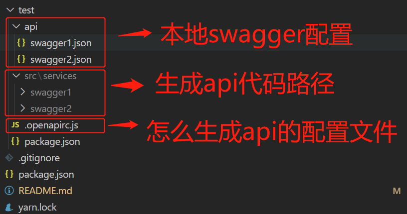
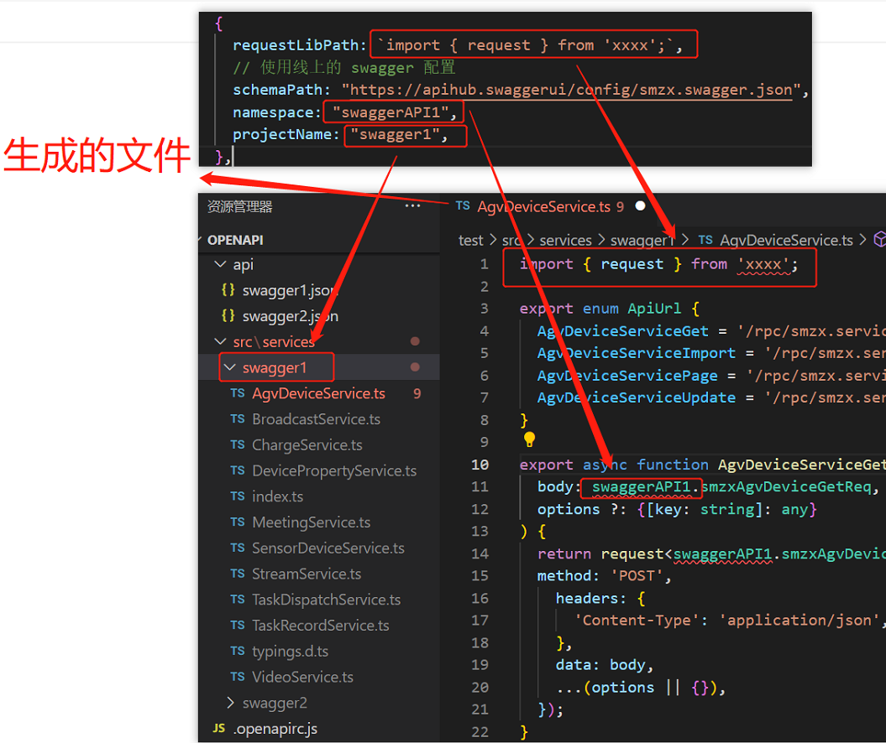

# 自动生成 api

umijs 有个 openapi 的功能，就是将后端的接口文档，自动编译为前端代码，不过该功能只能在 umijs 中使用，本人自己开发了一个工具, 可以将 swagger.json 格式转化为前端 api 代码,下面是说明

gitHub 地址: <https://github.com/ImCccc/openapi>

使用前, 先要创建一些文件夹

1. `api` 文件夹: 放置 swagger.json 配置文件 (一般直接在网上下载)
2. `src/services` 文件夹: 生成的代码
3. `.openapirc.js` 文件: 配置怎么生成代码



- .openapirc.js 配置格式

```js
const { join } = require("path");
module.exports = [
  {
    requestLibPath: `import { request } from 'xxxx';`,
    schemaPath: "https://xxx/swagger.json", // 使用线上的 swagger 配置
    namespace: "swaggerAPI1", // ts 接口命名空间
    projectName: "swagger1", // 文件夹名称
  },
  {
    requestLibPath: `import { request } from 'xxxx';`,
    schemaPath: join(__dirname, "./api/swagger2.json"), // 使用api文件夹下的 swagger 配置
    namespace: "swaggerAPI2", // ts 接口命名空间
    projectName: "swagger2", // 文件夹名称
  },
];
```



- 安装

```
yarn add lcr-create-api -D
```

- 配置 `package.json`

```javascript
  "scripts": {
    "create-api": "create-api"
  },
```

- 使用

```
npm run create-api
```
