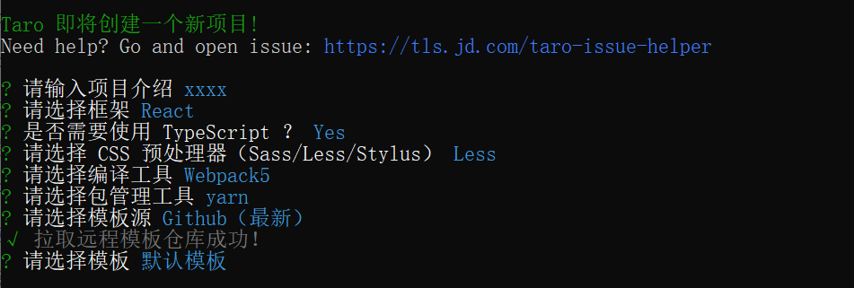
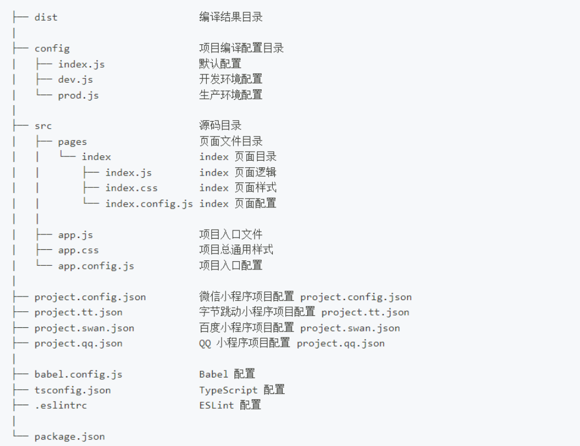

# taro

官网完档: <https://taro-docs.jd.com/taro/docs/react-page>

Taro 是一个开放式跨端跨框架解决方案，支持使用 React/Vue/Nerv 等框架来开发 微信 / 京东 / 百度 / 支付宝 / 字节跳动 / QQ / 飞书 小程序 / H5 / RN 等应用。本文描述使用 react 开发的要点

## 快速开始

1. 安装:

```javascript
npm install -g @tarojs/cli
// or
yarn global add @tarojs/cli
// or
cnpm install -g @tarojs/cli
```

2. 初始化

```javascript
taro init myApp
cd myApp
yarn
```



3. 编译运行

```javascript
// 运行微信小程序
yarn dev:weapp
// 编译微信小程序
yarn build:weapp
```

## 目录结构



## 入口组件

入口文件默认是 `src` 目录下的 `app.js`:

::: details class

```tsx
import React, { Component } from "react";

// 假设我们要使用 Redux
import { Provider } from "react-redux";
import configStore from "./store";

// 全局样式
import "./app.css";

const store = configStore();

class App extends Component {
  // 可以使用所有的 React 生命周期方法
  componentDidMount() {}

  // 对应 onLaunch
  onLaunch() {}

  // 对应 onShow
  componentDidShow() {}

  // 对应 onHide
  componentDidHide() {}

  render() {
    // 在入口组件不会渲染任何内容，但我们可以在这里做类似于状态管理的事情
    return (
      <Provider store={store}>
        {/* this.props.children 是将要被渲染的页面 */}
        {this.props.children}
      </Provider>
    );
  }
}
export default App;
```

:::

::: details hooks

```tsx
import React, { useEffect } from "react";
import { useDidShow, useDidHide } from "@tarojs/taro";
// 假设我们要使用 Redux
import { Provider } from "react-redux";
import configStore from "./store";
// 全局样式
import "./app.css";

const store = configStore();

function App(props) {
  // 可以使用所有的 React Hooks
  useEffect(() => {});
  // 对应 onShow
  useDidShow(() => {});
  // 对应 onHide
  useDidHide(() => {});

  return <Provider store={store}>{props.children}</Provider>;
}

export default App;
```

:::

## 页面组件

::: details class

```tsx
import React, { Component } from "react";
import { View } from "@tarojs/components";

class Index extends Component {
  // 可以使用所有的 React 生命周期方法
  componentDidMount() {}

  // onLoad
  onLoad() {}

  // onReady
  onReady() {}

  // 对应 onShow
  componentDidShow() {}

  // 对应 onHide
  componentDidHide() {}

  // 对应 onPullDownRefresh，除了 componentDidShow/componentDidHide 之外，
  // 所有页面生命周期函数名都与小程序相对应
  onPullDownRefresh() {}

  render() {
    return <View className="index" />;
  }
}

export default Index;
```

:::

::: details hooks

```tsx
import React, { useEffect } from "react";
import { View } from "@tarojs/components";
import {
  useReady,
  useDidShow,
  useDidHide,
  usePullDownRefresh,
} from "@tarojs/taro";

function Index() {
  // 可以使用所有的 React Hooks
  useEffect(() => {});

  // 对应 onReady
  useReady(() => {});

  // 对应 onShow
  useDidShow(() => {});

  // 对应 onHide
  useDidHide(() => {});

  // Taro 对所有小程序页面生命周期都实现了对应的自定义 React Hooks 进行支持
  usePullDownRefresh(() => {});

  return <View className="index" />;
}

export default Index;
```

:::

### onLoad ()

在小程序环境中对应页面的 onLoad

### onUnload ()

在小程序环境中对应页面的 onLoad

### onReady ()

在小程序环境中对应页面的 onReady (可以使用 createCanvasContext 或 createSelectorQuery 访问小程序渲染层的 DOM 节点)

### componentDidShow ()

在小程序环境中对应页面的 onShow, 页面显示/切入前台时触发。

### componentDidHide ()

在小程序环境中对应页面的 onHide, 页面隐藏/切入后台时触发。

### onPullDownRefresh ()

监听用户下拉动作

- 需要在全局配置的 window 选项中或页面配置中设置 `enablePullDownRefresh: true`
- `Taro.startPullDownRefresh` 触发下拉刷新，效果与用户手动下拉刷新一致
- `Taro.stopPullDownRefresh` 可以停止当前页面的下拉刷新.

### onReachBottom ()

监听用户上拉触底事件

- 可以在全局配置的 window 选项中或页面配置中设置触发距离 `onReachBottomDistance`
- 在触发距离内滑动期间，本事件只会被触发一次
- 需要 `enablePullDownRefresh` 配置

### onPageScroll (Object)

监听用户滑动页面事件

- 需要 `enablePullDownRefresh` 配置

### 其他钩子

<https://taro-docs.jd.com/taro/docs/react-page>

## 子组件

### onLoad ()

<font color="red">子组件没有该钩子</font>

### onUnload ()

<font color="red">子组件没有该钩子</font>

### onReady ()

只在页面组件才会触发 onReady

::: details 子组件实现 onReady

```tsx
import React from "react";
import { View } from "@tarojs/components";
import Taro, { eventCenter, getCurrentInstance } from "@tarojs/taro";

class Test extends React.Component {
  $instance = getCurrentInstance();

  componentWillMount() {
    const onReadyEventId = this.$instance.router.onReady;
    eventCenter.once(onReadyEventId, () => {
      console.log("子组件的 onReady");
      // onReady 触发后才能获取小程序渲染层的节点
      Taro.createSelectorQuery()
        .select("#only")
        .boundingClientRect()
        .exec((res) => {});
    });
  }

  render() {
    return <View id="only"></View>;
  }
}
```

:::

::: details 按需加载的子组件实现 onReady

```tsx
import React from "react";
import { View } from "@tarojs/components";
import Taro from "@tarojs/taro";

class Test extends React.Component {
  componentDidMount() {
    Taro.nextTick(() => {
      console.log("按需加载子组件的 onReady");
    });
  }

  render() {
    return <View id="only" />;
  }
}
```

:::

### componentDidShow ()

只在页面组件才会触发 componentDidShow 和 componentDidHide

::: details 子组件实现 componentDidShow 和 componentDidHide

```tsx
import React from "react";
import { View } from "@tarojs/components";
import { eventCenter, getCurrentInstance } from "@tarojs/taro";

class Test extends React.Component {
  $instance = getCurrentInstance();

  componentWillMount() {
    // 监听
    const onShowEventId = this.$instance.router.onShow;
    eventCenter.on(onShowEventId, this.onShow);

    // 监听
    const onHideEventId = this.$instance.router.onHide;
    eventCenter.on(onHideEventId, this.onHide);
  }

  componentWillUnmount() {
    // 卸载
    const onShowEventId = this.$instance.router.onShow;
    eventCenter.off(onShowEventId, this.onShow);

    // 卸载
    const onHideEventId = this.$instance.router.onHide;
    eventCenter.off(onHideEventId, this.onHide);
  }

  onShow = () => {
    console.log("子组件 onShow");
  };

  onHide = () => {
    console.log("子组件 onHide");
  };

  render() {
    return <View id="only" />;
  }
}
```

:::

## hooks

- Taro 的专有 Hooks（例如 usePageScroll, useReachBottom）从 @tarojs/taro 中引入
- 框架自己的 Hooks （例如 useEffect, useState）从对应的框架引入
- 文档 <https://taro-docs.jd.com/taro/docs/hooks>

## alias 别名配置

`/config/index.js:`

```javascript
import { resolve } from "path";

module.exports = {
  alias: {
    "@/components": resolve(__dirname, "..", "src/components"),
    "@/package": resolve(__dirname, "..", "package.json"),
    "@/project": resolve(__dirname, "..", "project.config.json"),
  },
};
```

`/tsconfig.json:`

```ts
{
  "compilerOptions": {
    "baseUrl": ".",
    "paths": {
      "@/components/*": ["./src/components/*"],
      "@/package": ["./package.json"],
      "@/project": ["./project.config.json"]
    },
  },
}
```

使用:

```javascript
import Comp from "@/components/comp1";
```

## 环境判断

`env` 用于设置环境变量，如 `process.env.NODE_ENV`, 区分开发环境和生产环境，可以如下配置：

```javascript
// config/dev.js：
module.exports = {
  env: {
    NODE_ENV: '"development"', // 这里需要引号, 因为会使用 JSON.stringify 转义
  },
};

// config/prod.js
module.exports = {
  env: {
    NODE_ENV: '"production"',
  },
};
```

这样就能在代码中通过` process.env.NODE_ENV === 'development'` 来判断环境
