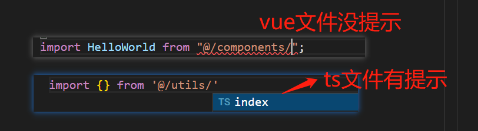
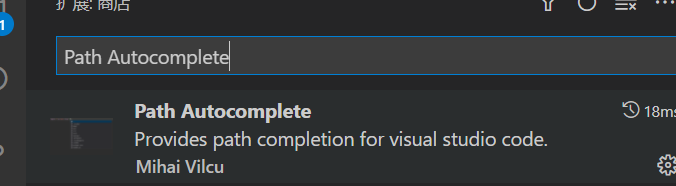
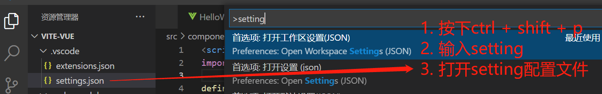
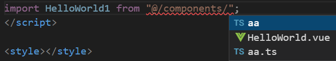
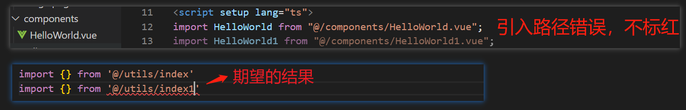
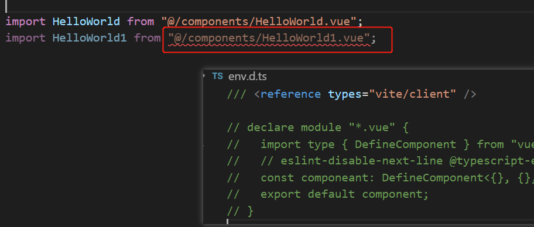
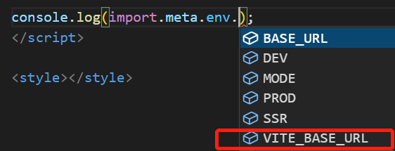

# vite

文档：<https://vitejs.cn/config/>

## 创建项目

```
 yarn create vite
 今天项目: cd 项目名
 安装: yarn
 启动: yarn dev
```

然后按照自己的需求选择即可

## 别名配置

1. 修改 vite.config.ts

```ts
export default defineConfig({
  resolve: {
    alias: { "@": "/src" },
  },
});
```

2. 修改 tsconfig.json (添加这个配置,引入文件就会有路径提示)

```ts
// 添加 baseUrl paths
{
  "compilerOptions": {
    "baseUrl": ".",
    "paths": {
      "@/*": ["./src/*"]
    },
    ...
  },
}
```

### vscode 没有文件名提示

项目中，import 引入文件，会有路径提示，不过除了 ts 文件，其他文件都没有文件名的提示，导致手敲，很麻烦：



解决方案：

1. 安装插件 Path Autocomplete



2. 按下 ctrl + shift + p, 输入 setting, 打开配置文件



setting.json:

```json
{
  //导入文件时是否携带文件的拓展名
  "path-autocomplete.extensionOnImport": true,
  //配置@的路径提示
  "path-autocomplete.pathMappings": {
    "@": "${folder}/src"
  }
}
```

3. 完成：



### 引入文件名错误不报错

当 import 引入文件时，例如<code>import HelloWorld from "@/components/HelloWorld1.vue"</code>, 其实时没有 HelloWorld1.vue 这个文件，但不会有报错提示



<font color="red">todo. . . 该问题暂未解决；</font>
非友好解决： 修改 env.d.ts ，不过这显然不是最终的解决方案， 这个文件是 IDE 的类型支持，不能随便修改



## 环境变量

Vite 在一个特殊的 import.meta.env 对象上暴露环境变量。

```js
  {
    MODE: "production", // 应用运行的模式
    BASE_URL: "/", // 部署应用时的基本 URL。他由 base 配置项决定。
    DEV: false, // 应用是否运行在开发环境 (永远与 import.meta.env.PROD相反)
    PROD: true // 应用是否运行在生产环境
  }
```

### 不同环境下添加不一样的变量

例子：
开发环境需要访问：https://www.baidu.com/;
生产环境需要访问：https://cn.bing.com/;
测试环境需要访问：https://www.youdao.com/

- 步骤 1：根目录下添加开发环境的变量文件 .env.development

```
VITE_BASE_URL=https://www.baidu.com/
```

- 步骤 2：根目录下添加生产环境的变量文件 .env.production

```
VITE_BASE_URL=https://cn.bing.com/
```

- 步骤 3：根目录下添加测试环境的变量文件 .env.test （添加一个模式）

```
VITE_BASE_URL=https://www.youdao.com/
```

- 步骤 4：package.json 中添加测试环境的打包命令

```json
  "scripts": {
    "build-test": "vite build --mode test",
  },
```

配置完成，可以这样访问：

```js
console.log(import.meta.env.VITE_BASE_URL);
```

:::tip

1. 测试环境打包时，需要使用 yarn build-test 打包
   > 生产环境和开发环境的环境变量文件名是固定的，测试环境可以自定义，但是需要打包时，传入一个模式变量, 那么就会引入该模式的环境变量
2. 只有以 VITE\_ 为前缀的变量才会暴露给经过 vite 处理的代码

:::

### 添加 ts 代码提示

src/env.d.ts 添加如下代码:

```ts
interface ImportMetaEnv {
  readonly VITE_BASE_URL: string;
  // 更多环境变量...
}

interface ImportMeta {
  readonly env: ImportMetaEnv;
}
```


