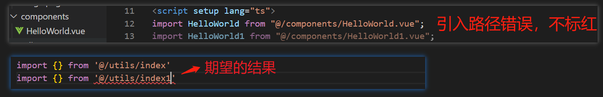
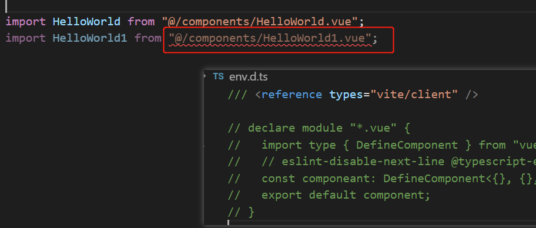
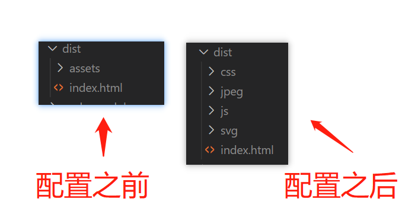
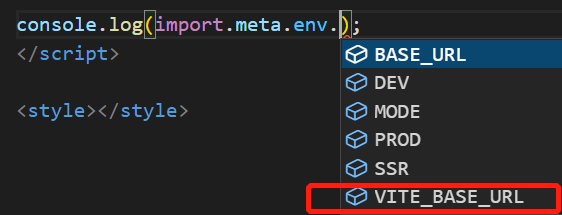

# vite

文档：<https://vitejs.cn/config/>

## 创建项目

```
 yarn create vite
 今天项目: cd 项目名
 安装: yarn
 启动: yarn dev
```

然后按照自己的需求选择即可

## 别名配置

1. 修改 vite.config.ts

```ts
export default defineConfig({
  resolve: {
    alias: { "@": "/src" },
  },
});
```

2. 修改 tsconfig.json (添加这个配置,引入文件就会有路径提示)

```ts
// 添加 baseUrl paths
{
  "compilerOptions": {
    "baseUrl": ".",
    "paths": {
      "@/*": ["./src/*"]
    },
    ...
  },
}
```

### 引入文件名错误不报错

当 import 引入文件时，例如<code>import HelloWorld from "@/components/HelloWorld1.vue"</code>, 其实时没有 HelloWorld1.vue 这个文件，但不会有报错提示



<font color="red">todo. . . 该问题暂未解决；</font>
非友好解决： 修改 env.d.ts ，不过这显然不是最终的解决方案， 这个文件是 IDE 的类型支持，不能随便修改



## 打包配置

```javascript
  build: {
    outDir: 'dist',
    rollupOptions: {
      output: {
        chunkFileNames: 'js/[name]-[hash].js',
        entryFileNames: 'js/[name]-[hash].js',
        assetFileNames: '[ext]/[name]-[hash].[ext]',
      },
    },
  },
```



## 环境变量

Vite 在一个特殊的 import.meta.env 对象上暴露环境变量。

```js
  {
    MODE: "production", // 应用运行的模式
    BASE_URL: "/", // 部署应用时的基本 URL。他由 base 配置项决定。
    DEV: false, // 应用是否运行在开发环境 (永远与 import.meta.env.PROD相反)
    PROD: true // 应用是否运行在生产环境
  }
```

### 不同环境下添加不一样的变量

例子：

1. 开发环境需要访问：https://www.baidu.com/;
2. 生产环境需要访问：https://cn.bing.com/;
3. 测试环境需要访问：https://www.youdao.com/

- 步骤 1：根目录下添加开发环境的变量文件 .env.development

```
VITE_BASE_URL=https://www.baidu.com/
```

- 步骤 2：根目录下添加生产环境的变量文件 .env.production

```
VITE_BASE_URL=https://cn.bing.com/
```

- 步骤 3：根目录下添加测试环境的变量文件 .env.test （添加一个模式）

```
VITE_BASE_URL=https://www.youdao.com/
```

- 步骤 4：package.json 中添加测试环境的打包命令

```json
  "scripts": {
    "build-test": "vite build --mode test",
  },
```

配置完成，可以这样访问：

```js
console.log(import.meta.env.VITE_BASE_URL);
```

:::tip

1. 测试环境打包时，需要使用 yarn build-test 打包
   > 生产环境和开发环境的环境变量文件名是固定的，测试环境可以自定义，但是需要打包时，传入一个模式变量, 那么就会引入该模式的环境变量
2. 只有以 VITE\_ 为前缀的变量才会暴露给经过 vite 处理的代码

:::

### 添加 ts 代码提示

src/env.d.ts 添加如下代码:

```ts
interface ImportMetaEnv {
  readonly VITE_BASE_URL: string;
  // 更多环境变量...
}

interface ImportMeta {
  readonly env: ImportMetaEnv;
}
```



## 创建 react 管理后台遇到问题

github 地址：<https://github.com/ImCccc/vite-react-demo>

### 项目初始化

```
yarn create vite react-app --template react-ts
cd react-app
yarn
yarn dev
```

### React 18 中 useEffect 会运行两次

将严格模式去掉

```jsx
// main.tsx
ReactDOM.createRoot(document.getElementById('root')!).render(
  <React.StrictMode>
    <App />
  </React.StrictMode>,
);

// 变为
ReactDOM.createRoot(document.getElementById('root')!).render(<App />);
```

### 配置 eslint

<font color="red">确保 vscode 安装 ESlint 插件</font>

1. 添加 `.eslintrc.js` 文件

::: details 点击查看 .eslintrc.js

```js
module.exports = {
  root: true,
  env: {
    browser: true,
    es2021: true,
    node: true,
  },
  parser: "@typescript-eslint/parser",
  extends: [
    "plugin:react/recommended",
    "plugin:react-hooks/recommended",
    "plugin:@typescript-eslint/recommended",
  ],
  parserOptions: {
    ecmaFeatures: {
      jsx: true,
    },
    ecmaVersion: 13,
    sourceType: "module",
  },
  plugins: ["react", "react-hooks", "@typescript-eslint"],
  rules: {
    "no-duplicate-imports": [1, { includeExports: true }], // 不能重复import
    "react-hooks/rules-of-hooks": "error",
    "react/react-in-jsx-scope": 0, // 关闭掉页面必须引入React
    "@typescript-eslint/no-explicit-any": 0, // 关闭any
    "react/prop-types": 0,
    "react/display-name": 0,
  },
};
```

:::

2. 安装插件

```
yarn add -D @typescript-eslint/parser eslint @typescript-eslint/eslint-plugin eslint-plugin-react eslint-plugin-react-hooks
```

### 配置 prettierrc

<font color="red">确保 vscode 安装 Prettier - Code formatter 插件</font>

1. 添加 `.prettierrc.js` 文件

::: details 点击查看 .prettierrc.js

```js
module.exports = {
  printWidth: 80,
  tabWidth: 2,
  semi: true,
  singleQuote: true,
  trailingComma: "all",
  proseWrap: "never",
  endOfLine: "lf",
  overrides: [{ files: ".prettierrc", options: { parser: "json" } }],
  // import 语句的排序
  importOrder: [
    "^react(.*)$",
    "^ice(.*)$",
    "<THIRD_PARTY_MODULES>",
    "^(?!.*(.css|.less|.sass|.scss|.jpg|.png|.gif|.svg|.jpeg|.bmp|.webp|.tiff|.ico|@/services))(@/.*)",
    "^(?!.*(.css|.less|.sass|.scss|.jpg|.png|.gif|.svg|.jpeg|.bmp|.webp|.tiff|.ico))(@/services.*)",
    "^(?!.*(.css|.less|.sass|.scss|.jpg|.png|.gif|.svg|.jpeg|.bmp|.webp|.tiff|.ico))(..?/.*)",
    "(.jpg|.png|.gif|.svg|.jpeg|.bmp|.webp|.tiff|.ico)$",
    "(.css|.less|.sass|.scss)$",
  ],
  importOrderSeparation: true,
  importOrderSortSpecifiers: true,
  importOrderCaseInsensitive: true,
  importOrderParserPlugins: ["typescript", "jsx", "classProperties"],
};
```

:::

### 按需加载 antd

1. 安装

```
yarn add -D consola vite-plugin-style-import
```

2. vite.config.ts

```js
import { createStyleImportPlugin } from 'vite-plugin-style-import';
{
  plugins: [
    createStyleImportPlugin({
      libs: [
        {
          libraryName: 'antd',
          esModule: true,
          resolveStyle: (name: string) => {
            return `antd/es/${name}/style/index`;
          },
        },
      ],
    }),
  ],
  css: {
    preprocessorOptions: {
      less: {
        javascriptEnabled: true,
        // 重写 less 变量，定制样式
        modifyVars: {
          '@primary-color': '#3d69fb',
        },
      },
    },
  },
}
```

## 不能直接用 ip 访问

想使用 ip 访问,vite.config.ts 需要添加`host: '0.0.0.0'`:

```
server: {
  host: '0.0.0.0',
  proxy: { ... },
},
```

## 插件

<https://vitejs.cn/guide/api-plugin.html#authoring-a-plugin>
