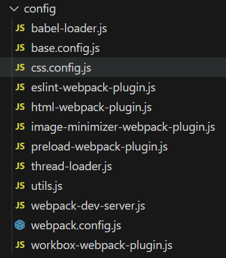

# webpack5

以下例子中, 配置文件都放在项目根目录的 config 文件夹中, 设计到地址配置,稍微留言下

项目的 github 地址: <https://github.com/ImCccc/webpack5>

## 开发环境插件

1. 安装

```
yarn add webpack-dev-server -D
```

2. webpack5 配置

```javascript
module.exports = {
  devServer: {
    host: "localhost",
    port: 3000,
    open: true, // 自动打开浏览器
    hot: true, // 热模块更新 （默认true）
  },
};
```

3. 修改 package.json

```json
{
  "scripts": {
    "dev": "webpack server --config ./config/webpack.config.js"
  }
}
```

## css 相关的 loader

1. 安装

```
yarn add style-loader css-loader -D
yarn add sass sass-loader -D
yarn add less less-loader -D
yarn add postcss-loader postcss postcss-preset-env -D
yarn add mini-css-extract-plugin -D
yarn add css-minimizer-webpack-plugin -D
```

2. 配置

```javascript
// css 单独生成文件
const MiniCssExtractPlugin = require("mini-css-extract-plugin");
// css 压缩
const CssMinimizerPlugin = require("css-minimizer-webpack-plugin");

const postcssLoader = {
  loader: "postcss-loader",
  options: {
    postcssOptions: {
      plugins: ["postcss-preset-env"],
    },
  },
};

module.exports = {
  module: {
    rules: [
      {
        test: /\.css$/,
        use: [
          MiniCssExtractPlugin.loader, // 'style-loader'
          "css-loader",
          postcssLoader,
        ],
      },
      {
        test: /\.scss$/,
        use: [
          MiniCssExtractPlugin.loader, // 'style-loader'
          "css-loader",
          postcssLoader,
          "sass-loader",
        ],
      },
      {
        test: /\.less$/,
        use: [
          MiniCssExtractPlugin.loader, // 'style-loader'
          "css-loader",
          postcssLoader,
          "less-loader",
        ],
      },
    ],
  },
  plugins: [new MiniCssExtractPlugin()],
  optimization: {
    minimizer: [new CssMinimizerPlugin()],
  },
};
```

3. 修改 package.json (postcss-loader 用到)

```json
{
  "browserslist": [
    "last 2 version", // 最近2个版本
    "> 1%", // 覆盖 99%
    "not dead" // 不要废弃的浏览器
  ]
}
```

**说明**

- 生产环境使用: [mini-css-extract-plugin](https://www.webpackjs.com/plugins/mini-css-extract-plugin/) 将 CSS 提取到单独的文件中
- 生产环境使用: css-minimizer-webpack-plugin 压缩 css
- 开发环境使用: style-loader: 将样式插入到 html 中(使用 MiniCssExtractPlugin 插件后需要替换)
- css-loader: 将 css 转化为 js 能
- postcss-loader: 解决样式兼容性
- less-loader: less 转 css
- sass-loader: scss 转 css

## 图片资源

<https://www.webpackjs.com/guides/asset-modules#inlining-assets>

1. webpack5 配置

```javascript
module.exports = {
  module: {
    rules: [
      {
        test: /\.(png|jpe?g|git|webp)$/,
        type: "asset",
        parser: {
          // 默认 小于 8kb 的图片变为 base64, 现在改为 10kb
          dataUrlCondition: { maxSize: 10 * 1024 },
        },
      },
    ],
  },
};
```

图片压缩: <https://www.webpackjs.com/plugins/image-minimizer-webpack-plugin/>

1. 安装

```
yarn add image-minimizer-webpack-plugin -D
yarn add imagemin-gifsicle imagemin-jpegtran imagemin-optipng imagemin-svgo -D
```

## 其他资源

```javascript
module.exports = {
  module: {
    rules: [
      {
        test: /\.(woff2?|ttf)$/,
        type: "asset/resource",
      },
    ],
  },
};
```

## html 插件

```javascript
/*
  yarn add html-webpack-plugin -D
*/
const HtmlWebpackPlugin = require("html-webpack-plugin");
module.exports = {
  plugins: [
    new HtmlWebpackPlugin({
      template: "src/index.html",
    }),
  ],
};
```

## eslint 插件

1. webpack5 配置

```javascript
/*
  yarn add eslint-webpack-plugin eslint -D
*/
const EslintPlugin = require("eslint-webpack-plugin");
const path = require("path");

module.exports = {
  plugins: [
    new EslintPlugin({
      // 开始缓存
      cache: true,
      // 缓存地址配置
      cacheLocation: path.resolve(
        __dirname,
        "../node_modules/.cache/eslintcache"
      ),
      context: path.resolve(__dirname, "src"),
    }),
  ],
};
```

2. 添加配置文件 `.eslintrc.js`

```javascript
module.exports = {
  extends: ["eslint:recommended"],
  env: {
    node: true,
    browser: true,
  },
  parserOptions: {
    ecmaVersion: 6,
    sourceType: "module",
  },
  // 不能使用 var
  rules: { "no-var": 2 },
  // 可以使用 import() 动态导入
  plugins: ["import"],
};
```

4. 添加忽略文件 `.eslintignore`

```
/node_modules
/dist
/config
```

::: tip
`cache: true` 开启缓存, `cacheLocation` 设置缓存目录
:::

## babel 插件

主要用于将 es6 语法转化为 es5 语法, 以便能在旧浏览器上运行: <https://www.webpackjs.com/loaders/babel-loader/>

1. webpack5 配置

```javascript
/*
  yarn add babel-loader @babel/core @babel/preset-env -D
  yarn add @babel/plugin-transform-runtime -D

  按需还需要安装:
  yarn add core-js@3 -D
*/
module.exports = {
  module: {
    rules: [
      {
        test: /\.m?js$/,
        exclude: /node_modules/,
        use: {
          loader: "babel-loader",
          options: {
            cacheDirectory: true, // 开启缓存
            cacheCompression: false, // 关闭缓存文件压缩
          },
          // 可以直接配置, 也可以通过配置文件
          // options: { presets: ["@babel/preset-env"] },
        },
      },
    ],
  },
};
```

2. 添加配置文件 `babel.config.js`

```javascript
// https://babeljs.io/docs/babel-preset-env#corejs
module.exports = {
  presets: [
    [
      "@babel/preset-env",
      // core-js 按需加载配置
      { useBuiltIns: "usage", corejs: 3 },
    ],
  ],
};
```

::: tip

1. 不知道为什么需要配置按需加载引入 es6 转 es5, 但是就是不生效
2. cacheDirectory 开启缓存, 缓存文件目录在 `node_modules\.cache\babel-loader`
3. `@babel/plugin-transform-runtime` 可以将公共方法单独抽离,它禁用了自动对每一个文件 runtime 注入，使所有辅助代码能够复用

:::

## core-js 解决兼容性问题

`babel-loader` 只能对箭头函数，点点点运算等转换， 不能解决类似于 Promise 数组的 includes 类似的 api, 下面使用 core-js 解决；

安装: `yarn add core-js -D`

1. 直接使用 (体积很大)

```js
import "core-js";
```

2. 按需加载 (用到什么就引用什么, 缺点太麻烦)

```js
import "core-js/es/promise";
```

3. 配置 `babel.config.js` 配置 (参考 babel 插件那一章, <font color="red">不过不知道为什么不生效</font> )

## 环境变量

1. 安装

```
yarn add cross-env -D
```

2. 修改 `package.json`

```json
{
  "scripts": {
    "dev": "cross-env NODE_ENV=development webpack server --config ./config/webpack.config.js",
    "prd": "cross-env NODE_ENV=production webpack --config ./config/webpack.config.js"
  }
}
```

3. 配置文件 `webpack.config.js` 使用

```js
console.log(process.env.NODE_ENV);
```

## SourceMap

原理： 生成一个 xxx.map 文件， 里面包含源码和构建后的代码的每一行每一列的对应关系；当构建后的代码在浏览器上出错了，可以帮助我们快速找到出错的位置.

webpack5 配置:

```js
module.exports = {
  mode: 'development' // production
  devtool: "cheap-module-source-map",
};
```

## 多进程打包

webpack5 配置

```js
/*
  yarn add eslint-webpack-plugin eslint -D
  yarn add babel-loader @babel/core @babel/preset-env @babel/plugin-transform-runtime -D
  yarn add thread-loader -D
*/
const os = require("os");
const path = require("path");
const EslintPlugin = require("eslint-webpack-plugin");
const TerserPlugin = require("terser-webpack-plugin");
const threads = os.cpus().length; // cpu 核数

module.exports = {
  module: {
    rules: [
      {
        test: /\.m?js$/,
        exclude: /node_modules/,
        use: [
          // 多进程打包
          {
            loader: "thread-loader",
            options: { works: threads },
          },
          {
            loader: "babel-loader",
            options: {
              cacheDirectory: true,
              cacheCompression: false,
              plugins: ["@babel/plugin-transform-runtime"],
            },
          },
        ],
      },
    ],
  },

  optimization: {
    minimizer: [
      // 多进程压缩 js
      new TerserPlugin({ parallel: threads }),
    ],
  },

  plugins: [
    new EslintPlugin({
      context: path.resolve(__dirname, "../src"),
      cache: true,
      cacheLocation: path.resolve(
        __dirname,
        "../node_modules/.cache/eslintcache"
      ),
      threads, // 多进程打包
    }),
  ],
};
```

## 动态导入

```js
module.exports = {
  optimization: {
    // 代码分割配置 https://www.webpackjs.com/plugins/split-chunks-plugin/
    splitChunks: {
      chunks: "all",
    },
  },
};
```

添加后， 发现`import("xxx.js").then(() => {});` 会单独打包成一个文件，引入 node_modules 的模块也会单独打包

**给打包输出的文件命名：**

```js
// 使用
import(/* webpackChunkName: "sum" */ "./js/index.js");

// 配置
module.exports = {
  output: {
    filename: "xxx",
    chunkFilename: "js/chunk.[name].[contenthash:5].js",
  },
  optimization: {
    splitChunks: {
      chunks: "all",
    },
  },
};
```

::: tip
如果 eslint 报错： Parsing error: 'import' and 'export' may only appear at the top leveleslint , 可以这样做:

1. package.json 添加 `plugins: ["import"]` 配置：

```js
module.exports = {
  extends: ["eslint:recommended"],
  plugins: ["import"],
};
```

2. 安装`yarn add @babel/eslint-parser -D`,修改`.eslintrc.js` 配置:

```js
module.exports = {
  extends: ["eslint:recommended"],
  parser: "@babel/eslint-parser",
};
```

:::

## Preload Prefetch

`Preload` `Prefetch` 共同点：

1. 只会加载资源，不会执行；
2. 浏览器兼容性差；

`Preload` `Prefetch` 不同点:

1. preload: 告诉浏览器马上加载资源；prefetch: 告诉浏览器空闲的时候才加载资源；
2. preload 优先级高，prefetch 低
3. prefetch 可以加载下一个页面的资源，preload 不可以

```js
/*
  yarn add @vue/preload-webpack-plugin -D
*/
const PreloadPlugin = require("@vue/preload-webpack-plugin");

module.exports = {
  plugins: [
    // new PreloadPlugin({
    //   rel: "prefetch",
    // }),
    new PreloadPlugin({
      rel: "preload",
      as: "script", // 优先级最高：style
    }),
  ],
};
```

## 打包缓存优化

打包的时候， 只修改一个 sum.js, 但是发现引用了 sum 模块的 js 也跟着重新打包， 这一节我们修改配置来解决这个问题：

```js
module.exports = {
  output: {
    filename: "js/[name].[contenthash:10].js",
    chunkFilename: "js/chunk.[name].[contenthash:5].js",
  },
  optimization: {
    splitChunks: { chunks: "all" },
    runtimeChunk: {
      name: (entrypoint) => `runtime~${entrypoint.name}.js`,
    },
  },
};
```

::: tip

为什么使用`contenthash`不使用`hash`？因为打包的时候，不改变的文件，不需要修改文件名称，上线后就可以缓存

:::

## PWA

参考: <https://www.webpackjs.com/guides/progressive-web-application/#registering-our-service-worker>

解决断网不能访问的问题, 下面是使用方法:

1. webpack5 配置

```javascript
/*
  yarn add workbox-webpack-plugin -D
*/
const WorkboxPlugin = require("workbox-webpack-plugin");
const config = {
  plugins: [
    new WorkboxPlugin.GenerateSW({
      clientsClaim: true,
      skipWaiting: true,
    }),
  ],
};
module.exports = config;
```

2. 入口文件添加如下代码

```javascript
if ("serviceWorker" in navigator) {
  window.addEventListener("load", () => {
    navigator.serviceWorker
      .register("/service-worker.js")
      .then((registration) => {
        console.log("注册成功: ", registration);
      })
      .catch((registrationError) => {
        console.log("注册失败: ", registrationError);
      });
  });
}
```

打包后, 会自动生成 `service-worker.js`, 启动时候会加载该文件, 不过 pwa 兼容性比较差

## 一些使用技巧

### 使用 JSDoc

文档: <https://jsdoc.bootcss.com/about-plugins.html>

使用 JSDoc 添加配置文件的代码提示, 以 pwd 插件 配置为例:

```javascript
const WorkboxPlugin = require("workbox-webpack-plugin");

/** @type import("webpack").Configuration */
const config = {
  plugins: [
    new WorkboxPlugin.GenerateSW({
      clientsClaim: true,
      skipWaiting: true,
    }),
  ],
};
module.exports = config;
```

注意不能这样写 `module.exports = {xxxx}`

### 使用 serve

使用 serve 在某一个目录下开启服务

- 安装 `npm i serve -g`
- 启动 `serve dist`

### 合并配置文件

将 webpack 配置分散写, 方便维护(一个插件一个配置), 然后写一个方法, 将 config 文件夹下的所 webpack 配置文件合并, 文件目录结构如下:



```js
// utils.js
const fs = require("fs");
let config = require("./base.config");

const isNull = (v) => v === undefined || v === null;
const isArray = (v) => Object.prototype.toString.call(v) === "[object Array]";
const isObject = (v) => Object.prototype.toString.call(v) === "[object Object]";
const isBaseType = (v) => ["string", "number", "boolean"].includes(typeof v);

const mergeOptions = (option1, option2) => {
  const keys = [...new Set([...Object.keys(option1), ...Object.keys(option2)])];
  keys.forEach((key) => {
    const v1 = option1[key];
    const v2 = option2[key];
    if (isNull(v2)) return;
    if (isNull(v1)) return (option1[key] = v2);
    const v1IsBaseType = isBaseType(v1);
    const v2IsBaseType = isBaseType(v2);
    const v1IsArray = isArray(v1);
    const v2IsArray = isArray(v2);
    const v1IsObject = isObject(v1);
    const v2IsObject = isObject(v2);
    // 基本类型合并， option2 覆盖 option1
    if (v1IsBaseType && v2IsBaseType) {
      option1[key] = v2;
      return;
    }
    // v1 是数组， v2 是基本类型 或者 对象
    if (v1IsArray && (v2IsBaseType || v2IsObject)) {
      v1.push(v2);
      option1[key] = v1;
      return;
    }
    // v2 是数组， v1 是基本类型 或者 对象
    if (v2IsArray && (v1IsBaseType || v1IsObject)) {
      v2.push(v1);
      option1[key] = v2;
      return;
    }
    // 都是数组
    if (v1IsArray && v2IsArray) {
      option1[key] = [...v1, ...v2];
      return;
    }
    // 都是对象
    if (v1IsObject && v2IsObject) {
      option1[key] = mergeOptions(v1, v2);
      return;
    }
    option1[key] = v2;
  });
  return option1;
};

const getWebpackConfig = () => {
  const files = fs.readdirSync(__dirname);
  files.forEach(function (file) {
    let curPath = __dirname + "/" + file;
    if (file === "utils.js" || file === "webpack.config.js") return;
    const curConfig = require(curPath);
    if (curConfig.__ignore) return;
    config = mergeOptions(config, curConfig);
  });
  return config;
};

module.exports = { getWebpackConfig };
```

```javascript
// webpack.config.js
const { getWebpackConfig } = require("./utils");
module.exports = getWebpackConfig();
```

## 复制文件的插件

```javascript
/*
  yarn add copy-webpack-plugin -D
*/

const path = require("path");
const CopyWebpackPlugin = require("copy-webpack-plugin");

const config = {
  plugins: [
    new CopyWebpackPlugin({
      patterns: [
        {
          from: path.resolve(__dirname, "../public"),
          to: path.resolve(__dirname, "../dist"),
          globOptions: { ignore: ["**/index.html"] }, // 忽略 indx.html
        },
      ],
    }),
  ],
};

module.exports = config;
```

## 集成 react

1. 安装相关包

```
yarn add react react-dom -S
yarn add react-router-dom -S
```

2. 相关代码

```jsx
// main.js
import React from "react";
import ReactDOM from "react-dom/client";
import App from "./App";
const root = ReactDOM.createRoot(document.getElementById("app"));
root.render(<App />);

// App.jsx
import React, { Suspense, lazy } from "react";
import { HashRouter, Link, Route, Routes } from "react-router-dom";
const About = lazy(() => import(/*webpackChunkName: "about"*/ "./pages/About"));
const Home = lazy(() => import(/*webpackChunkName: "home"*/ "./pages/Home"));

const App = () => {
  return (
    <HashRouter>
      <div>
        <Link to="/home">home</Link>
      </div>
      <div>
        <Link to="/about">about</Link>
      </div>
      <Suspense fallback={<div>loading......</div>}>
        <Routes>
          <Route path="/" element={<Home />}></Route>
          <Route path="/home" element={<Home />}></Route>
          <Route path="/about" element={<About />}></Route>
        </Routes>
      </Suspense>
    </HashRouter>
  );
};

export default App;
```

### js 压缩配置

react 打包后的 js 代码不会自动压缩, 需要手动配置

```jsx
const TerserPlugin = require("terser-webpack-plugin");
const isDev = process.env.NODE_ENV === "development";
const config = {
  optimization: {
    minimizer: [!isDev && new TerserPlugin()].filter(Boolean),
  },
};

module.exports = config;
```

### eslint 配置

webpack 配置和之前的没有什么不一样, 不过需要安装 `eslint-config-react-app -D`, 和修改`.eslintrc.js` 配置修

```javascript
/*
  yarn add eslint eslint-webpack-plugin -D
  yarn add eslint-config-react-app -D
*/
const path = require("path");
const EslintPlugin = require("eslint-webpack-plugin");
const config = {
  plugins: [
    new EslintPlugin({
      context: path.resolve(__dirname, "../src"),
      cache: true,
      cacheLocation: path.resolve(
        __dirname,
        "../node_modules/.cache/eslintcache"
      ),
    }),
  ],
};
module.exports = config;
```

```javascript
// .eslintrc.js
module.exports = {
  extends: ["react-app"],
  parserOptions: {
    babelOptions: {
      presets: [
        ["babel-preset-react-app", false],
        "babel-preset-react-app/prod",
      ],
    },
  },
};
```

### babel 配置

webpack 配置, babel 需要处理 jsx 文件, 需要安装 `babel-preset-react-app` 和修改 `babel.config.js`

```javascript
/*
  yarn add babel-loader @babel/core babel-preset-react-app -D
*/
const config = {
  module: {
    rules: [
      {
        test: /\.jsx?$/,
        exclude: /node_modules/,
        use: {
          loader: "babel-loader",
          options: {
            cacheDirectory: true,
            cacheCompression: false,
          },
        },
      },
    ],
  },
};
module.exports = config;
```

```javascript
// babel.config.js
// https://github.com/facebook/create-react-app/blob/main/packages/babel-preset-react-app/create.js
module.exports = {
  presets: ["react-app"],
};
```

### react 组件热更新

只在开发环境使用, 首先需要安装:

```
yarn add @pmmmwh/react-refresh-webpack-plugin react-refresh -D
```

然后配置文件, 如果使用 `babel`, 还要在 `babel-loader` 中添加插件:

```javascript
const ReactRefreshWebpackPlugin = require("@pmmmwh/react-refresh-webpack-plugin");
const isDev = process.env.NODE_ENV === "development";

const config = {
  plugins: [isDev && new ReactRefreshWebpackPlugin()].filter(Boolean),
  module: {
    rules: [
      {
        test: /\.jsx?$/,
        exclude: /node_modules/,
        use: {
          loader: "babel-loader",
          options: {
            plugins: [isDev && "react-refresh/babel"].filter(Boolean),
          },
        },
      },
    ],
  },
};

module.exports = config;
```

### 集成 antd

1. 安装

```
yarn add antd
```

2. main.js 引入

```js
import "antd/dist/antd";
```

3. 使用

```jsx
import { Button } from "antd";
<Button>测试</Button>;
```

4. 修改主题颜色

antd 5 版本修改起来很简单, 文档 <https://ant.design/docs/react/customize-theme-cn>

```jsx
import { Button, ConfigProvider } from "antd";
const App: React.FC = () => (
  <ConfigProvider theme={{ token: { colorPrimary: "#00b96b" } }}>
    <Button />
  </ConfigProvider>
);
```

antd5,还可以针对某一个组件修改主题:

```jsx
<ConfigProvider theme={{ components: { Radio: { colorPrimary: "#00b96b" } } }}>
  <Radio>Radio</Radio>
  <Checkbox>Checkbox</Checkbox>
</ConfigProvider>
```

### 打包分组

如果页面引入很多第三方包, 例如 react react-dom react-router-dom antd 等等, 那么打包出来的文件就会很大, 这时候可以使用如下方法进行分组:

```javascript
const config = {
  optimization: {
    splitChunks: {
      chunks: "all",
      cacheGroups: {
        // react react-dom react-router-dom
        react: {
          test: /[\\/]node_modules[\\/]react(.*)?[\\/]/,
          name: "chunk-react",
          priority: 10,
        },
        // antd-design
        antd: {
          test: /[\\/]node_modules[\\/]antd(.*)?[\\/]/,
          name: "chunk-antd",
          priority: 9,
        },
        // 剩下的 node_modules
        libs: {
          test: /[\\/]node_modules[\\/]/,
          name: "chunk-libs",
          priority: 8,
        },
      },
    },
  },
};
```

打包后的结果:

```
js/runtime~main.js.1b17003f8c.js
js/chunk-react.8e1ab83a56.js
js/chunk-antd.c9f2dc20ff.js
js/chunk-libs.f170381f60.js
js/main.5967e94206.js
```

### 所有配置

webpack.config.js

```javascript
/*
  webpack 相关:
  yarn add webpack webpack-cli -D

  html插件:
  yarn add html-webpack-plugin -D
  
  复制文件插件:
  yarn add copy-webpack-plugin -D

  css相关:
  yarn add style-loader css-loader -D
  yarn add less less-loader css-loader -D
  yarn add postcss postcss-loader postcss-preset-env -D
  yarn add mini-css-extract-plugin css-minimizer-webpack-plugin -D

  babel相关:
  yarn add babel-loader @babel/core babel-preset-react-app -D

  eslint相关:
  yarn add eslint eslint-webpack-plugin eslint-config-react-app -D

  react 组件热更新:
  yarn add @pmmmwh/react-refresh-webpack-plugin react-refresh -D

  开发服务器:
  yarn add webpack-dev-server -D
*/

const CopyWebpackPlugin = require("copy-webpack-plugin");
const MiniCssExtractPlugin = require("mini-css-extract-plugin");
const CssMinimizerPlugin = require("css-minimizer-webpack-plugin");
const HtmlWebpackPlugin = require("html-webpack-plugin");
const EslintPlugin = require("eslint-webpack-plugin");
const TerserPlugin = require("terser-webpack-plugin");
const ReactRefreshWebpackPlugin = require("@pmmmwh/react-refresh-webpack-plugin");

const path = require("path");
const mode = process.env.NODE_ENV;
const isDev = mode === "development";
const isPrd = mode === "production";

let output = {
  clean: true,
  path: path.join(__dirname, "../dist"),
  filename: "js/[name].[contenthash:10].js",
  chunkFilename: "js/chunk.[name].[contenthash:5].js",
  assetModuleFilename: "imgs/[hash:5][ext][query]",
};

if (isDev) {
  output = {
    filename: "js/[name].js",
    chunkFilename: "js/chunk.[name].js",
    assetModuleFilename: "imgs/[hash:5][ext][query]",
  };
}

const postcssLoader = {
  loader: "postcss-loader",
  options: {
    postcssOptions: { plugins: ["postcss-preset-env"] },
  },
};

/** @type import("webpack").Configuration */
const config = {
  mode,
  output,
  entry: "/src/main.js",
  devtool: isDev ? "cheap-module-source-map" : "source-map",

  module: {
    rules: [
      {
        test: /\.css$/,
        use: [
          isDev ? "style-loader" : MiniCssExtractPlugin.loader,
          "css-loader",
          postcssLoader,
        ],
      },
      {
        test: /\.less$/,
        use: [
          isDev ? "style-loader" : MiniCssExtractPlugin.loader,
          "css-loader",
          postcssLoader,
          "less-loader",
        ],
      },
      {
        test: /\.jsx?$/,
        exclude: /node_modules/,
        use: {
          loader: "babel-loader",
          options: {
            cacheDirectory: true,
            cacheCompression: false,
            // 开发环境需要 react 组件热更新的配置
            plugins: [isDev && "react-refresh/babel"].filter(Boolean),
          },
        },
      },
      {
        test: /\.(png|jpe?g|git|webp|svg)$/,
        type: "asset",
        parser: {
          dataUrlCondition: { maxSize: 10 * 1024 },
        },
        generator: {
          filename: "imgs/[hash:10][ext][query]",
        },
      },
      {
        test: /\.(woff2?|ttf)$/,
        type: "asset/resource",
      },
    ],
  },

  resolve: {
    extensions: [".jsx", ".js", ".json"],
  },

  optimization: {
    // 控制是否进行压缩
    minimize: isPrd,
    minimizer: [
      // js 压缩
      new TerserPlugin(),
      // 样式压缩
      new CssMinimizerPlugin(),
    ],

    splitChunks: {
      chunks: "all",
      cacheGroups: {
        // react react-dom react-router-dom
        react: {
          test: /[\\/]node_modules[\\/]react(.*)?[\\/]/,
          name: "chunk-react",
          priority: 10,
        },
        // antd-design
        antd: {
          test: /[\\/]node_modules[\\/]antd(.*)?[\\/]/,
          name: "chunk-antd",
          priority: 9,
        },
        // 剩下的 node_modules
        libs: {
          test: /[\\/]node_modules[\\/]/,
          name: "chunk-libs",
          priority: 8,
        },
      },
    },

    runtimeChunk: {
      name: (entrypoint) => `runtime~${entrypoint.name}.js`,
    },
  },

  plugins: [
    // 生产环境:复制静态资源
    isPrd &&
      new CopyWebpackPlugin({
        patterns: [
          {
            from: path.resolve(__dirname, "../public"),
            to: path.resolve(__dirname, "../dist"),
            globOptions: { ignore: ["**/index.html"] }, // 忽略 indx.html
          },
        ],
      }),

    // 生产环境:css 压缩
    isPrd &&
      new MiniCssExtractPlugin({
        filename: "css/[name].[hash:5].css",
        chunkFilename: "css/chunk.[name].[hash:5].css",
      }),

    // 开发环境:react 组件热更新的配置
    isDev && new ReactRefreshWebpackPlugin(),

    new EslintPlugin({
      context: path.resolve(__dirname, "../src"),
      cache: true,
      cacheLocation: path.resolve(
        __dirname,
        "../node_modules/.cache/eslintcache"
      ),
    }),

    new HtmlWebpackPlugin({
      template: path.resolve(__dirname, "../public/index.html"),
    }),
  ].filter(Boolean),

  devServer: {
    host: "localhost",
    port: 3001,
    open: true,
    hot: true,
    // 解决前端 history 路由 404 问题
    historyApiFallback: true,
  },

  // 关闭性能分析, 提高打包速度
  performance: false,
};

module.exports = config;
```

.eslintrc.js

```js
/* .eslintrc.js */
module.exports = {
  extends: ["react-app"],
  parserOptions: {
    babelOptions: {
      presets: [
        ["babel-preset-react-app", false],
        "babel-preset-react-app/prod",
      ],
    },
  },
};
```

babel.config.js

```js
module.exports = {
  presets: ["react-app"],
};
```

package.json

```json
{
  "scripts": {
    "dev": "cross-env NODE_ENV=development webpack server --config ./config/webpack.config.js",
    "prd": "cross-env NODE_ENV=production webpack --config ./config/webpack.config.js"
  },
  "browserslist": ["last 2 version", "> 1%", "not dead"]
}
```

## 集成 vue

因为和 react 配置差不多, 所以只说差异的地方

### 集成 eslint

安装:

```
yarn add eslint eslint-webpack-plugin eslint-plugin-vue @babel/eslint-parser -D
```

.eslintrc.js 配置:

```javascript
module.exports = {
  root: true,
  env: {
    node: true,
  },
  extends: ["plugin:vue/vue3-essential", "eslint:recommended"],
  parserOptions: {
    parser: "@babel/eslint-parser",
  },
};
```

### 集成 babel

安装:

```
yarn add babel-loader @babel/core @vue/cli-plugin-babel -D
```

babel.config.js:

```js
module.exports = {
  presets: ["@vue/cli-plugin-babel/preset"],
};
```

### 解释 .vue

vue 通过 vue-loader 和 vue-style-loader 自动实现热更新, 不需要安装其他插件下面是使用流程:

1. 安装:

```
yarn add vue
yarn add vue-loader vue-style-loader -D
```

2. `style-loader` 改为 `vue-style-loader`, 添加 `VueLoaderPlugin`:

```javascript
const { VueLoaderPlugin } = require("vue-loader");

const config = {
  module: {
    rules: [
      {
        test: /\.css$/,
        use: [
          "vue-style-loader",
          "css-loader",
          {
            loader: "postcss-loader",
            options: { postcssOptions: { plugins: ["postcss-preset-env"] } },
          },
        ],
      },
      {
        test: /\.less$/,
        use: [
          "vue-style-loader",
          "css-loader",
          {
            loader: "postcss-loader",
            options: { postcssOptions: { plugins: ["postcss-preset-env"] } },
          },
          "less-loader",
        ],
      },
      {
        test: /\.js$/,
        exclude: /node_modules/,
        use: {
          loader: "babel-loader",
          options: {
            cacheDirectory: true,
            cacheCompression: false,
          },
        },
      },
      {
        test: /\.vue$/,
        use: "vue-loader",
      },
    ],
  },

  resolve: {
    extensions: [".vue", ".js", ".json"],
  },

  plugins: [
    // https://vue-loader.vuejs.org/zh/
    new VueLoaderPlugin(),
  ],
};
```

### 添加 vue-router

```
yarn add vue vue-router
```

```javascript
import { createApp } from "vue";
import App from "./App";
import { createRouter, createWebHashHistory } from "vue-router";
const Home = () => import("./pages/Home");
const About = () => import("./pages/About");
const router = createRouter({
  history: createWebHashHistory(),
  routes: [
    { path: "/", component: Home },
    { path: "/home", component: Home },
    { path: "/about", component: About },
  ],
});
createApp(App).use(router).mount(document.getElementById("app"));
```

### 集成 element-plus

文档：<http://element-plus.org/zh-CN/guide/design.html>

```
yarn add element-plus
```

1. 全局引用

```js
import ElementPlus from "element-plus";
import "element-plus/dist/index.css";
import { createApp } from "vue";
import App from "./App";
createApp(App).use(ElementPlus).mount(document.getElementById("app"));
```

2. 按需引入

```
yarn add unplugin-vue-components unplugin-auto-import -D
```

```javascript
// main.js
import { createApp } from "vue";
import App from "./App";
import router from "./router";
createApp(App).use(router).mount(document.getElementById("app"));

// webpack.config.js
const AutoImport = require("unplugin-auto-import/webpack");
const Components = require("unplugin-vue-components/webpack");
const { ElementPlusResolver } = require("unplugin-vue-components/resolvers");
module.exports = {
  plugins: [
    AutoImport({ resolvers: [ElementPlusResolver()] }),
    Components({ resolvers: [ElementPlusResolver()] }),
  ],
};
```

3. 定制主题颜色

步骤 1：添加样式变量 `src/styles/element/index.scss`：

```css
@forward "element-plus/theme-chalk/src/common/var.scss" with (
  $colors: (
    "primary": (
      "base": green
    )
  )
);
```

步骤 2：修改 `sass-loader` 配置

```js
{
  test: /\.scss$/,
  use: [
    {
      loader: "sass-loader",
      options: {
        additionalData: `@use "@/styles/element/index.scss" as *;`,
      },
    },
  ],
};
```

步骤 3：添加别名配置

```javascript
{
  resolve: {
    alias: {
      "@": path.resolve(__dirname, "../src"),
    },
  },
};
```

步骤 4：添加按需引插件

```js
const AutoImport = require("unplugin-auto-import/webpack");
const Components = require("unplugin-vue-components/webpack");
const { ElementPlusResolver } = require("unplugin-vue-components/resolvers");

{
  plugins: [
    AutoImport({
      resolvers: [ElementPlusResolver()],
    }),
    Components({
      resolvers: [ElementPlusResolver({ importStyle: "sass" })],
    }),
  ];
}
```

### 解决控制台警告报错

```javascript
const { DefinePlugin } = require("webpack");

module.exports = {
  plugins: [
    // cross-env 定义的环境变量只能在 nodejs 中使用
    // DefinePlugin 插件定义的变量可以带浏览器中使用, 解决 vue 警告问题
    new DefinePlugin({
      __VUE_OPTIONS_API__: true,
      __VUE_PROD_DEVTOOLS__: false,
    }),
  ],
};
```

### 总的配置

```js
/*
  webpack 相关:
  yarn add webpack webpack-cli -D

  vue 相关:
  yarn add vue vue-router

  vue loader:
  yarn add vue-loader vue-style-loader -D

  element-plus:
  yarn add element-plus
  yarn add unplugin-vue-components unplugin-auto-import -D

  html插件:
  yarn add html-webpack-plugin -D
  
  复制文件插件:
  yarn add copy-webpack-plugin -D

  css相关:
  yarn add css-loader -D
  yarn add sass sass-loader css-loader -D
  yarn add postcss postcss-loader postcss-preset-env -D
  yarn add mini-css-extract-plugin css-minimizer-webpack-plugin -D

  babel相关:
  yarn add babel-loader @babel/core @vue/cli-plugin-babel -D

  eslint相关:
  yarn add eslint eslint-webpack-plugin eslint-plugin-vue @babel/eslint-parser -D

  开发服务器:
  yarn add webpack-dev-server cross-env -D
*/
const { DefinePlugin } = require("webpack");
const { VueLoaderPlugin } = require("vue-loader");
const TerserPlugin = require("terser-webpack-plugin");
const EslintPlugin = require("eslint-webpack-plugin");
const CopyWebpackPlugin = require("copy-webpack-plugin");
const HtmlWebpackPlugin = require("html-webpack-plugin");
const MiniCssExtractPlugin = require("mini-css-extract-plugin");
const CssMinimizerPlugin = require("css-minimizer-webpack-plugin");
const AutoImport = require("unplugin-auto-import/webpack");
const Components = require("unplugin-vue-components/webpack");
const { ElementPlusResolver } = require("unplugin-vue-components/resolvers");

const path = require("path");
const mode = process.env.NODE_ENV;
const isDev = mode === "development";
const isPrd = mode === "production";

let output = {
  clean: true,
  path: path.join(__dirname, "../dist"),
  filename: "js/[name].[contenthash:10].js",
  chunkFilename: "js/chunk.[name].[contenthash:5].js",
  assetModuleFilename: "imgs/[hash:5][ext][query]",
};

if (isDev) {
  output = {
    filename: "js/[name].js",
    chunkFilename: "js/chunk.[name].js",
    assetModuleFilename: "imgs/[hash:5][ext][query]",
  };
}

const postcssLoader = {
  loader: "postcss-loader",
  options: {
    postcssOptions: { plugins: ["postcss-preset-env"] },
  },
};

/** @type import("webpack").Configuration */
const config = {
  mode,
  output,
  entry: "/src/main.js",
  devtool: isDev ? "cheap-module-source-map" : "source-map",

  module: {
    rules: [
      {
        test: /\.css$/,
        use: [
          isDev ? "vue-style-loader" : MiniCssExtractPlugin.loader,
          "css-loader",
          postcssLoader,
        ],
      },
      {
        test: /\.scss$/,
        use: [
          isDev ? "vue-style-loader" : MiniCssExtractPlugin.loader,
          "css-loader",
          postcssLoader,
          {
            loader: "sass-loader",
            options: {
              additionalData: `@use "@/styles/element/index.scss" as *;`,
            },
          },
        ],
      },
      {
        test: /\.js$/,
        exclude: /node_modules/,
        use: {
          loader: "babel-loader",
          options: {
            cacheDirectory: true,
            cacheCompression: false,
          },
        },
      },
      {
        test: /\.vue$/,
        use: "vue-loader",
      },
      {
        test: /\.(png|jpe?g|git|webp|svg)$/,
        type: "asset",
        parser: {
          dataUrlCondition: { maxSize: 10 * 1024 },
        },
        generator: {
          filename: "imgs/[hash:10][ext][query]",
        },
      },
      {
        test: /\.(woff2?|ttf)$/,
        type: "asset/resource",
      },
    ],
  },

  resolve: {
    extensions: [".vue", ".js", ".json"],
    alias: {
      "@": path.resolve(__dirname, "../src"),
    },
  },

  optimization: {
    // 控制是否进行压缩
    minimize: isPrd,
    minimizer: [
      // js 压缩
      new TerserPlugin(),
      // 样式压缩
      new CssMinimizerPlugin(),
    ],

    splitChunks: {
      chunks: "all",
      cacheGroups: {
        // vue vue-router
        react: {
          test: /[\\/]node_modules[\\/]vue(.*)?[\\/]/,
          name: "chunk-vue",
          priority: 10,
        },
        // element-plus
        antd: {
          test: /[\\/]node_modules[\\/]element-plus[\\/]/,
          name: "chunk-element",
          priority: 9,
        },
        // 剩下的 node_modules
        libs: {
          test: /[\\/]node_modules[\\/]/,
          name: "chunk-libs",
          priority: 8,
        },
      },
    },

    runtimeChunk: {
      name: (entrypoint) => `runtime~${entrypoint.name}.js`,
    },
  },

  plugins: [
    // 生产环境:复制静态资源
    isPrd &&
      new CopyWebpackPlugin({
        patterns: [
          {
            from: path.resolve(__dirname, "../public"),
            to: path.resolve(__dirname, "../dist"),
            globOptions: { ignore: ["**/index.html"] }, // 忽略 indx.html
          },
        ],
      }),

    // 生产环境:css 压缩
    isPrd &&
      new MiniCssExtractPlugin({
        filename: "css/[name].[hash:5].css",
        chunkFilename: "css/chunk.[name].[hash:5].css",
      }),

    new EslintPlugin({
      context: path.resolve(__dirname, "../src"),
      cache: true,
      cacheLocation: path.resolve(
        __dirname,
        "../node_modules/.cache/eslintcache"
      ),
    }),

    // https://vue-loader.vuejs.org/zh/
    new VueLoaderPlugin(),

    // cross-env 定义的环境变量只能在 nodejs 中使用
    // DefinePlugin 插件定义的变量可以带浏览器中使用, 解决 vue 警告问题
    new DefinePlugin({
      __VUE_OPTIONS_API__: true,
      __VUE_PROD_DEVTOOLS__: false,
    }),

    new HtmlWebpackPlugin({
      template: path.resolve(__dirname, "../public/index.html"),
    }),

    // element-按需加载
    AutoImport({
      resolvers: [ElementPlusResolver()],
    }),
    Components({
      resolvers: [ElementPlusResolver({ importStyle: "sass" })],
    }),
  ].filter(Boolean),

  devServer: {
    host: "localhost",
    port: 3001,
    open: false,
    hot: true,
    // 解决前端 history 路由 404 问题
    historyApiFallback: true,
  },

  // 关闭性能分析, 提高打包速度
  performance: false,
};

module.exports = config;
```

## 总结

webpack 优化方案包括:

- 图片压缩, js css 压缩
- 对 eslint babel 处理结果进行缓存
- 使用 Thead 多进程打包
- 开启 SourceMap
- Tree shaking 移除 js 中无用的代码, 需要依赖 Es Module, webpack 默认开启该功能
- 使用 code Split 对代码进行分割, 然后使用 import 方法实现动态导入
- 使用 network cache 实现文件缓存
- 使用 PWA 离线优化
- Preload Prefetch 对代码提前加载
- corejs 对 js 兼容性处理
