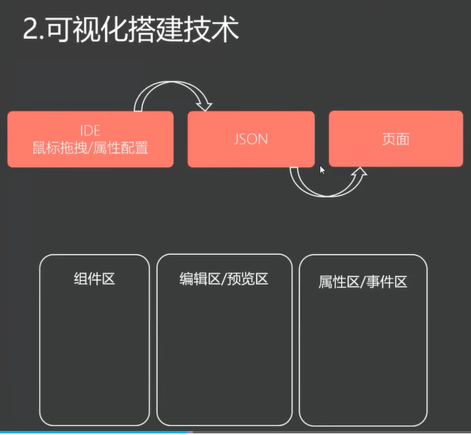
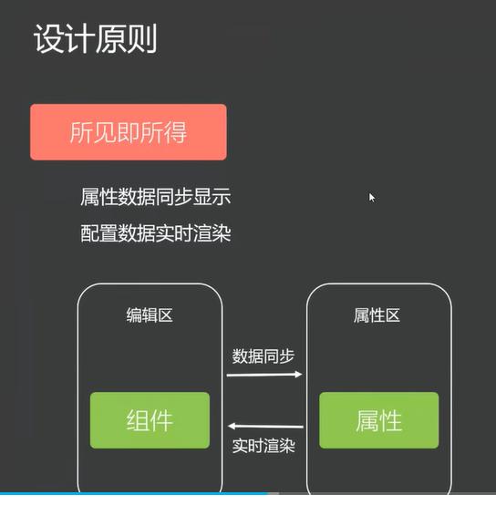
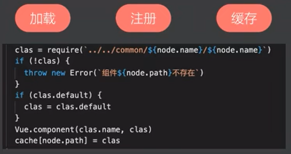
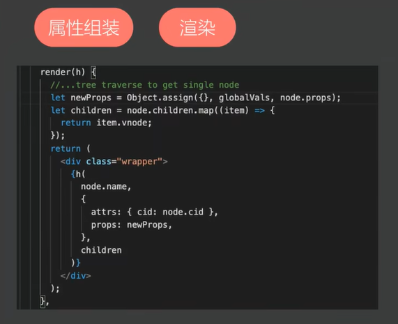
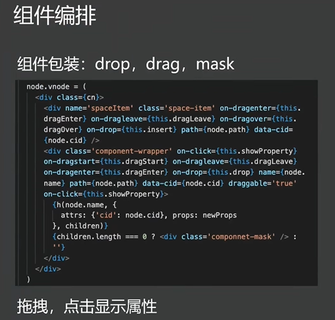
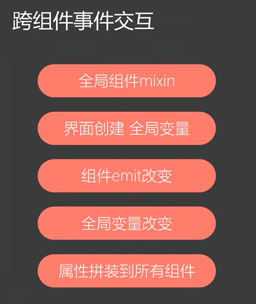
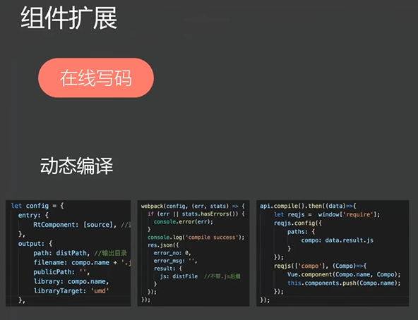
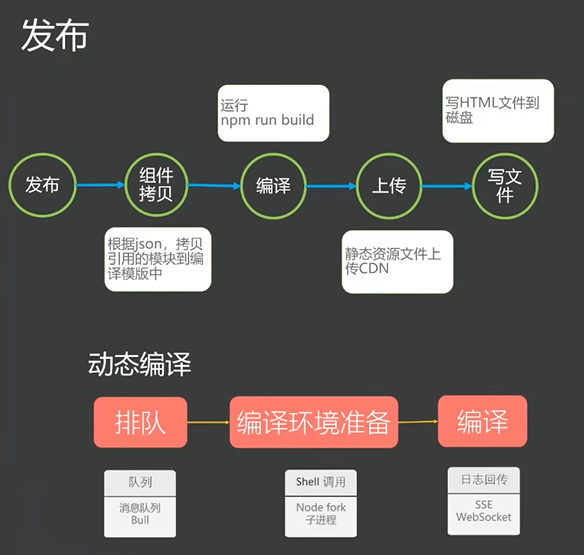

# 低代码

低代码平台优势:

1. 开发效率提升: 降低重复的劳动力;
2. 质量保障: 通过配置生成的页面, 无需反复的回归测试, 只需要验证核心功能;
3. 业务驱动: 通过给产品一个产品级的框架, 驱动业务发展;

<https://www.bilibili.com/video/BV12g411M7St/?spm_id_from=333.337.search-card.all.click&vd_source=7e7a5cca5f48eb83db0e5eccf1453626>

