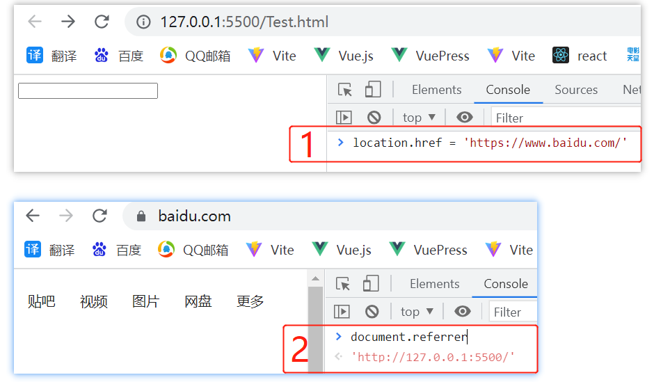

# [Document](https://developer.mozilla.org/zh-CN/docs/Web/API/Document)

Document 接口表示任何在浏览器中载入的网页，并作为网页内容的入口，也就是 DOM 树。DOM 树包含了像 \<body\> 、\<table\> 这样的元素，以及大量其他元素。它向网页文档本身提供了全局操作功能，能解决如何获取页面的 URL ，如何在文档中创建一个新的元素这样的问题。

document 的原型链：

```js
document.__proto__; // HTMLDocument
document.__proto__.__proto__; // Document
document.__proto__.__proto__.__proto__; // Node
document.__proto__.__proto__.__proto__.__proto__; // EventTarget
document.__proto__.__proto__.__proto__.__proto__.__proto__; // Object.prototype
document.__proto__.__proto__.__proto__.__proto__.__proto__.__proto__; // null
```

## 常见属性

### `Document.all`

返回一个以文档节点为根节点的 HTMLAllCollection 集合。换句话说，它能返回页面的完整内容。

### `Document.characterSet`

返回文档正在使用的字符集。例如：`UTF-8`

### `Document.images`

返回当前文档中所包含的图片的 HTMLCollection  集合。

### `Document.styleSheetSets`

返回文档上可用样式表的列表。

### `Document.referrer`

返回来源页面的 URI。



### `Document.title`

获取或设置当前文档的标题。

## 查询 dom 元素相关

### `Document.getElementsByClassName()`

Element 也有该方法，[参考](/js/element.html#getelementsbyclassname)

### `Document.getElementsByTagName()`

Element 也有该方法，[参考](/js/element.html#element-getelementsbytagname)

### `Document.querySelector()`

Element 也有该方法，[参考](/js/element.html#element-queryselector)

### `Document.querySelectorAll()`

Element 也有该方法，[参考](/js/element.html#element-queryselectorall)

### `Document.getElementById()`

返回: 一个匹配特定 `ID` 的 [ Element ](/js/document.html#element)

语法: `var element = document.getElementById(id)`

:::tip
Element 没有该方法
:::

### `document.getElementsByName()`

- [语法](https://developer.mozilla.org/zh-CN/docs/Web/API/Document/getElementsByName)： `document.getElementsByName(name)`
- 返回：实时集合 NodeList <font color="red">（可以自动更新自己来保持和 DOM 树的同步）</font>
- 参数：name 是元素的 name 属性的值

:::tip
Element 没有该方法
:::

```js
<form name="up" id="form1"></form>
<form name="up" id="form2"></form>

var forms = document.getElementsByName("up");
console.log(forms);  // NodeList(2) [form#form1, form#form2]

document.getElementById("form1").remove();
console.log(forms); // NodeList [form#form2]
```

::: danger
有浏览器兼容性问题。在 IE 和 Opera 中， getElementsByName() 方法还会返回那些 id 为指定值的元素。不要为元素的 name (en-US) 和 id 赋予相同的值。

IE 和 Edge 都返回一个 HTMLCollection, 而不是 NodeList 。
:::

## 创建 dom 元素相关

### `Document.createTextNode()`

创建一个新的文本节点。这个方法可以用来转义 HTML 字符。

- 语法: `document.createTextNode(data)`
- 返回: 文本节点
- 参数: data 是一个字符串，包含了要放入文本节点的内容

```js
var text = document.createTextNode(`<span>1</span>`);
const p1 = document.getElementById("p1").appendChild(text);
```

### `Document.createElement()`

创建一个由标签名称 tagName 指定的 HTML 元素

- 语法: `document.createElement(tagName, [options])`
- 返回: 新建的元素（Element）
- 参数 tagName: 指定要创建元素类型的字符串
- 参数 options:

### `Document.createDocumentFragment()`

创建一个新的空白的文档片段 (DocumentFragment)。

```js
let fragment = document.createDocumentFragment();
```

DocumentFragments 是 DOM 节点。它们不是主 DOM 树的一部分。通常的用例是创建文档片段，将元素附加到文档片段，然后将文档片段附加到 DOM 树。

因为文档片段存在于内存中，并不在 DOM 树中，所以将子元素插入到文档片段时不会引起页面回流。因此，使用文档片段通常会带来更好的性能。

```js
let fragment = document.createDocumentFragment();

["Firefox", "Chrome", "Opera", "Safari"].forEach((browser) => {
  let li = document.createElement("li");
  li.textContent = browser;
  fragment.appendChild(li);
});

document.getElementById("ul").appendChild(fragment);
```
