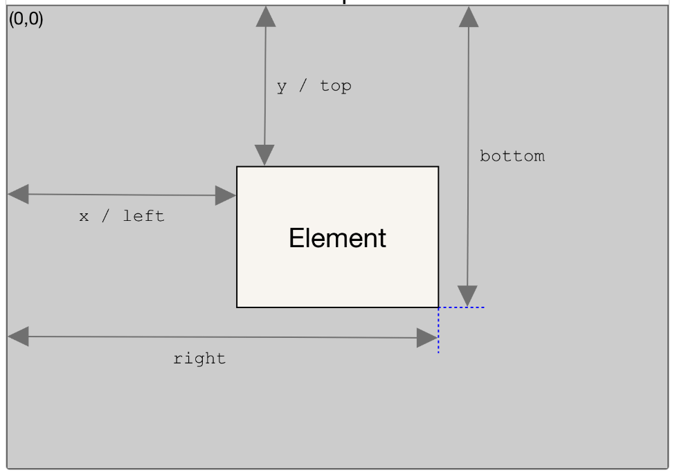
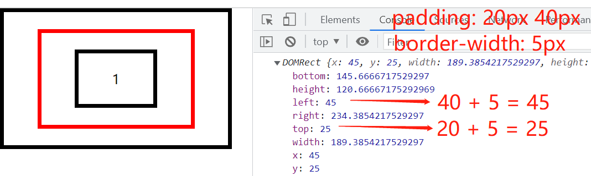

# document 常见的 api

## [Element](https://developer.mozilla.org/zh-CN/docs/Web/API/Element)

Element 是一个通用性非常强的基类，所有 Document 对象下的对象都继承自它。这个接口描述了所有相同种类的元素所普遍具有的方法和属性。一些接口继承自 Element 并且增加了一些额外功能的接口描述了具体的行为。例如， HTMLElement 接口是所有 HTML 元素的基本接口，而 SVGElement 接口是所有 SVG 元素的基础。


**属性：** 所有属性继承自它的祖先接口 [Node](/js/document.html#node)

### `Element.attributes`

返回一个与该元素相关的所有属性集合:

```html
<div data-age="18" name="lcr" class="flex box"></div>
```

```js
var attributes = document.querySelector(".flex").attributes;

attributes["data-age"]; // data-age="18"
attributes[0]; // data-age="18"

attributes.name; // name="lcr"
attributes[1]; // name="lcr"
```

### `Element.classList`

只读，返回该元素包含的 class 属性

```html
<div data-age="18" name="lcr" class="flex box"></div>
```

```js
var classList = document.querySelector(".flex").classList;
console.log(classList); // ['flex', 'box']
console.log(classList.value); // 'flex box'
```

### `Element.className`

```html
<div data-age="18" name="lcr" class="flex box"></div>
```

```js
var className = document.querySelector(".flex").className;
console.log(className); // 'flex box'
```

### `Element.clientHeight`

只读，返回 Number 表示内部相对于外层元素的高度。<font color="red">(不包含 border)</font>

### `Element.clientWidth`

只读，返回 Number 表示该元素内部的宽度。<font color="red">(不包含 border)</font>

### `Element.clientLeft`

只读，返回 Number 表示该元素距离它左边界的宽度。<font color="red">(感觉就是 border-left 的宽度)</font>

### `Element.clientTop`

只读，返回 Number 表示该元素距离它上边界的高度。<font color="red">(感觉就是 border-top 的宽度)</font>

### `Element.scrollHeight`

只读，返回类型为： Number，表示元素的滚动视图高度。

### `Element.scrollWidth`

只读，返回类型为： Number，表示元素的滚动视图宽度。

### `Element.scrollTop`

读取或设置元素滚动条到元素上边的距离

### `Element.scrollLeft`

读取或设置元素滚动条到元素左边的距离

### `Element.innerHTML`

获取 `HTML String` 或者设置元素的后代的 `HTML`

```js
const content = element.innerHTML; // 获取
element.innerHTML = htmlString; // 设置
```

### `Element.outerHTML`

和`innerHTML`的区别，就是包含自身。获取值，包含自身的 `HTML` 文本; 设置时替换自身

### `Element.tagName`

返回一个字符串，其中包含给定元素的标记名称`(例子：DIV, SPAN)`

### `EventTarget.addEventListener()`

[EventTarget.addEventListener](https://developer.mozilla.org/zh-CN/docs/Web/API/EventTarget/addEventListener) 方法将指定的监听器注册到 EventTarget 上，当该对象触发指定的事件时，指定的回调函数就会被执行。

事件目标可以是一个文档上的元素 Element,Document 和 Window 或者任何其他支持事件的对象 (比如 XMLHttpRequest)。

语法：

```js
target.addEventListener(type, listener, options);
target.addEventListener(type, listener, useCapture);
```

- type: 表示监听[事件类型](https://developer.mozilla.org/zh-CN/docs/Web/Events)的字符串。

- listener: 一个实现了 EventListener 接口的对象，或者是一个函数。

- options: 一个指定有关 listener 属性的可选参数对象。可用的选项如下

  > capture: true 表示 事件捕获阶段传播到该 EventTarget 时触发，（默认冒泡）。
  >
  > once: true 表示 listener 会在其被调用之后自动移除。

- useCapture: 默认 false, 事件冒泡传播，由下往上；设置 true，变为由上往下捕获传播

有些复杂，举例说明下：

```html
<style>
  div {
    display: inline-flex;
    border: 5px solid;
    padding: 20px 40px;
  }
</style>

<div id="yeye">
  <div id="baba">
    <div id="bb"></div>
  </div>
</div>

<script>
  let yeye = document.getElementById("yeye");
  let baba = document.getElementById("baba");
  let bb = document.getElementById("bb");

  // 爷爷冒泡
  yeye.addEventListener("click", (e) => console.log("爷爷"), false);

  // 爸爸是捕获
  baba.addEventListener("click", (e) => console.log("爸爸"), true);

  // 宝宝冒泡
  bb.addEventListener("click", (e) => console.log("宝宝"), false);

  /*
    场景1：点击宝宝
    结果： 依次打印 '爸爸' '宝宝' '爷爷'

    场景2：宝宝添加 e.stopPropagation() ，点击宝宝
    结果： 依次打印 '爸爸' '宝宝'

    场景3：爸爸添加 e.stopPropagation() ，点击宝宝
    结果： 依次打印 '爸爸'

    其他场景就不说了，不懂不适合编程
  */
</script>
```

### `Element.closest()`

匹配特定选择器且离当前元素最近的祖先元素（也可以是当前元素本身）。如果匹配不到，则返回 null。

- 语法 `var closestElement = targetElement.closest(selectors);`
- 参数 `p:hover, .toto + q`

### `Element.getAttribute()`

getAttribute() 返回元素上一个指定的属性值，不存在返回 null

- 语法： `let attribute = element.getAttribute('id')`

### `Element.getAttributeNames()`

- 语法: `let attributeNames = element.getAttributeNames()`
- 返回: 返回一个 Array, Element 的所有 **属性名称**(例子：`['id', 'class']`)

### `Element.getBoundingClientRect()`

Element.getBoundingClientRect() 方法返回一个 DOMRect 对象，该对象使用 ` left` ` top` `right` `bottom` `x` `y` `width` 和 `height` 这几个以像素为单位的只读属性描述整个矩形的位置和大小。除了 width 和 height 以外的属性是相对于视图窗口的左上角来计算的。



例子：

```html
<style>
  * {
    padding: 0;
    margin: 0;
  }
  div {
    display: inline-flex;
    border: 5px solid;
    padding: 20px 40px;
  }
  #baba {
    border: 5px solid red;
  }
</style>

<div id="yeye">
  <div id="baba">
    <div id="bb">1</div>
  </div>
</div>

<script>
  var baba = document.getElementById("baba");
  console.log(baba.getBoundingClientRect());
</script>
```



:::tip

1. 对象中的 width 和 height 属性是包含了 padding 和 border-width

:::

## [Node](https://developer.mozilla.org/zh-CN/docs/Web/API/Node)

Node 是一个接口，各种类型的 DOM API 对象会从这个接口继承。它允许我们使用相似的方式对待这些不同类型的对象；比如，继承同一组方法。以下接口都从 Node 继承其方法和属性：`Document, Element, DocumentFragment, ...`

下面举例 span 元素的继承关系：

```js
// HTMLElement 元素的继承关系
var s = document.querySelector(".span1");
s.__proto__; // HTMLSpanElement
s.__proto__.__proto__; // HTMLElement
s.__proto__.__proto__.__proto__; // Element
s.__proto__.__proto__.__proto__.__proto__; // Node
s.__proto__.__proto__.__proto__.__proto__.__proto__; // EventTarget
s.__proto__.__proto__.__proto__.__proto__.__proto__.__proto__; // Object.prototype
s.__proto__.__proto__.__proto__.__proto__.__proto__.__proto__.__proto__; // null

// text 文本元素的继承关系
var t = document.querySelector(".class").childNodes[0]; // <div class="class">1</div>
console.log(a.__proto__); // Text
console.log(a.__proto__.__proto__); // CharacterData
console.log(a.__proto__.__proto__.__proto__); // Node

// 注释元素 comment ....
```

下面列出常见属性方法，注意不是全部

### `Node.childNodes`

只读, 返回一个包含了该节点所有子节点的实时的 NodeList，空字符串也算一个 `Text` 节点 <font color="red">（如果该节点的子节点发生了变化，NodeList 对象就会自动更新）</font>

### `Node.firstChild`

只读, 返回该节点的第一个子节点 Node，如果该节点没有子节点则返回 null。

### `Node.lastChild`

只读, 返回该节点的最后一个子节点 Node，如果该节点没有子节点则返回 null。

### `Node.nextSibling`

只读, 返回与该节点同级的下一个节点 Node，如果没有返回 null。

### `Node.parentNode`

只读, 返回一个当前节点 Node 的父节点 。没有返回 null。

### `Node.parentElement`

只读, 返回一个当前节点的父节点 Element 。没有返回 null。

### `Node.previousSibling`

只读, 返回一个当前节点同辈的前一个 Node。没有返回 null。

### `Node.textContent`

返回或<font color="red"> 设置 </font> 一个元素内所有子节点及其后代的文本内容。

### `Node.nodeName`

返回一个包含该节点名字的 DOMString。HTMLElement 的名字跟它所关联的标签对应。

- span 元素返回 SPAN；
- Text 节点对应的是 '#text' ；
- Document 节点对应的是 '#document'

### `Node.nodeValue`

Node 的 nodeValue 属性返回或设置当前节点的值。

- 对于文档节点 `HTMLElement` 来说，nodeValue 返回 null.
- 对于 text, comment，和 CDATA 节点来说，nodeValue 返回该节点的文本内容.
- 对于 attribute 节点来说，返回该属性的属性值。

### `Node.appendChild()`

将指定的 childNode 参数作为最后一个子节点添加到当前节点。

- 语法: `element.appendChild(aChild)`
- 返回: 返回追加后的子节点 `aChild`
- 参数: `aChild` 要追加给父节点的节点

### `Node.cloneNode()`

- 语法: `var dupNode = node.cloneNode(deep)`
- node: 将要被克隆的节点
- 返回: 克隆生成的副本节点
- 参数: `deep` 是否采用深度克隆；true 节点的后代也被克隆；false 只克隆本身。

### `Node.contains()`

- 语法: `node.contains(otherNode)`
- 返回: 如果 `otherNode` 是 `node` 的后代或是 `node` 节点本身。则返回 true , 否则返回 false
- 参数: `node`节点

### `Node.hasChildNodes()`

返回一个 Boolean 布尔值，来表示该元素是否包含有子节点。

### `Node.insertBefore()`

语法: `parentNode.insertBefore(newNode, referenceNode)`

- `parentNode` 新插入节点的父节点
- 返回 : 被插入节点 (newNode)
- 参数 1: `newNode` 用于插入的节点
- 参数 2:: `referenceNode` newNode 将要插在这个节点之前

### `Node.removeChild()`

语法 `let oldChild = node.removeChild(child)` 或者 `element.removeChild(child)`

返回值 `oldChild === child`

### `Node.replaceChild()`

替换一个子节点 Node 为另外一个节点

语法 `let oldChild = parentNode.replaceChild(newChild, replaceChild)`

返回值 `oldChild === replaceChild`

## [NodeList](https://developer.mozilla.org/zh-CN/docs/Web/API/NodeList)

NodeList 对象是节点的集合，通常是由属性(Node.childNodes)和方法(document.querySelectorAll)返回

::: warning

- NodeList 是一个类数组的对象。
- 虽然不是数组，但是可以使用 forEach() 来迭代。
- 可以使用 Array.from() 将其转换为数组。

:::

在一些情况下，NodeList 是一个实时集合，文档中的节点树发生变化，NodeList 也会随之变化。例如，Node.childNodes 是实时的：

```js
var parent = document.getElementById("parent");

var child_nodes = parent.childNodes;
console.log(child_nodes.length); // 我们假设结果会是“2”

parent.appendChild(document.createElement("div"));
console.log(child_nodes.length); // 但此时的输出是“3”
```

在其他情况下，NodeList 是一个静态集合，也就意味着随后对文档对象模型的任何改动都不会影响集合的内容。比如 document.querySelectorAll 就会返回一个静态 NodeList。

### `Array.from(NodeList)`

> 转数组

### `NodeList.length`

> NodeList 中包含的节点个数

### `NodeList.item()`

> 返回 NodeList 对象中指定索引的节点，如果索引越界，则返回 null。
>
> 等价的写法是 nodeList[i]，不过，在这种情况下，越界访问将返回 undefined。

### `NodeList.entries()`

```js
let b = document.querySelectorAll(`.class1`);
for (let c of b.entries()) {
  console.log(c); // [0, div.class1]  [1, div.class1]
}
```

### `NodeList.keys()`

```js
for (let c of b.keys()) {
  console.log(c); // 0 1
}
```

### `NodeList.values()`

```js
for (let c of b.values()) {
  console.log(c); // div.class1  div.class1
}
```

### `NodeList.forEach()`

> 遍历节点

- 遍历的方法：

```js
// Array.forEach
Array.prototype.forEach.call(NodeList, function (node) {});

//  forEach() 与 entries()、values()、和 keys()
NodeList.forEach((node) => console.log(node));

// 经典for
for (var i = 0; i < NodeList.length; ++i) {}
```

:::warning
不要尝试使用 for...in 来遍历一个 NodeList 对象中的元素, NodeList 对象中的 length 和 item 属性也会被遍历出来
:::

## [HTMLCollection](https://developer.mozilla.org/zh-CN/docs/Web/API/HTMLCollection)

HTMLCollection 接口表示一个包含了元素（元素顺序为文档流中的顺序）的通用集合，还提供了用来从该集合中选择元素的方法和属性。<font color="red">HTMLCollection 不是数组，不能使用 map , filter 等等 api</font>

### `Array.from(HTMLCollection)`

> 转数组

### `HTMLCollection.length`

> 返回元素的数目

### `HTMLCollection.item()`

> 根据给定的索引（从 0 开始），返回具体的节点。如果索引超出了范围，则返回 null。
>
> 访问 collection[i]（在索引 i 超出范围时会返回 undefined）的替代方法。

### `HTMLCollection.namedItem()`

> 根据 ID 返回指定节点，若不存在，则根据字符串所表示的 name 属性来匹配。不存在返回 null。
>
> 访问 collection[name]（在 name 不存在时会返回 undefined）的替代方法。

## getElementById

返回: 一个匹配特定 `ID` 的 [ Element ](/js/document.html#element)

语法: `var element = document.getElementById(id)`

## [getElementsByClassName](https://developer.mozilla.org/zh-CN/docs/Web/API/Document/getElementsByClassName)

- 语法: `document.getElementsByClassName(names)` 或者 `element.getElementsByClassName(names)`
- 返回: 实时集合 HTMLCollection<font color="red">（可以自动更新自己来保持和 DOM 树的同步）</font>
- 参数: names 是一个字符串，表示要匹配的类名列表

```js
var elements = document.getElementsByClassName("className");
// or
var rootElement = document.getElementById("#id");
var elements = rootElement.getElementsByClassName("className");
```

## [getElementsByName](https://developer.mozilla.org/zh-CN/docs/Web/API/Document/getElementsByName)

- 语法： `document.getElementsByName(name)`
- 返回：实时集合 NodeList <font color="red">（可以自动更新自己来保持和 DOM 树的同步）</font>
- 参数：name 是元素的 name 属性的值

```js
<form name="up" id="form1"></form>
<form name="up" id="form2"></form>

var forms = document.getElementsByName("up");
console.log(forms);  // NodeList(2) [form#form1, form#form2]

document.getElementById("form1").remove();
console.log(forms); // NodeList [form#form2]
```

::: danger
有浏览器兼容性问题。在 IE 和 Opera 中， getElementsByName() 方法还会返回那些 id 为指定值的元素。不要为元素的 name (en-US) 和 id 赋予相同的值。

IE 和 Edge 都返回一个 HTMLCollection, 而不是 NodeList 。
:::

## getElementsByTagName

- 语法: `document.getElementsByTagName(name)`
- 返回: 实时集合 HTMLCollection <font color="red">（可以自动更新自己来保持和 DOM 树的同步）</font>
- 参数: name 是一个代表元素的名称的字符串。特殊字符 "\*" 代表了所有元素

```js
var elements = document.getElementsByTagName("div");
// or
var div1 = document.getElementById("div1");
var div1Paras = div1.getElementsByTagName("p");
```

::: danger
最新的 W3C 规范 说明这些元素是 HTMLCollection（HTML 集合）； 然而这个方法在 WebKit 内核的浏览器中返回一个 NodeList
:::

## querySelector

- 语法: `document.querySelector(selectors)` 或者 `element.querySelector(selectors)`
- 返回: 方法返回匹配的第一个 Element 对象，找不到返回 null。
- 参数: 包含一个或多个要匹配的选择器的 DOM 字符串

```js
// id选择器
document.querySelector("#id");
// 属性选择器
document.querySelector(`[name="down"]`);
// 类选择器
document.querySelector(".class");
// Node 元素上使用
var elements = document.getElementsByTagName("div");
elements.querySelector(".class");
```

## querySelectorAll

- 语法: `document.querySelectorAll(selectors)` 或者 `element.querySelectorAll(selectors)`
- 返回: 静态 NodeList 集合<font color="red">（不能保持 DOM 树的同步）</font>
- 参数: 包含一个或多个要匹配的选择器的 DOM 字符串

```js
// 返回文档中所有<div>元素的列表，其中 class 包含"note"或"alert"
var matches = document.querySelectorAll("div.note, div.alert");

// 返回文档中属性名为"data-src"的iframe元素列表：
var matches = document.querySelectorAll("iframe[data-src]");

// 返回 ID 为"userlist"的列表中包含值为"1"的"data-active"属性的元素
var container = document.querySelector("#userlist");
var matches = container.querySelectorAll("li[data-active='1']");
```

## createTextNode

创建一个新的文本节点。这个方法可以用来转义 HTML 字符。

- 语法: `document.createTextNode(data)`
- 返回: 文本节点
- 参数: data 是一个字符串，包含了要放入文本节点的内容

```js
var text = document.createTextNode(`<span>1</span>`);
const p1 = document.getElementById("p1").appendChild(text);
```

## createElement

创建一个由标签名称 tagName 指定的 HTML 元素

- 语法: `document.createElement(tagName, [options])`
- 返回: 新建的元素（Element）
- 参数 tagName: 指定要创建元素类型的字符串
- 参数 options:
