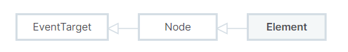
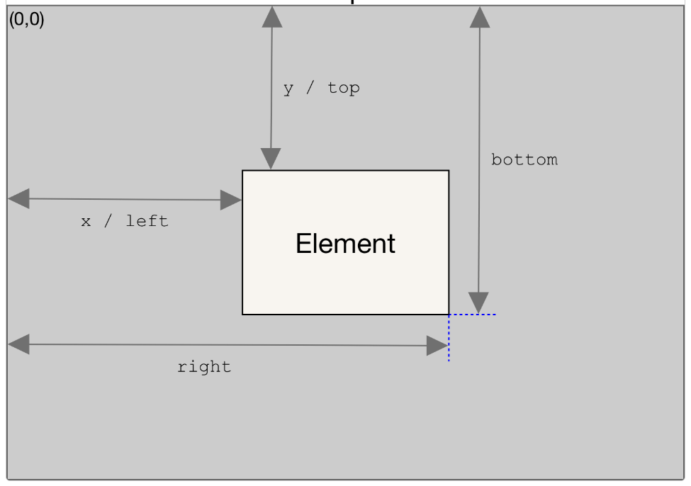
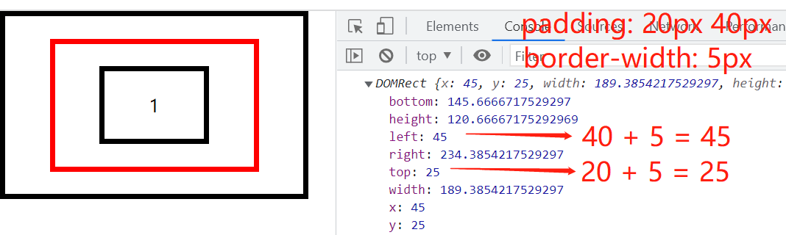
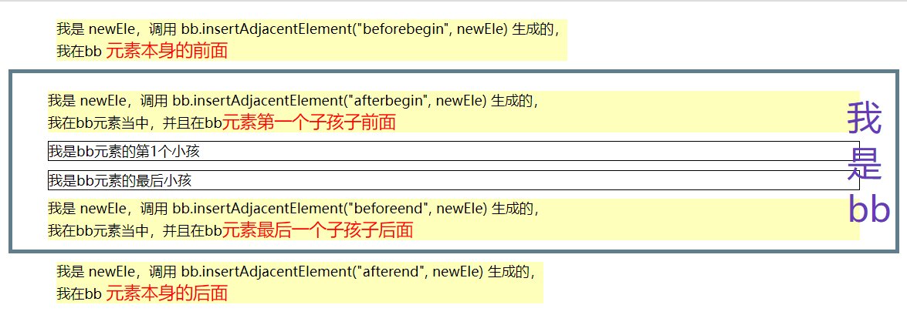

# [Element](https://developer.mozilla.org/zh-CN/docs/Web/API/Element)

Element 是一个通用性非常强的基类，所有 Document 对象下的对象都继承自它。这个接口描述了所有相同种类的元素所普遍具有的方法和属性。一些接口继承自 Element 并且增加了一些额外功能的接口描述了具体的行为。例如， HTMLElement 接口是所有 HTML 元素的基本接口，而 SVGElement 接口是所有 SVG 元素的基础。



**属性：** 所有属性继承自它的祖先接口 [Node](/js/document.html#node)

## attributes 属性相关

### `Element.attributes`

返回一个与该元素相关的所有属性集合:

```html
<div data-age="18" name="lcr" class="flex box"></div>
```

```js
var attributes = document.querySelector(".flex").attributes;

attributes["data-age"]; // data-age="18"
attributes[0]; // data-age="18"

attributes.name; // name="lcr"
attributes[1]; // name="lcr"
```

### `Element.className`

```html
<div data-age="18" name="lcr" class="flex box"></div>
```

```js
var className = document.querySelector(".flex").className;
console.log(className); // 'flex box'
```

### `Element.classList`

只读，返回该元素包含的 class 属性

```html
<div data-age="18" name="lcr" class="flex box"></div>
```

```js
var classList = document.querySelector(".flex").classList;
console.log(classList); // ['flex', 'box']
console.log(classList.value); // 'flex box'
```

### `Element.tagName`

返回一个字符串，其中包含给定元素的标记名称`(例子：DIV, SPAN)`

### `Element.getAttribute()`

getAttribute() 返回元素上一个指定的属性值，不存在返回 null

- 语法： `let attribute = element.getAttribute('id')`

### `Element.getAttributeNames()`

- 语法: `let attributeNames = element.getAttributeNames()`
- 返回: 返回一个 Array, Element 的所有 **属性名称**(例子：`['id', 'class']`)

### `Element.hasAttribute()`

判断元素有没有某个属性 `var hasAttr = Element.hasAttribute('id')`

### `Element.removeAttribute()`

删除元素某个属性 `Element.removeAttribute('id')`

### `Element.setAttribute()`

设置元素某个属性 `Element.setAttribute('id', 'xxx')`

## 元素距离宽高相关

### `Element.clientHeight`

只读，返回 Number 表示内部相对于外层元素的高度。<font color="red">(不包含 border)</font>

### `Element.clientWidth`

只读，返回 Number 表示该元素内部的宽度。<font color="red">(不包含 border)</font>

### `Element.clientLeft`

只读，返回 Number 表示该元素距离它左边界的宽度。<font color="red">(感觉就是 border-left 的宽度)</font>

### `Element.clientTop`

只读，返回 Number 表示该元素距离它上边界的高度。<font color="red">(感觉就是 border-top 的宽度)</font>

### `Element.getBoundingClientRect()`

Element.getBoundingClientRect() 方法返回一个 DOMRect 对象，该对象使用 ` left` ` top` `right` `bottom` `x` `y` `width` 和 `height` 这几个以像素为单位的只读属性描述整个矩形的位置和大小。除了 width 和 height 以外的属性是相对于视图窗口的左上角来计算的。



例子：

```html
<style>
  * {
    padding: 0;
    margin: 0;
  }
  div {
    display: inline-flex;
    border: 5px solid;
    padding: 20px 40px;
  }
  #baba {
    border: 5px solid red;
  }
</style>

<div id="yeye">
  <div id="baba">
    <div id="bb">1</div>
  </div>
</div>

<script>
  var baba = document.getElementById("baba");
  console.log(baba.getBoundingClientRect());
</script>
```



:::tip

1. 对象中的 width 和 height 属性是包含了 padding 和 border-width

:::

## 更新 dom 元素相关

### `Element.innerHTML`

获取 `HTML String` 或者设置元素的后代的 `HTML`

```js
const content = element.innerHTML; // 获取
element.innerHTML = htmlString; // 设置
```

### `Element.outerHTML`

和`innerHTML`的区别，就是包含自身。获取值，包含自身的 `HTML` 文本; 设置时替换自身

### `Element.remove()`

元素在 dom 文档树上删除

### `Element.insertAdjacentElement()`

- 语法: `element.insertAdjacentElement(position, element)`

- element: 要插入到树中的元素。

- position: 表示相对于该元素的位置；必须是以下字符串之一：
  > - `beforebegin`: 在该元素本身的前面。
  > - `afterend`: 在该元素本身的后面。
  > - `afterbegin`:只在该元素当中，在该元素第一个子孩子前面。
  > - `beforeend`:只在该元素当中，在该元素最后一个子孩子后面。



## 事件相关

### `EventTarget.addEventListener()`

[EventTarget.addEventListener](https://developer.mozilla.org/zh-CN/docs/Web/API/EventTarget/addEventListener) 方法将指定的监听器注册到 EventTarget 上，当该对象触发指定的事件时，指定的回调函数就会被执行。

事件目标可以是一个文档上的元素 Element,Document 和 Window 或者任何其他支持事件的对象 (比如 XMLHttpRequest)。

语法：

```js
target.addEventListener(type, listener, options);
target.addEventListener(type, listener, useCapture);
```

- type: 表示监听[事件类型](https://developer.mozilla.org/zh-CN/docs/Web/Events)的字符串。

- listener: 一个实现了 EventListener 接口的对象，或者是一个函数。

- options: 一个指定有关 listener 属性的可选参数对象。可用的选项如下

  > capture: true 表示 事件捕获阶段传播到该 EventTarget 时触发，（默认冒泡）。
  >
  > once: true 表示 listener 会在其被调用之后自动移除。

- useCapture: 默认 false, 事件冒泡传播，由下往上；设置 true，变为由上往下捕获传播

有些复杂，举例说明下：

```html
<style>
  div {
    display: inline-flex;
    border: 5px solid;
    padding: 20px 40px;
  }
</style>

<div id="yeye">
  <div id="baba">
    <div id="bb"></div>
  </div>
</div>

<script>
  let yeye = document.getElementById("yeye");
  let baba = document.getElementById("baba");
  let bb = document.getElementById("bb");

  // 爷爷冒泡
  yeye.addEventListener("click", (e) => console.log("爷爷"), false);

  // 爸爸是捕获
  baba.addEventListener("click", (e) => console.log("爸爸"), true);

  // 宝宝冒泡
  bb.addEventListener("click", (e) => console.log("宝宝"), false);

  /*
    场景1：点击宝宝
    结果： 依次打印 '爸爸' '宝宝' '爷爷'

    场景2：宝宝添加 e.stopPropagation() ，点击宝宝
    结果： 依次打印 '爸爸' '宝宝'

    场景3：爸爸添加 e.stopPropagation() ，点击宝宝
    结果： 依次打印 '爸爸'

    其他场景就不说了，不懂不适合编程
  */
</script>
```

### `EventTarget.removeEventListener()`

删除监听事件，注意监听函数不能是内联函数

```js
let yeye = document.getElementById("yeye");
let listener = (e) => console.log("爷爷");
yeye.addEventListener("click", listener, false);
yeye.removeEventListener(listener);
```

## 查询 dom 元素相关

### `Element.closest()`

匹配特定选择器且离当前元素最近的祖先元素（也可以是当前元素本身）。如果匹配不到，则返回 null。

- 语法 `var closestElement = targetElement.closest(selectors);`
- 参数 `p:hover, .toto + q`

### `getElementsByClassName()`

- [语法](https://developer.mozilla.org/zh-CN/docs/Web/API/Document/getElementsByClassName): `document.getElementsByClassName(names)` 或者 `element.getElementsByClassName(names)`
- 返回: 实时集合 HTMLCollection<font color="red">（可以自动更新自己来保持和 DOM 树的同步）</font>
- 参数: names 是一个字符串，表示要匹配的类名列表

```js
var elements = document.getElementsByClassName("className");
// or
var rootElement = document.getElementById("#id");
var elements = rootElement.getElementsByClassName("className");
```

### `Element.getElementsByTagName()`

- 语法: `document.getElementsByTagName(name)` 或者 `element.getElementsByTagName(name)`
- 返回: 实时集合 HTMLCollection <font color="red">（可以自动更新自己来保持和 DOM 树的同步）</font>
- 参数: name 是一个代表元素的名称的字符串。特殊字符 "\*" 代表了所有元素

```js
var elements = document.getElementsByTagName("div");
// or
var div1 = document.getElementById("div1");
var div1Paras = div1.getElementsByTagName("p");
```

::: danger
最新的 W3C 规范 说明这些元素是 HTMLCollection（HTML 集合）； 然而这个方法在 WebKit 内核的浏览器中返回一个 NodeList
:::

### `Element.querySelector()`

- 语法: `document.querySelector(selectors)` 或者 `element.querySelector(selectors)`
- 返回: 方法返回匹配的第一个 Element 对象，找不到返回 null。
- 参数: 包含一个或多个要匹配的选择器的 DOM 字符串

```js
// id选择器 属性选择器 类选择器
document.querySelector("#id"); // [name="down"]  .class

// Element 元素上使用
var elements = document.getElementsByTagName("div");
elements.querySelector('[name="down"]');
```

### `Element.querySelectorAll()`

- 语法: `document.querySelectorAll(selectors)` 或者 `element.querySelectorAll(selectors)`
- 返回: 静态 NodeList 集合<font color="red">（不能保持 DOM 树的同步）</font>
- 参数: 包含一个或多个要匹配的选择器的 DOM 字符串

```js
// 返回文档中所有<div>元素的列表，其中 class 包含"note"或"alert"
var matches = document.querySelectorAll("div.note, div.alert");

// 返回文档中属性名为"data-src"的iframe元素列表：
var matches = document.querySelectorAll("iframe[data-src]");

// 返回 ID 为"userlist"的列表中包含值为"1"的"data-active"属性的元素
var container = document.querySelector("#userlist");
var matches = container.querySelectorAll("li[data-active='1']");
```

## 滚动相关

### `Element.scrollHeight`

只读，返回类型为： Number，表示元素的滚动视图高度。

### `Element.scrollWidth`

只读，返回类型为： Number，表示元素的滚动视图宽度。

### `Element.scrollTop`

读取或设置元素滚动条到元素上边的距离

### `Element.scrollLeft`

读取或设置元素滚动条到元素左边的距离

### `Element.scroll()`

### `Element.scrollBy()`

### `Element.scrollIntoView()`

- 语法： `childrenElement.scrollIntoView()`
- 作用： `childElement` 元素调用 `scrollIntoView()` 滚动条就会滚动到`childElement`那

:::tip
如果有 2 条滚动条，例如： childElement 爸爸是 `overflow: auto`, body 也是 `overflow: auto`，并且他们同时产生滚动条，那么 `scrollIntoView` 也能定位到
:::

### `Element.scrollTo()`
