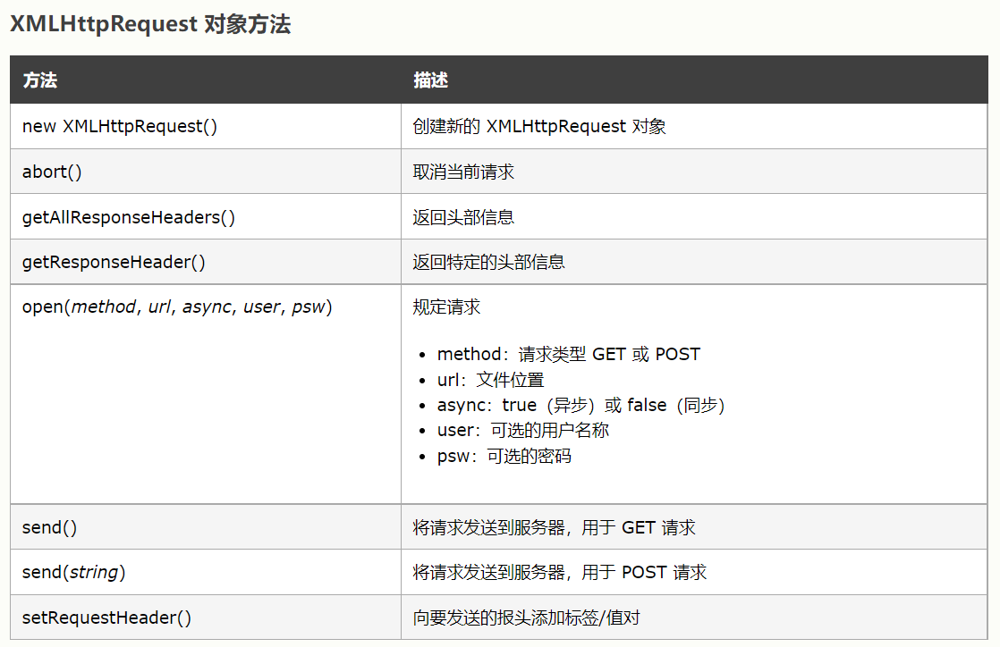
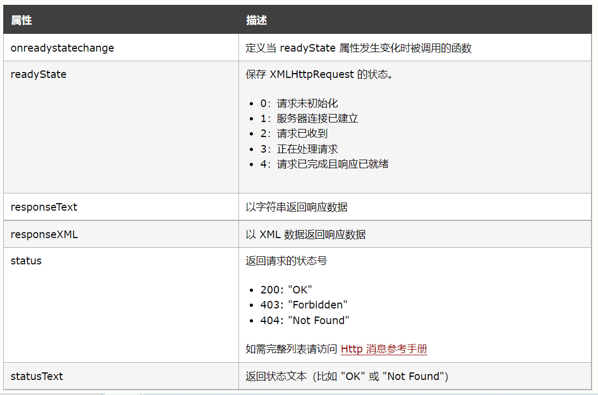

# 原生 js 请求

<https://www.w3school.com.cn/js/js_ajax_intro.asp>

## XMLHttpRequest

Ajax 的核心是 XMLHttpRequest 对象

### 对象方法

- `new XMLHttpRequest()` 创建新的 `XMLHttpRequest` 对象
- `abort()` 取消当前请求
- `getAllResponseHeaders()` 返回头部信息
- `getResponseHeader()` 返回特定的头部信息
- `open(method, url, async, user, psw)`
- `send()` 将请求发送到服务器，用于 GET 请求
- `send(string)` 将请求发送到服务器，用于 POST 请求
- `setRequestHeader()` 向要发送的报头添加标签/值对



### 对象属性

- `onreadystatechange` 定义当 readyState 属性发生变化时被调用的函数
- `readyState` 保存 XMLHttpRequest 的状态。
- `responseText` 以字符串返回响应数据
- `responseXML` 以 XML 数据返回响应数据
- `status` 返回请求的状态号
- `statusText` 返回状态文本（比如 "OK" 或 "Not Found"）



### get 请求

```js
//步骤一:创建异步对象
var ajax = new XMLHttpRequest();

//步骤二:设置请求的url, 异步请求
ajax.open("get", "xxx/xx?starName=美女", true);

//步骤三:发送请求
ajax.send();

//步骤四:注册事件 onreadystatechange 状态改变就会调用
ajax.onreadystatechange = function () {
  if (ajax.readyState == 4 && ajax.status == 200) {
    // 输入相应的内容
    console.log(ajax.responseText);
  }
};
```

### post 请求

```js
var xhr = new XMLHttpRequest();

// 设置请求头
xhr.setRequestHeader("Content-type", "application/x-www-form-urlencoded");

xhr.open("post", "xxx/xx", true);

//发送请求
xhr.send("name=fox&age=18");

xhr.onreadystatechange = function () {
  if (xhr.readyState == 4 && xhr.status == 200) {
    console.log(xhr.responseText);
  }
};
```

## Fetch

<https://developer.mozilla.org/en-US/docs/Web/API/Fetch_API>

<https://developer.mozilla.org/zh-CN/docs/Web/API/Fetch_API>

基本使用：

```js
fetch("http://example.com/movies.json")
  .then((response) => response.json())
  .then((data) => console.log(data));
```

### post 请求

```js
fetch("https://example.com/profile", {
  method: "POST",
  body: JSON.stringify({ username: "example" }),
  headers: { "Content-Type": "application/json" },
})
  .then((res) => res.json())
  .then((data) => console.log("Success:", data))
  .catch((error) => console.error("Error:", error));
```

### 上传文件

```js
const formData = new FormData();
const fileField = document.querySelector('input[type="file"]');
formData.append("username", "abc123");
formData.append("avatar", fileField.files[0]);

fetch("https://example.com/profile/avatar", {
  method: "PUT",
  body: formData,
})
  .then((res) => res.json())
  .then((result) => console.log("Success:", result))
  .catch((error) => console.error("Error:", error));
```
