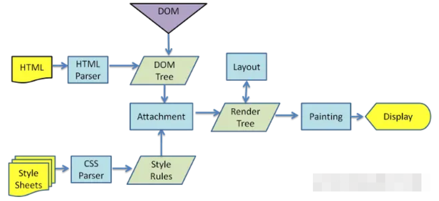

# css html

常见的 css html 面试题

## css 盒模型介绍

1. 盒子模型由 content + padding + border + margin 构成
2. 标准盒模型宽高只包含 content
3. IE（替代）盒模型宽高：content + padding + border

## HTML 语义化

增加代码可读性, 有助于 SEO 优化, 爬虫抓取更多的有效信息，爬虫依赖于标签来确定上下文和各个关键字的权重

## script 中 defer 和 async

1. script：会阻碍 HTML 解析，只有下载好并执行完脚本才会继续解析 HTML
2. async script：解析 HTML 过程中进行脚本的异步下载，下载成功立马执行
3. defer script：完全不会阻碍 HTML 的解析，解析完成之后再按照顺序执行脚本
4. type 为'module'，浏览器会异步加载，等同于 defer。

```html
<script src="./a.js" defer async></script>
<script src="./b.js" defer></script>
<script src="./c.js" type="module"></script>
<script type="module">
  import "./a.js";
</script>
```

## 重排 reflow 重绘 repaint



### 浏览器渲染过程

1. 解析 HTML，生成 DOM 树，解析 CSS，生成 CSSOM 树
2. 将 DOM 树和 CSSOM 树结合，生成渲染树(Render Tree)
3. Layout(回流):根据生成的渲染树，进行回流，得到节点的几何信息（位置，大小）
4. Painting(重绘):根据渲染树以及回流得到的几何信息，得到节点的绝对像素
5. Display:将像素发送给 GPU，展示在页面上。

### 构建渲染树 (渲染树只包含可见的节点):

1. Dom 树开始遍历每个可见节点
2. 对于每个可见的节点，找到 CSSOM 树中对应的规则，并应用它们
3. 根据每个可见节点以及其对应的样式，组合生成渲染树

备注: display: none 不可见; script、meta、link 不可见; visibility 和 opacity 可见

### 回流

当页面布局和几何信息发生变化的时候，就需要回流, 回流将重新构造渲染树，将可见 DOM 节点以及它对应的样式结合起来，需要计算它们在设备视口(viewport)内的确切位置和大小，下面条件将会触发回流:

1. 添加 , 删除可见的 DOM 元素
2. 元素的位置 , 内容 , 尺寸(高/宽/边框/边距等)发生变化
3. 页面一开始渲染的时候
4. 浏览器的窗口尺寸变化（因为回流是根据视口的大小来计算）

**回流一定会触发重绘，而重绘不一定会回流**

### 重绘

通过构造渲染树和回流阶段, 知道了哪些节点是可见的, 以及可见节点的样式和具体的几何信息(位置、大小), 将渲染树的每个节点都转换为屏幕上的实际像素，叫重绘节点

- 如何优化

1. 减少它的发生次数

   - 修改样式使用 class，尽量少于 style
   - 使用 cssTest

2. 批量修改 DOM

   - 隐藏元素，应用修改，重新显示
   - 用文档片段(document fragment)在当前 DOM 之外构建一个子树，再把它拷贝回文档
   - 将原始元素拷贝到一个脱离文档的节点中，修改节点后，再替换原始的元素

参考文档：
<https://juejin.cn/post/6844903779700047885>

## 水平垂直居中实现方式

1. 父 relative;子 absolute, left 和 top 50%, transform: translate(-50%, -50%)

```css
.f {
  position: relative;
}
.c {
  position: absolute;
  left: 50%;
  top: 50%;
  transform: translate(-50%, -50%);
}
```

2. 父 relative;子元素所有方向都为 0,将 margin 设置为 auto,该方法必须盒子有宽高

```css
.f {
  position: relative;
}
.c {
  position: absolute;
  top: 0;
  left: 0;
  right: 0;
  bottom: 0;
  margin: auto;
  height: 100px;
  width: 100px;
}
```

3. 使用 flex

```css
.f {
  display: flex;
  justify-content: center;
  align-items: center;
}
```
