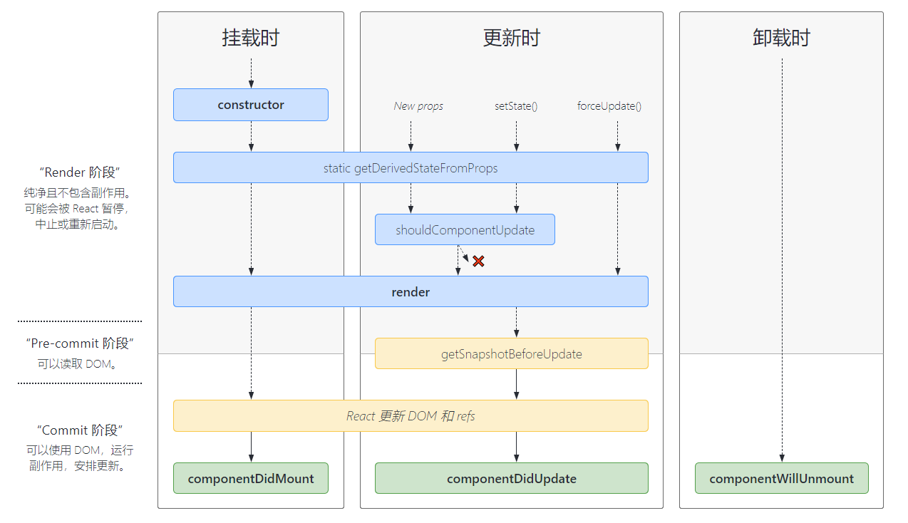
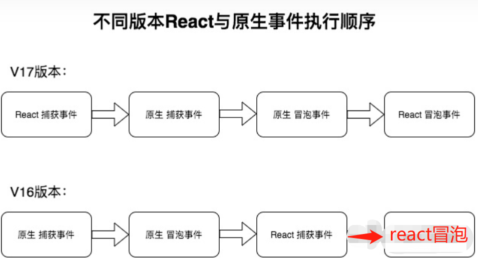

# react

react 面试常见面试题

## react 生命周期



### render

render 是 class 组件中唯一必须实现的方法, render() 函数应该为纯函数，意味着在不修改组件 state 的情况下，每次调用时都返回相同的结果，并且它不会直接与浏览器交互

### constructor

react 组件挂载之前，会调用它的构造函数, 构造函数仅用于以下两种情况：

1. 通过给 this.state 赋值对象来初始化内部 state。
2. 为事件处理函数绑定实例
3. 不要调用 setState() 方法。直接使用 this.state = xxx

### componentDidMount

1. componentDidMount 会在组件挂载后（插入 DOM 树中）立即调用
2. 依赖于 DOM 节点的初始化应该放在这里。如需通过网络请求获取数据
3. 这个方法是比较适合添加订阅的地方。如果添加了订阅，请不要忘记在 componentWillUnmount() 里取消订阅

### componentDidUpdate

构造签名: componentDidUpdate(prevProps, prevState, snapshot)
 会在更新后会被立即调用。首次渲染不会执行此方法,
 可调用 setState()，但必须被包裹在一个条件语句里，否则会导致死循环
 如果组件实现了 getSnapshotBeforeUpdate() 生命周期，则它的返回值将作为 componentDidUpdate() 的第三个参数 “snapshot” 参数传递

### componentWillunmount

1. 在组件销毁之前调用,
2. 清除定时器, 清除事件绑定, 取消网络请求,清除订阅等都在 componentWillUnmount 进行

### shouldComponentUpdate

**构造签名 shouldComponentUpdate(nextProps, nextState)**

1. 组件更新时,会触发该方法,首次渲染或者 forceUpdate 时不会触发
2. 根据 shouldComponentUpdate 返回值(true, false),可以决定组件是否更新,默认更新(true), 返回 false 不会触发 render,componentDidUpdate 钩子, 但并不会阻止子组件在 state 更改时重新渲染。

### getSnapshotBeforeUpdate

**构造签名: getSnapshotBeforeUpdate(prevProps, prevState)**

1. 在 render 后,更新 dom 前触发, 可让组件在 dom 变化之前,获取信息(滚动位置)
2. 此生命周期方法的任何返回值将作为参数传递给 componentDidUpdate()
3. 例子: 往数组添加 item, 现在 componentDidUpdate 获取当前的滚动位置, 更新完成后, 更新当前滚动位置, 使得不会将旧的 item 推出视图

### static getDerivedStateFromProps

**构造签名: static getDerivedStateFromProps(props, state)**

1. render 方法之前调用，并且在初始挂载及后续更新时都会被调用
2. 它应返回一个对象来更新 state，如果返回 null 则不更新任何内容
3. 无权访问组件实例

## React 废弃了哪些生命周期？为什么

1. componentWillMount
2. componentWillUpdate
3. componentWillReceiveProps

被废弃的三个函数都是在 render 之前执行，因为 fiber 的出现, 很可能因为高优先级任务的出现而打断现有任务导致它们会被执行多次。

**下面是代替品**

**1. UNSAFE_componentWillMount()**

它在 render() 之前调用，因此在此方法中同步调用 setState() 不会触发额外渲染。通常，我们建议使用 constructor() 来初始化 state

**2. UNSAFE_componentWillReceiveProps(nextProps)**

只有组件接收新的 props 之前才被调用,父组件导致组件重新渲染，即使 props 没有更改，也会调用此方法（挂载前不会调用, this.setState 不会调用）

**3. UNSAFE_componentWillUpdate()**

初始渲染不会调用此方法, 组件收到新的 props 或 state 时，会在渲染之前调用 UNSAFE_componentWillUpdate()

参考文档:

<https://projects.wojtekmaj.pl/react-lifecycle-methods-diagram/>

<https://zh-hans.reactjs.org/docs/react-component.html#reference>

## react 事件机制

**React16 事件机制**

将 所有 click 事件绑定到 document 处监听了所有的事件，当事件发生并且冒泡到 document 处的时候，React 将事件内容封装并交由真正的处理函数运行。

问题 1：
<font color="red">
如果页面上有多个 React 版本，他们都将在顶层注册事件处理器。这会破坏 e.stopPropagation():如果嵌套树结构中阻止了事件冒泡，但外部树依然能接收到它。这会使不同版本 React 嵌套变得困难重重。</font>

问题 2： <font color="red">
尽量避免原生事件与合成事件混用，如果原生事件阻止冒泡，可能会导致合成事件不执行，因为需要冒泡到 document 上合成事件才会执行。</font>

**React17 事件机制**

将事件处理器附加到渲染 React 树的根 DOM 容器中，React 17 将会在底层调用 rootNode.addEventListener()



### React 的事件和原生事件有什么区别

1. 命名方式不同，原生事件为全小写，react 采用小驼峰
2. 对于事件函数处理语法，原生事件为字符串，react 事件为函数
3. react 事件不能采用 return false 的方式来阻止浏览器的默认行为，而必须要地明确地调用 preventDefault()来阻止默认行为

### react 合成事件好处

1. 兼容所有浏览器，更好的跨平台
2. 将事件统一存放在一个数组，避免频繁的新增与删除,提升性能
3. 使用事件代理,可以动态添加事件

#### 参考文档:

<https://zh-hans.reactjs.org/blog/2020/08/10/react-v17-rc.html>

## 函数组件和类组件有什么区别

1. 编程思想不同，类组件是基于面向对象方式编程，需要新建实例；函数组件不需要插件实例，是基于函数式编程的思想
2. 类组件需要创建实例，需要占用内存空间，函数组件不需要
3. 类组件可以定义状态，有生命周期钩子函数，函数组件再 16.8 版本之前是没有状态和钩子函数，有 hooks 之后，就可以有类似的 hooks 实现
4. 类组件通过高阶组件，render props 实现代码复用，函数组件使用 hooks 实现类似的功能
5. 类组件通过 shouldComponentUpdate 和 PureComponent 跳过更新，函数组件通过 React.meno 跳过更新

## HOC、Render props、hooks 的区别

- HOC（高阶组件）

> HOC 是 React 中用于复用组件逻辑的一种高级技巧。HOC 自身不是 React API 的一部分，它是一种基于 React 的组合特性而形成的设计模式。具体而言，高阶组件是参数为组件，返回值为新组件的函数

- render props

> 是指父组件传递一个函数给子组件,子组件调用函数,可以传递参数,生成需要的组件的技术

- Hook

> React 16.8 的新增特性。它可以让你在不编写 class 的情况下使用 state 以及其他的 React 特性。通过自定义 hook，可以复用代码逻辑。

**总结**

Hoc、render props 和 hook 都是为了解决代码复用的问题，但是 hoc 和 render props 都有特定的使用场景和明显的缺点(props 覆盖; 地狱嵌套)。hook 是 react16.8 更新的新的 API，让组件逻辑复用更简洁明了，同时也解决了 hoc 和 render props 的一些缺点。

## redux 与 mobx 的区别

1. redux 将数据保存在单一的 store 中，mobx 将数据保存在分散的多个 store 中
2. redux 使用不可变状态，不能直接去修改它，而是应该返回一个新的状态，同时使用纯函数；mobx 中的状态是可变的，可以直接对其进行修改
3. mobx 更多的使用面向对象的编程思维；redux 是函数式编程思想，掌握起来不是那么容易，同时需要借助一系列的中间件来处理异步和副作用

## Fiber 的理解

React V15 在渲染时，会递归比对 VirtualDOM 树，找出需要变动的节点，然后同步更新它们， 一气呵成。这个过程 React 称为 Reconcilation(中文可以译为协调)。这个过程期间， React 会占据浏览器资源，这会导致用户触发的事件得不到响应，并且**会导致掉帧，导致用户感觉到卡顿**

React-fiber 就是解决上面问题, 原理是不能让一个程序长期霸占着资源, 通过某些调度策略合理地分配 CPU 资源，从而提高浏览器的用户响应速率, 同时兼顾任务执行效率。React 通过 Fiber 架构，让自己的 Reconcilation 过程变成可被中断。 这样的好处:

1. 可以让浏览器及时地响应用户的交互
2. 与其一次性操作大量 DOM 节点相比, 分批延时对 DOM 进行操作，可以得到更好的用户体验
3. 给浏览器一点喘息的机会，他会对代码进行编译优化及进行热代码优化，或者对 reflow 进行修正

## 什么是 react 的协调

定义：某一时间节点调用 React 的 render() 方法，会创建一棵由 React 元素组成的树, 在下一次 state 或 props 更新时，相同的 render() 方法会返回一棵不同的树。React 需要基于这两棵树之间的差别来判断如何高效的更新 UI，以保证当前 UI 与最新的树保持同步。

#### Diffing 算法的基于以下原则

2. 不会跨层比较
1. 不同类型的元素时，React 会拆卸原有的树并且建立起新的树
1. 对比两个相同类型的 React 元素时，React 会保留 DOM 节点，仅比对及更新有改变的属性

## PureComponent、React.meno 原理

#### PureComponent

其实就是重写 shouldComponentUpdate 方法，对前后的父组件属性 props、前后本地状态 state 进行浅比较判断是否更新；

#### React.meno

是用在函数组件跳过更新的，只有 props 不变，函数组件就不会更新，对比方式也是浅比较前后的 props

## 什么是受控组件和非控组件

#### 受控组件

简单来讲，就是受我们控制的组件，组件的状态全程响应外部数据；

#### 非受控组件

简单来讲，就是不受我们控制的组件，一般情况是在初始化的时候接受外部数据，然后自己在内部存储其自身状态，当需要时，可使用 ref 获取当前值

## state props 区别

#### 相同点

props 和 state 都是 JavaScript 对象。它们都是用来保存信息的，这些信息可以控制组件的渲染输出

#### 不同点

props 是传递给组件的,子组件不能修改，而 state 是在组件内被组件自己管理的

## setState 是同步还是异步

**有时表现出异步,有时表现出同步**

1. setState 只在合成事件和钩子函数中是“异步”的，在原生事件和 setTimeout 中都是同步的。

2. setState 的“异步”并不是说内部由异步代码实现，本身执行的过程是同步的，只是合成事件和钩子函数的调用顺序在更新之前，导致在合成事件和钩子函数中没法立马拿到更新后的值，形成了所谓的“异步”; 当然可以通过第二个参数 setState(partialState, callback) 中的 callback 拿到更新后的结果。

3. 合成事件、钩子函数中，setState 的批量更新优化也是“异步”的，在“异步”中如果对同一个值进行多次 setState，setState 的批量更新策略会对其进行覆盖，取最后一次的执行，如果是同时 setState 多个不同的值，在更新时会对其进行合并批量更新。<font color="red">（在原生事件和 setTimeout 中不会批量更新）</font>

## 组件通讯

1. 父子通讯:
   > - 父组件通过 props 向子组件传数据;
   > - 子组件通过 props 接受父组件传递的函数,调用函数进行通讯
2. 孙子通讯:
   > - 使用 props 一层一层传递
   > - 使用 context
3. 兄弟通讯:
   > - 以父组件作为媒介, 通过 props 传递给各个子组件
4. 陌生人通讯:
   > - eventbus 发布订阅模式
   > - 使用第三方库进行全局数据管理(redux, mbox)

## useEffect 与 useLayoutEffect 区别

- 相同点

  > useEffect 与 useLayoutEffect 两者都是用于处理副作用，这些副作用包括改变 DOM、设置订阅、操作定时器等。在函数组件内部操作副作用是不被允许的，所以需要使用这两个函数去处理。使用方式也是一模一样

- 不同点

1. 使用场景：

   > useEffect 在渲染过程是异步调用的，用于大多数的场景。useLayoutEffect 会在所有的 DOM 变更之后同步调用，主要用于处理 DOM 操作、调整样式、避免页面闪烁等问题。也正因为是同步，要避免在 useLayoutEffect 做计算量较大的耗时任务从而造成阻塞

2. 执行时机
   > useLayoutEffect 总是比 useEffect 先执行。useEffect 是改变屏幕像素之后执行（先渲染，后改变 DOM）当改变屏幕内容，可能会产生闪烁,相反 useLayoutEffect 是改变屏幕像素之前就执行了（先改变 DOM 后渲染）不会闪烁

## hooks 出现是解决什么问题

hooks 是解决以下问题:

1. 组件之间很难复用状态逻辑
   > 之前逻辑复用是通过 render props 和高阶组件,但这写方案需要重新组织你的组件结构,让代码难以理解. Hook 使你在无需修改组件结构的情况下复用状态逻辑,使得组件复用逻辑很便捷
2. 复杂的组件变得难以理解
   > 生命周期函数与业务逻辑耦合太深，导致关联部分难以拆分；另外，组件销毁时又需要清除一些副作用，定时器，dom 事件等。完成不相关的代码组合在一起，很容易出现 bug，代码也难以维护。Hook 可以将组件中相互关联的部分，拆分成更小的函数，而非按照生命周期划分，这样更合理
3. 类组件的 this 问题难以理解
   > React 主张函数式编程，类组件是面向对象编程。函数编程方便单元测试，节省内存，逻辑更容易复用。Hook 使你在非 class 的情况下可以使用更多的 React 特性

## hooks 需要注意什么

1. 不要在循环语句,条件语句调用 hooks
2. 不要在类组件调用 hook

**为什么**

因为 Hooks 的设计是基于链表实现，在调用时按顺序加入数组中，如果使用循环、条件或嵌套函数很有可能导致数组取值错位，执行错误的 Hook。为了避免这样的情况，可以引入 ESLint 的 Hooks 检查插件进行预防

## React 错误处理

react16 引用了错误边界新的概念。错误边界是一种 React 组件，这种组件可以捕获发生在其子组件树任何位置的 JavaScript 错误，并打印这些错误，同时展示降级 UI，而并不会渲染那些发生崩溃的子组件树

> 错误边界在渲染期间、生命周期方法和整个组件树的构造函数中捕获错误

> 形成错误边界组件的两个条件：1. 使用了 static getDerivedStateFromError()； 2. 使用了 componentDidCatch()

对于无法捕获的错误(事件处理,异步代码,服务器渲染…)可以使用使用 js 的 try...catch...语法, 还可以使用 window 监听 onerror 事件

## Jsx 转化真实 dom 过程

1. 使用 React.createElement 或 JSX 编写 React 组件，实际上所有的 JSX 代码最后都会转换成 React.createElement(...) ，Babel 帮助我们完成了这个转换的过程。

2. createElement 函数对 key 和 ref 等特殊的 props 进行处理，并获取 defaultProps 对默认 props 进行赋值，并且对传入的孩子节点进行处理，最终构造成一个虚拟 DOM 对象

3. ReactDOM.render 将生成好的虚拟 DOM 渲染到指定容器上，其中采用了批处理、事务等机制并且对特定浏览器进行了性能优化，最终转换为真实 DOM

## React 懒加载

通过 import()、React.lazy 和 Suspense 共同一起实现了 React 的懒加载, 也就是我们常说了运行时动态加载, React.lazy 函数，它配合 webpack 的 Code Splitting ，做到只有当组件被加载，对应的资源才会导入 ，从而达到懒加载的效果

```javascript
import React, { Suspense } from "react";
const OtherComponent = React.lazy(() => import("./OtherComponent"));
function MyComponent() {
  return (
    <div>
      <Suspense fallback={<div>Loading...</div>}>
        <OtherComponent />
      </Suspense>
    </div>
  );
}
```

## React 的性能优化的方法

1. 减少不必要的嵌套, 例如高阶组件, render props;
2. 对于大量数据,使用虚拟列表;
3. 惰性加载,例如 Tab 组件,一开始没有必要将所有 panel 都渲染,而是等到被激活才渲染;同样的例子还有树形选择器, 下拉列表, 折叠组件等
4. 使用 PureComponent、React.meno,减少组件的重复渲染
5. 路由懒加载
