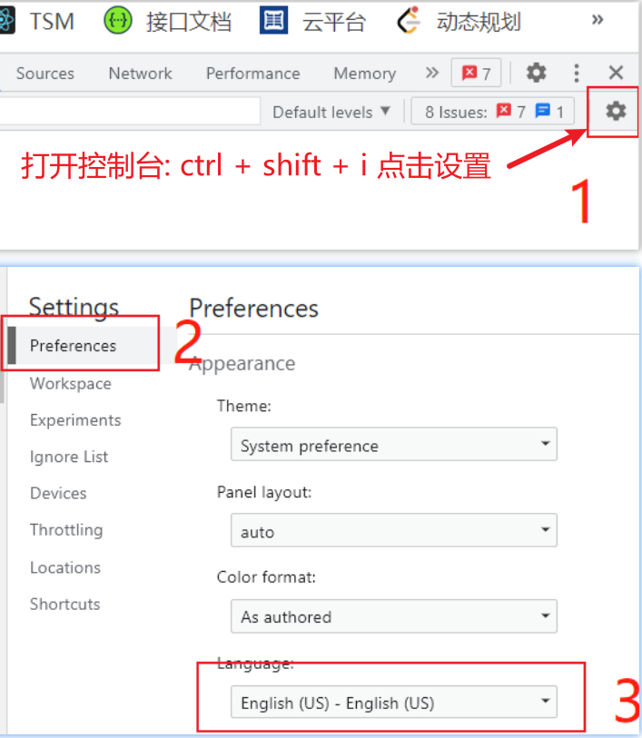

# 常见问题

下面列出开发过程中遇到的一些问题，但和前端开发无关系的

## 浏览器按下 F5 刷新不了

_同时按下 Fn + Esc_


## window 删除文件

一些文件夹，如果下面很多文件，桌面上是很难删除的，这时候可以使用终端命令删除：

```
rd /s/q node_modules
```

在某个文件夹，快速打开终端：


## json 转 ts

在线地址： <https://ujuwu.com/#/json2ts>

代码实现：

1. 安装： `npm install json2ts -D`

2. 当前目录，打开 cmd

3. 新建文件夹：`mkdir mock`

4. 新建入口文件 `index.js`

```js
const fs = require("fs");
const json2ts = require("json2ts");

const mock_path = "./mock";
const interface_path = "./interface-type";

// 将 mock 文件夹下面的所有json数据， 转化为ts类型，放到 interface-type文件夹下
function mockToTs() {
  fs.readdir(mock_path, function (err, files) {
    files.forEach((name) => {
      const mockPath = `${mock_path}/${name}`;
      fs.readFile(mockPath, { encoding: "utf-8" }, (err, data) => {
        const formatData = JSON.stringify(JSON.parse(data), null, 2);
        fs.writeFile(mockPath, formatData, () => {});
        const interfaceString = json2ts.convert(formatData);
        const tsPath = `${interface_path}/${name.replace("json", "ts")}`;
        fs.writeFile(tsPath, interfaceString, () =>
          console.log("写入ts成功:", tsPath)
        );
      });
    });
  });
}
mockToTs();
```

5. 运行 `node index.js`


## 图片转为 base64

<https://c.runoob.com/front-end/59/>

## 导入 xlsx 转 json

1. `yarn add xlsx`

2. 项目代码

```js
import * as XLSX from "xlsx";

const uploadChange = (uploadFile) => {
  // 通过FileReader对象读取文件
  const fileReader = new FileReader();

  // readAsArrayBuffer之后才会启动onload事件
  fileReader.onload = (event) => {
    const data = new Unit8Array(event.target.result);
    const { SheetNames, Sheets } = XLSX.read(data, { type: "array" });

    // 这里只取第一个sheet
    const workSheets = Sheets[SheetsNames[0]];
    const sheetRows = XLSX.utils.sheet_to_json(workSheets);

    console.log('转换的excel: 'sheetRows);
  };

  // uploadFile是上传文件的文件流
  fileReader.readAsArrayBuffer(uploadFile);
};
```

## chrome 浏览器打开控制台很慢

按照如下设置即可



## 创建固定比例的图片

蓝湖: <https://mastergo.com/file/70946820792614>

1. 新建: 按住键盘 `a`, 然后拖拉鼠标, 或者选择右侧的模板;

2. 直接复制图片到区域中, 按住 `shift` 对图片进行等比例缩小, 右侧区域可以通过输入具体数值,进行编辑;

## sass pass lass

下面以通过 MeEdu 开源系统搭建网校平台的例子说明三者关系:

### lass

搭建网校平台, 需要将源码署到服务器上才能访问, 服务器可以单独买，但成本高，维护会麻烦; 更方便的方式是去云服务平台租一台，租的这个服务器包括什么？包括服务器、存储设备、网络设备这些基础设施, 这种租硬件设备的服务就是 Iass，Infrastructure-as-a-Service(基础设施即服务); 把服务器存储设备和网络这些当做服务卖给客户，例如平时自己做个网站说我租个服务器，其实就是购买的 Iass 服务

### Pass

回到网校系统设计上，就以视频线上点播功能的实现为例, 除了基本的系统框架外，需要考虑课程视频上传哪里？视频如何转码？视频如何加密？视频能否倍速播放？这么多问题和需求都需要自己解决吗？不用！大厂的云平台都提供了媒体服务，只需要调用媒体服务的接口，就能实现以上的功能，而这个服务就是 Pass，全称 Platform as a service 平台级服务。Pass 就是提供了一套接口来满足开发人员直接实现某些功能，再比如线上售卖课程，支付功能少不了。这样的话就可以调用第三方的支付系统来实现支付功能，第三方的支付系统也是一个 Pass 服务。

### sass

不同于 MeEdu 私有化部署模式，市场上有很多通过云部署多租户的系统服务，每年通过收取租金，让客户通过访问租用第三方云系统，这样服务模式就是 Saas。全称 Software as a service(软件即服务)。像大家用的一些云笔记云记账，还有企业用的一些云财务软软件，云办公软件或者是理发店饭店用的一些云会员管理系统，这些都是 Saas 服务或者叫 Saas 系统。

**总结:**

1. 把软件当作服务，就是 Saas。
2. 把工具或者框架当做服务，让开发人员调接口就能使用的话，就是 Pass
3. 把服务器和网络还有存储设备这种基础设施当作服务，就是 Iass
