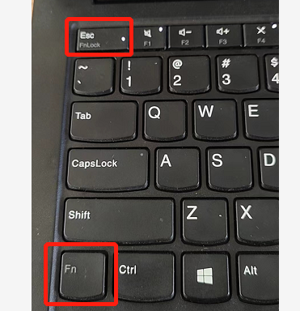
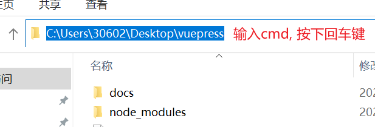
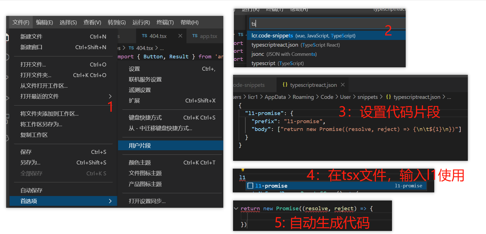

# 常见问题

下面列出开发过程中遇到的一些问题，但和前端开发无关系的

## vscode 不能使用 rm-rf 删除文件夹

- 方法 1

全局安装:

```
npm install rimraf –g
```

执行命令:

```
rimraf node_modules
```

- 方法 2

当前安装：

```
npm install rimraf –D
```

package.json 添加：

```
"scripts": {
  "rm": :rimraf node_modules"
}
```

执行命令:

```
npm run rm
```

## 浏览器按下 F5 刷新不了

_同时按下 Fn + Esc_



## window 删除文件

一些文件夹，如果下面很多文件，桌面上是很难删除的，这时候可以使用终端命令删除：

```
rd /s/q node_modules
```

在某个文件夹，快速打开终端：



## vscode 看不到远程分支

执行：

```
git remote update origin --prune
```

## vscode 不能使用 cnpm

1、打开 vs code（以管理员身份运行）

2、在终端执行：get-ExecutionPolicy，显示 Restricted（表示状态是禁止的）

3、在终端执行：set-ExecutionPolicy RemoteSigned

4、在终端执行：get-ExecutionPolicy，显示 RemoteSigned

## vscode 设置代码片段



## 在线 json 转 ts

在线地址： <https://ujuwu.com/#/json2ts>
