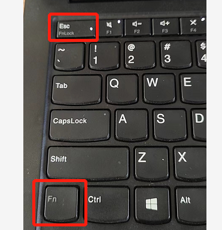
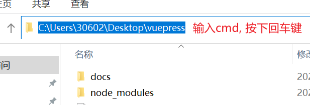
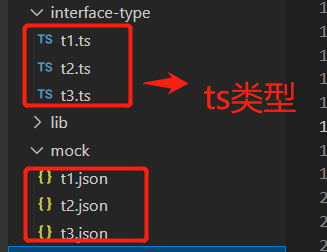
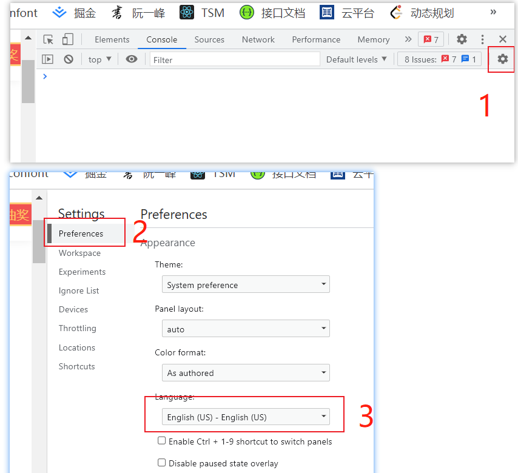
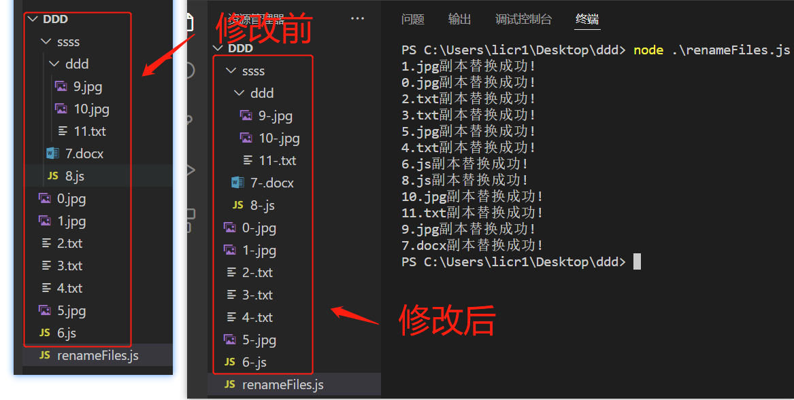

# 常见问题

下面列出开发过程中遇到的一些问题，但和前端开发无关系的

## 浏览器按下 F5 刷新不了

_同时按下 Fn + Esc_



## window 删除文件

一些文件夹，如果下面很多文件，桌面上是很难删除的，这时候可以使用终端命令删除：

```
rd /s/q node_modules
```

在某个文件夹，快速打开终端：



## json 转 ts

在线地址： <https://ujuwu.com/#/json2ts>

代码实现：

1. 安装： `npm install json2ts -D`

2. 当前目录，打开 cmd

3. 新建文件夹：`mkdir mock`

4. 新建入口文件 `index.js`

```js
const fs = require("fs");
const json2ts = require("json2ts");

const mock_path = "./mock";
const interface_path = "./interface-type";

// 将 mock 文件夹下面的所有json数据， 转化为ts类型，放到 interface-type文件夹下
function mockToTs() {
  fs.readdir(mock_path, function (err, files) {
    files.forEach((name) => {
      const mockPath = `${mock_path}/${name}`;
      fs.readFile(mockPath, { encoding: "utf-8" }, (err, data) => {
        const formatData = JSON.stringify(JSON.parse(data), null, 2);
        fs.writeFile(mockPath, formatData, () => {});
        const interfaceString = json2ts.convert(formatData);
        const tsPath = `${interface_path}/${name.replace("json", "ts")}`;
        fs.writeFile(tsPath, interfaceString, () =>
          console.log("写入ts成功:", tsPath)
        );
      });
    });
  });
}
mockToTs();
```

5. 运行 `node index.js`



## 图片转为 base64

<https://c.runoob.com/front-end/59/>

## 导入 xlsx 转 json

1. `yarn add xlsx`

2. 项目代码

```js
import * as XLSX from "xlsx";

const uploadChange = (uploadFile) => {
  // 通过FileReader对象读取文件
  const fileReader = new FileReader();

  // readAsArrayBuffer之后才会启动onload事件
  fileReader.onload = (event) => {
    const data = new Unit8Array(event.target.result);
    const { SheetNames, Sheets } = XLSX.read(data, { type: "array" });

    // 这里只取第一个sheet
    const workSheets = Sheets[SheetsNames[0]];
    const sheetRows = XLSX.utils.sheet_to_json(workSheets);

    console.log('转换的excel: 'sheetRows);
  };

  // uploadFile是上传文件的文件流
  fileReader.readAsArrayBuffer(uploadFile);
};
```

## chrome 浏览器打开控制台很慢

按照如下设置即可



## node 修改文件名称

renameFiles.js：

```javascript
let fs = require("fs");

var path = "./";

// 替换名称的方法
let index = 0;
function replaceName(oldName) {
  return oldName + "-";
}

function rename(filePath) {
  fs.readdir(filePath, (_, files) => {
    files.forEach((filename) => {
      if (filename === "renameFiles.js") return;
      var oldPath = filePath + filename;
      let fsStats = fs.statSync(oldPath);
      if (fsStats.isFile()) {
        const suffixIndex = filename.lastIndexOf(".");
        const oldName = filename.slice(0, suffixIndex);
        const suffix = filename.slice(suffixIndex, filename.length);
        const newName = replaceName(oldName);
        let newPath = filePath + newName + suffix;
        fs.rename(oldPath, newPath, (err) => {
          if (!err) return console.log(filename + "副本替换成功!");
        });
      } else if (fsStats.isDirectory()) {
        rename(oldPath + "/");
      }
    });
  });
}

rename(path);
```


