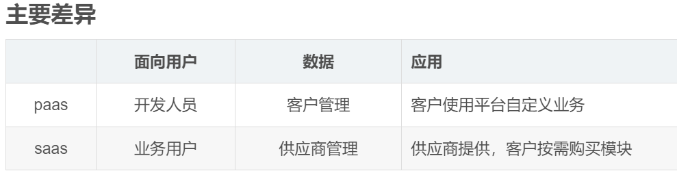

# 常见问题

下面列出开发过程中遇到的一些问题，但和前端开发无关系的

## 浏览器按下 F5 刷新不了

_同时按下 Fn + Esc_


## window 删除文件

一些文件夹，如果下面很多文件，桌面上是很难删除的，这时候可以使用终端命令删除：

```
rd /s/q node_modules
```

在某个文件夹，快速打开终端：


## json 转 ts

在线地址： <https://ujuwu.com/#/json2ts>

代码实现：

1. 安装： `npm install json2ts -D`

2. 当前目录，打开 cmd

3. 新建文件夹：`mkdir mock`

4. 新建入口文件 `index.js`

```js
const fs = require("fs");
const json2ts = require("json2ts");

const mock_path = "./mock";
const interface_path = "./interface-type";

// 将 mock 文件夹下面的所有json数据， 转化为ts类型，放到 interface-type文件夹下
function mockToTs() {
  fs.readdir(mock_path, function (err, files) {
    files.forEach((name) => {
      const mockPath = `${mock_path}/${name}`;
      fs.readFile(mockPath, { encoding: "utf-8" }, (err, data) => {
        const formatData = JSON.stringify(JSON.parse(data), null, 2);
        fs.writeFile(mockPath, formatData, () => {});
        const interfaceString = json2ts.convert(formatData);
        const tsPath = `${interface_path}/${name.replace("json", "ts")}`;
        fs.writeFile(tsPath, interfaceString, () =>
          console.log("写入ts成功:", tsPath)
        );
      });
    });
  });
}
mockToTs();
```

5. 运行 `node index.js`


## 图片转为 base64

<https://c.runoob.com/front-end/59/>

## 导入 xlsx 转 json

1. `yarn add xlsx`

2. 项目代码

```js
import * as XLSX from "xlsx";

const uploadChange = (uploadFile) => {
  // 通过FileReader对象读取文件
  const fileReader = new FileReader();

  // readAsArrayBuffer之后才会启动onload事件
  fileReader.onload = (event) => {
    const data = new Unit8Array(event.target.result);
    const { SheetNames, Sheets } = XLSX.read(data, { type: "array" });

    // 这里只取第一个sheet
    const workSheets = Sheets[SheetsNames[0]];
    const sheetRows = XLSX.utils.sheet_to_json(workSheets);

    console.log('转换的excel: 'sheetRows);
  };

  // uploadFile是上传文件的文件流
  fileReader.readAsArrayBuffer(uploadFile);
};
```

## chrome 浏览器打开控制台很慢

按照如下设置即可


## 创建固定比例的图片

蓝湖: <https://mastergo.com/file/70946820792614>

1. 新建: 按住键盘 `a`, 然后拖拉鼠标, 或者选择右侧的模板;

2. 直接复制图片到区域中, 按住 `shift` 对图片进行等比例缩小, 右侧区域可以通过输入具体数值,进行编辑;

## sass pass lass



### lass

基础服务，包含硬件服务器、存储设备和网络设备等。可以理解为房屋所占用的土地；土地可以用来种地、盖房等，提供一种基础服务。

## pass

PaaS: platform-as-a-service.平台即服务。提供一个基础平台，用户基础此基础平台开发、运行和管理自己的应用，而无需构件和维护与自身业务流程无关的基础架构或平台。

## SaaS

SaaS: software-as-a-service, 软件即服务。用户通过网络连接到云端，使用由供应商提供的云端应用服务。SaaS 提供完整的软件解决方案，让用户可以按需购买，随用随附。所有的基础数据、应用软件、用户资料皆在供应商方存储。
