# css

## less

<https://less.bootcss.com/>

安装：

```
npm install less -g
npm install less@2.7.1 -g
npm i less --save-dev
```

命令行用法:

```
lessc [option option=parameter ...] <source> [destination]
```

将 bootstrap.less 编译为 bootstrap.css

```
lessc bootstrap.less bootstrap.css
```

### 变量（Variables）

```css
@width: 10px;
@height: @width + 10px;
#header {
  width: @width;
  height: @height;
}
```

### 混合（Mixins）

```css
.bordered {
  border-top: dotted 1px black;
  border-bottom: solid 2px black;
}

.post {
  color: red;
  .bordered();
}
```

### 嵌套（Nesting）

```css
/* & 表示当前选择器的父级 */
.clearfix {
  display: block;
  zoom: 1;
  &:after {
    content: " ";
    display: block;
    font-size: 0;
    height: 0;
    clear: both;
    visibility: hidden;
  }
}
```

## sass

<https://www.sass.hk/docs/>

Sass 是一款强化 CSS 的辅助工具，它在 CSS 语法的基础上增加了变量 (variables)、嵌套 (nested rules)、混合 (mixins)、导入 (inline imports) 等高级功能，这些拓展令 CSS 更加强大与优雅。Sass 有两种语法格式:

1. scss (Sassy CSS) 这种格式仅在 CSS3 语法的基础上进行拓展，所有 CSS3 语法在 SCSS 中都是通用的，同时加入 Sass 的特色功能, 这种格式以 .scss 作为拓展名

2. sass 缩进格式 (Indented Sass) 通常简称 "Sass"，是一种简化格式。它使用 “缩进” 代替 “花括号” 表示属性属于某个选择器，用 “换行” 代替 “分号” 分隔属性, 这种格式以 .sass 作为拓展名

```js
// 在命令行中运行 Sass：
sass input.scss output.css

// 监视单个 Sass 文件，每次修改并保存时自动编译：
sass --watch input.scss:output.css

// 监视整个文件夹：
sass --watch app/sass:public/stylesheets
```

### 父选择器

用 & 代表嵌套规则外层的父选择器:

```css
a {
  font-weight: bold;
  &:hover {
    text-decoration: underline;
  }
  body.firefox & {
    font-weight: normal;
  }
}

/* 编译为 */
a {
  font-weight: bold;
}
a:hover {
  text-decoration: underline;
}
body.firefox a {
  font-weight: normal;
}
```

& 必须作为选择器的第一个字符，其后可以跟随后缀生成复合的选择器，例如

```css
#main {
  &-sidebar {
    border: 1px solid;
  }
}

/* 编译为 */
#main-sidebar {
  border: 1px solid;
}
```

### 变量 $

变量以美元符号开头，赋值方法与 CSS 属性的写法一样, 变量支持块级作用域，嵌套规则内定义的变量只能在嵌套规则内使用（局部变量），不在嵌套规则内定义的变量则可在任何地方使用（全局变量）

```css
$width: 5em;

#main {
  width: $width;
}
```

**将局部变量转换为全局变量可以添加 !global 声明：**

```css
#main {
  /* 局部变量，添加 !global 后变为全局变量 */
  $width: 5em !global;

  width: $width;
}

#sidebar {
  width: $width;
}
```

### 数据类型

- 字符串 (Strings)
  SassScript 支持 CSS 的两种字符串类型：有引号字符串 (quoted strings)，如 "Lucida Grande" ；与无引号字符串 (unquoted strings)，如 sans-serif bold，在编译 CSS 文件时不会改变其类型。只有一种情况例外，使用 #{} (interpolation) 时，有引号字符串将被编译为无引号字符串，这样便于在 mixin 中引用选择器名：

```css
@mixin firefox-message($selector) {
  body.firefox #{$selector}:before {
    content: "Hi, Firefox users!";
  }
}
@include firefox-message(".header");
```

## flex 布局

下面说容器上（display: flex 那个元素）；项目，就是子元素

下面的文档只列举常见的使用方式

### 容器属性 flex-direction 方向

它可能有 4 个值:

- row（默认值）：主轴为水平方向，起点在左端。
- row-reverse：主轴为水平方向，起点在右端。
- column：主轴为垂直方向，起点在上沿。
- column-reverse：主轴为垂直方向，起点在下沿。

```css
.box {
  display: flex;
  flex-direction: column;
}
```

### 容器属性 flex-wrap 换行

默认情况下，项目都排在一条线（又称”轴线”）上。flex-wrap 属性定义，如果一条轴线排不下，如何换行。

- nowrap（默认）：不换行
- wrap：换行，第一行在上方

```css
.box {
  display: flex;
  flex-wrap: wrap;
}
```

### 容器属性 flex-flow

flex-flow 属性是 flex-direction 属性和 flex-wrap 属性的简写形式，默认值为 row nowrap。

```css
.box {
  display: flex;
  /* flex-direction: row; flex-wrap: wrap; */
  flex-flow: row wrap;
}

.box {
  display: flex;
  /* flex-direction: initial; flex-wrap: wrap; */
  flex-flow: wrap;
}
```

### 容器属性 justify-content

justify-content 属性定义了项目在主轴上的对齐方式:

- flex-start（默认值）：左对齐
- flex-end：右对齐
- center： 居中
- space-between：两端对齐，项目之间的间隔都相等
- space-around：每个项目两侧的间隔相等

```css
.box {
  display: flex;
  justify-content: flex-start | flex-end | center | space-between | space-around;
}
```

### 容器属性 align-items

- align-items 属性定义项目在交叉轴上如何对齐:
- flex-start：交叉轴的起点对齐。
- flex-end：交叉轴的终点对齐。
- center：交叉轴的中点对齐。
- baseline: 项目的第一行文字的基线对齐。
- stretch（默认值）：如果项目未设置高度或设为 auto，将占满整个容器的高度。

### 容器属性 align-content

align-content 属性定义了多根轴线的对齐方式。如果项目只有一根轴线，该属性不起作用，一般配合 `flex-wrap: wrap` 使用

- stretch（默认值）：轴线占满整个交叉轴。
- flex-start：与交叉轴的起点对齐。
- flex-end：与交叉轴的终点对齐。
- center：与交叉轴的中点对齐。
- space-between：与交叉轴两端对齐，轴线之间的间隔平均分布。
- space-around：每根轴线两侧的间隔都相等。所以，轴线之间的间隔比轴线与边框的间隔大一倍。

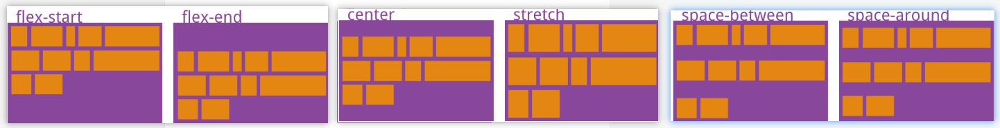

```css
.box {
  display: flex;
  flex-wrap: wrap;
  align-content: flex-start;
}
```

### 项目属性 flex-grow

flex-grow 属性定义项目的放大比例，默认为 0，即如果存在剩余空间，也不放大；一般铺满剩余空间，常见就是 `flex-grow: 1`

```css
.box-item {
  flex-grow: 1;
}
```

- 如果所有项目的 flex-grow 属性都为 1，则它们将等分剩余空间。
- 如果一个项目的 flex-grow 属性为 2，其他项目都为 1，则前者占据的剩余空间将比其他项多一倍。

### 项目属性 flex-shrink

flex-shrink 属性定义了项目的缩小比例，默认为 1，即如果空间不足，该项目将缩小。一般设置 `flex-shrink: 0` 来阻止缩放

```css
.box-item {
  flex-shrink: 0;
}
```

### 项目属性 flex

flex 属性是 `flex-grow`, `flex-shrink` 和 `flex-basis` 的简写，默认值为 `0 1 auto`。后两个属性可选。

### 项目属性 align-self

align-self 属性允许单个项目有与其他项目不一样的对齐方式，可覆盖 align-items 属性。默认值为 auto，表示继承父元素的 align-items 属性，如果没有父元素，则等同于 stretch。

```css
.item {
  align-self: auto | flex-start | flex-end | center | baseline | stretch;
}
```

### 项目属性 flex-basis

flex-basis 属性定义了在分配多余空间之前，项目占据的主轴空间（main size）。浏览器根据这个属性，计算主轴是否有多余空间。它的默认值为 auto，即项目的本来大小， 它可以设为跟 width 或 height 属性一样的值（比如 350px），则项目将占据固定空间。

比较少用到

## 选择器

### 基本选择器

- \* 通用元素选择器，匹配任何元素
- E 标签选择器，匹配所有使用 E 标签的元素
- .info class 选择器，匹配所有 class 属性中包含 info 的元素
- #footer id 选择器，匹配所有 id 属性等于 footer 的元素

### 组合选择器

#### `E, F`

多元素选择器: 同时匹配所有 E 元素或 F 元素，E 和 F 之间用逗号分隔

#### `E F`

后代元素选择器: 匹配所有属于 E 元素后代的 F 元素，E 和 F 之间用空格分隔

#### `E > F`

子元素选择器: 子元素选择器，匹配所有 E 元素的子元素 F

#### `E + F`

相邻元素选择器: 相邻元素选择器，匹配所有紧随 E 元素之后的同级元素 F

#### `E ~ F`

同级元素通用选择器: 匹配任何在 E 元素之后的同级 F 元素

### 属性选择器

#### `E[att]`

匹配所有具有 att 属性的 E 元素，不考虑它的值。
注意：E 在此处可以省略，比如"[cheacked]"。以下同。）

#### `E[att=val]`

匹配所有 att 属性等于"val"的 E 元素

#### `E[att~=val]`

匹配所有 att 属性具有多个空格分隔的值、其中一个值等于"val"的 E 元素

#### `E[att|=val]`

匹配所有 att 属性具有多个连字号分隔（hyphen-separated）的值、其中一个值以"val"开头的 E 元素，主要用于 lang 属性，比如"en"、"en-us"、"en-gb"等等

#### `E[att^="val"]`

属性 att 的值以"val"开头的元素

#### `E[att$="val"]`

属性 att 的值以"val"结尾的元素

#### `E[att*="val"]`

属性 att 的值包含"val"字符串的元素

```css
p[title] {
  color: #f00;
}

div[class="error"] {
  color: #f00;
}

td[headers~="col1"] {
  color: #f00;
}

p[lang|="en"] {
  color: #f00;
}

blockquote[class="quote"][cite] {
  color: #f00;
}
```

### 伪元素选择器

#### `E:first-line`

匹配 E 元素的第一行

#### `E:first-letter`

匹配 E 元素的第一个字母

#### `E:before`

在 E 元素之前插入生成的内容

#### `E:after`

在 E 元素之后插入生成的内容

#### `E:enabled`

匹配表单中激活的元素

#### `E:disabled`

匹配表单中禁用的元素

#### `E:checked`

匹配表单中被选中的 radio（单选框）或 checkbox（复选框）元素

#### `E::selection`

匹配用户当前选中的元素

#### `E:root`

匹配文档的根元素，对于 HTML 文档，就是 HTML 元素

#### `E:nth-child(n)`

匹配其父元素的第 n 个子元素，第一个编号为 1

#### `E:nth-last-child(n)`

匹配其父元素的倒数第 n 个子元素，第一个编号为 1

#### `E:nth-of-type(n)`

与:nth-child()作用类似，但是仅匹配使用同种标签的元素

#### `E:nth-last-of-type(n)`

与:nth-last-child() 作用类似，但是仅匹配使用同种标签的元素

#### `E:last-child`

匹配父元素的最后一个子元素，等同于:nth-last-child(1)

#### `E:first-of-type`

匹配父元素下使用同种标签的第一个子元素，等同于:nth-of-type(1)

#### `E:last-of-type`

匹配父元素下使用同种标签的最后一个子元素，等同于:nth-last-of-type(1)

#### `E:only-child`

匹配父元素下仅有的一个子元素，等同于:first-child:last-child 或 :nth-child(1):nth-last-child(1)

#### `E:only-of-type`

匹配父元素下使用同种标签的唯一一个子元素，等同于:first-of-type:last-of-type 或 :nth-of-type(1):nth-last-of-type(1)

#### `E:empty`

匹配一个不包含任何子元素的元素，注意，文本节点也被看作子元素
序号 选择器 含义

#### `E:not(s)`

匹配不符合当前选择器的任何元素

```css
input[type="text"]:disabled {
  background: #ddd;
}

p:nth-child(3) {
  color: #f00;
}

p:nth-child(odd) {
  color: #f00;
}

p:nth-child(even) {
  color: #f00;
}

p:nth-child(3n + 0) {
  color: #f00;
}

p:nth-child(3n) {
  color: #f00;
}

tr:nth-child(2n + 11) {
  background: #ff0;
}

tr:nth-last-child(2) {
  background: #ff0;
}

p:last-child {
  background: #ff0;
}

p:only-child {
  background: #ff0;
}

p:empty {
  background: #ff0;
}

:not(p) {
  border: 1px solid #ccc;
}
```

## transition 过渡

如需创建过渡效果，必须明确两件事：

1. 添加效果的 CSS 属性
2. 效果的持续时间

api:

- transition 简写属性，用于将四个过渡属性设置为单一属性
- transition-delay 规定过渡效果的延迟（以秒计）
- transition-duration 规定过渡效果要持续多少秒或毫秒
- transition-property 规定过渡效果所针对的 CSS 属性的名称(`all`代表全部)
- transition-timing-function 规定过渡效果的速度曲线

```css
div {
  width: 100px;
  height: 100px;
  background: red;
  transition: width 2s, height 4s;
}
div:hover {
  width: 300px;
}
```

**速度曲线 transition-timing-function**

`transition-timing-function` 属性规定过渡效果的速度曲线。可接受以下值：

- ease - 规定过渡效果，先缓慢地开始，然后加速，然后缓慢地结束（默认）
- linear - 规定从开始到结束具有相同速度的过渡效果
- ease-in -规定缓慢开始的过渡效果
- ease-out - 规定缓慢结束的过渡效果
- ease-in-out - 规定开始和结束较慢的过渡效果
- cubic-bezier(n,n,n,n) - 允许您在三次贝塞尔函数中定义自己的值

## animation 动画

### @keyframes

在 @keyframes 规则中指定了 CSS 样式，动画将在特定时间逐渐从当前样式更改为新样式。
要使动画生效，必须将动画绑定到某个元素。

```css
/* 动画代码1 */
@keyframes example1 {
  from {
    background-color: red;
  }
  to {
    background-color: yellow;
  }
}

/* 动画代码2 */
@keyframes example2 {
  0% {
    background-color: red;
  }
  50% {
    background-color: blue;
  }
  100% {
    background-color: red;
  }
}

/* 使用动画的元素上的样式 */
.animation1 {
  width: 100px;
  height: 100px;
  color: red;
  animation-name: example2;
  animation-duration: 4s;
}
```

### 动画时长 animation-duration

4 秒完成： `animation-duration: 4s`（默认 0s）

### 动画延迟 animation-delay

2 秒的延迟：`animation-delay: 2s`

### 运行次数 animation-iteration-count

3 次： `animation-iteration-count: 3`

### 永远执行 infinite

永远执行：`animation-iteration-count: infinite`

### 反向或交替运行 animation-direction

animation-direction 属性指定是向前播放、向后播放还是交替播放动画。可接受以下值：

- normal - 动画正常播放（向前）。默认值
- reverse - 动画以反方向播放（向后）
- alternate - 动画先向前播放，然后向后
- alternate-reverse - 动画先向后播放，然后向前

### 动画的速度曲线 animation-timing-function

animation-timing-function 属性可接受以下值：

- ease - 指定从慢速开始，然后加快，然后缓慢结束的动画（默认）
- linear - 规定从开始到结束的速度相同的动画
- ease-in - 规定慢速开始的动画
- ease-out - 规定慢速结束的动画
- ease-in-out - 指定开始和结束较慢的动画
- cubic-bezier(n,n,n,n) - 运行您在三次贝塞尔函数中定义自己的值

### animation-fill-mode

CSS 动画不会在第一个关键帧播放之前或在最后一个关键帧播放之后影响元素。animation-fill-mode 属性能够覆盖这种行为。animation-fill-mode 属性可接受以下值：

- none - 默认值。动画在执行之前或之后不会对元素应用任何样式。
- forwards - 元素将保留由最后一个关键帧设置的样式值
- backwards - 元素将获取由第一个关键帧设置的样式值，并在动画延迟期间保留该值。
- both - 动画会同时遵循向前和向后的规则，从而在两个方向上扩展动画属性。

### 动画简写属性

```css
div {
  animation-name: example;
  animation-delay: 2s;
  animation-duration: 5s;
  animation-timing-function: linear;
  animation-iteration-count: infinite;
  animation-direction: alternate;
}

/* 简写 */
div {
  animation: example 5s linear 2s infinite alternate;
}
```

### 例子：loading 加载中

```html

<style>
  .loading {
    width: 40px;
    animation: fadenum 1.5s linear infinite;
  }
  @keyframes fadenum {
    100% {
      transform: rotate(360deg);
    }
  }
</style>
```

## CSS 渐变

CSS 渐变使您可以显示两种或多种指定颜色之间的平滑过渡。CSS 定义了两种渐变类型：

1. 线性渐变（向下/向上/向左/向右/对角线）
2. 径向渐变（由其中心定义）

如需创建线性渐变，您必须定义至少两个色标。色标是您要呈现平滑过渡的颜色。您还可以设置起点和方向（或角度）以及渐变效果。语法：

```css
background-image: linear-gradient(direction, color-stop1, color-stop2, ...);
```

### 从上到下（默认）

```css
#grad {
  background-image: linear-gradient(red, yellow);
}
```

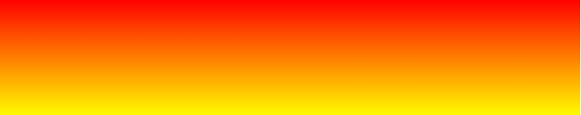

### 从左到右

```css
#grad {
  background-image: linear-gradient(to right, red, yellow);
}
```

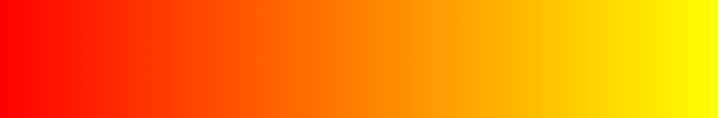

### 对角线

```css
#grad {
  background-image: linear-gradient(to bottom right, #000, yellow);
}
```

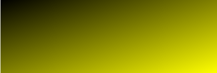

### 使用角度

如果希望对渐变角度做更多的控制，您可以定义一个角度，来取代预定义的方向（向下、向上、向右、向左、向右下等等）。值 `0deg` 等于向上（`to top`）。值 `90deg` 等于向右（`to right`）。值 `180deg` 等于向下（`to bottom`）。

### 透明度

```css
#grad {
  background-image: linear-gradient(
    to right,
    rgba(255, 0, 0, 0),
    rgba(255, 0, 0, 1)
  );
}
```

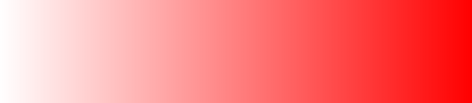

### CSS 径向渐变

径向渐变由其中心定义。如需创建径向渐变，您还必须定义至少两个色标

```css
background-image: radial-gradient(
  shape size at position,
  start-color,
  ...,
  last-color
);
```

默认： shape 为椭圆形，size 为最远角，position 为中心。

例子 1：

```css
#grad {
  background-image: radial-gradient(red, yellow, green);
}
```

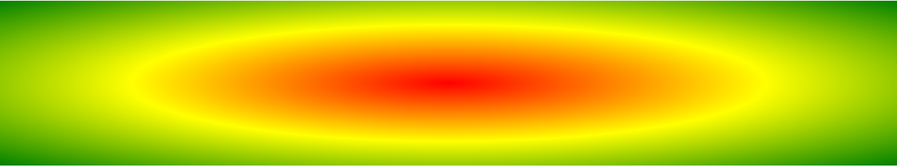

例子 2：

```css
#grad {
  background-image: radial-gradient(red 5%, yellow 15%, green 60%);
}
```


例子 3：

```css
/* shape 参数定义形状。它可接受 circle 或 ellipse 值。默认值为 ellipse（椭圆） */
#grad {
  background-image: radial-gradient(circle, red, yellow, green);
}
```

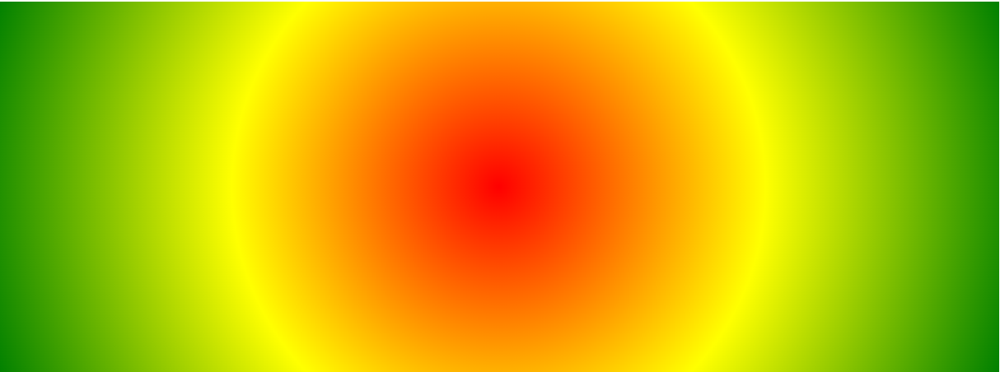

例子 4：

```css
/* repeating-radial-gradient() 函数用于重复径向渐变： */
#grad {
  background-image: repeating-radial-gradient(red, yellow 10%, green 15%);
}
```

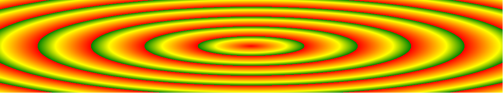

## CSS 阴影效果

### 文字阴影 text-shadow

```css
/* 例子 1： */
h1 {
  text-shadow: 2px 2px;
}

/* 例子 2： */
h1 {
  text-shadow: 2px 2px red;
}

/* 例子 3： */
h1 {
  text-shadow: 2px 2px 5px red;
}

/* 例子 4： */
h1 {
  color: white;
  text-shadow: 2px 2px 4px #000000;
}

/* 例子 5 多个阴影： */
h1 {
  text-shadow: 0 0 3px #ff0000, 0 0 5px #0000ff;
}

/* 例子 6 ： */
h1 {
  color: white;
  text-shadow: 1px 1px 2px black, 0 0 25px blue, 0 0 5px darkblue;
}

/* 例子 7 */
h1 {
  color: yellow;
  text-shadow: -1px 0 black, 0 1px black, 1px 0 black, 0 -1px black;
}
```

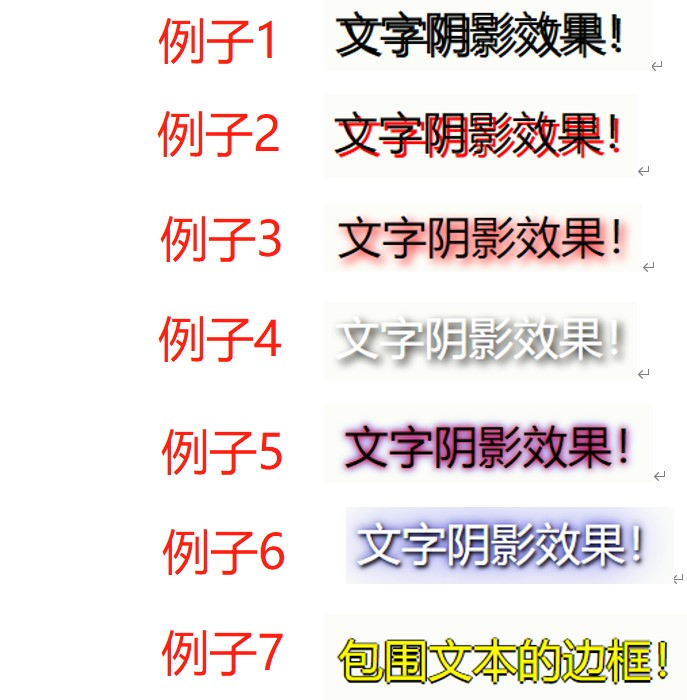

### 边框阴影 box-shadow

```css
/* 例子 1： */
div {
  box-shadow: 10px 10px;
}

/* 例子 2：为阴影添加颜色 */
div {
  box-shadow: 10px 10px grey;
}

/* 例子 3：向阴影添加模糊效果 */
div {
  box-shadow: 10px 10px 5px grey;
}

/* 例子 4：创建纸质卡片效果 */
div.card {
  width: 100px;
  height: 100px;
  box-shadow: 0 4px 8px 0 rgba(0, 0, 0, 0.2), 0 6px 20px 0 rgba(0, 0, 0, 0.19);
}
```

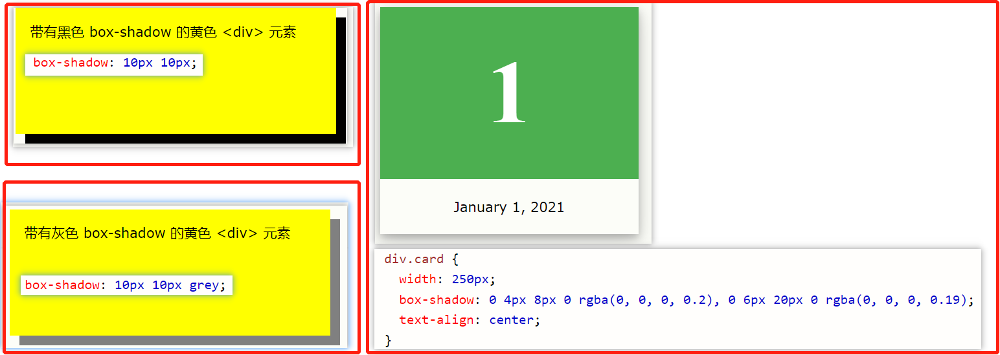

## transform

通过使用 CSS transform 属性，您可以利用以下 2D 转换方法：

- translate()
- rotate()
- scaleX()
- scaleY()
- scale()
- skewX()
- skewY()
- skew()
- matrix()

### 位移 translate

1. `transform: translate(50px, 100px)`
2. `transform: translateX(50px)`
3. `transform: translateY(50px)`

### 旋转 rotate

1. 顺时针旋转 20 度：`transform: rotate(20deg);`
2. 逆时针旋转 20 度：`transform: rotate(-20deg);`

### 缩放 scale

1. 缩小一般：`transform: scale(0.5, 0.5);`
2. 原始宽度的一半: `transform: scaleX(0.5);`
3. 原始高度的一半: `transform: scaleY(0.5);`

### 倾斜 skew

1. X 轴倾斜 20 度: `transform: skewX(20deg);`
2. Y 轴倾斜 20 度: `transform: skewY(20deg);`
3. X 轴倾斜 20 度，同时沿 Y 轴倾斜 10 度：`transform: skew(20deg, 10deg);`

## 媒体查询

<https://www.w3school.com.cn/cssref/pr_mediaquery.asp>

针对不同的媒体使用不同的样式表：

```html
<link
  rel="stylesheet"
  media="screen and (min-width: 900px)"
  href="widescreen.css"
/>
<link
  rel="stylesheet"
  media="screen and (max-width: 600px)"
  href="smallscreen.css"
/>
```

例子：如果视口的宽度为 800 像素或更宽，请使用媒体查询将背景色设置为淡紫色；如果视口的宽度介于 400 至 799 像素之间，则使用媒体查询将背景色设置为浅绿色。如果视口小于 400 像素，则背景色为浅蓝色：

```CSS
body {
  background-color: lightblue;
}

@media screen and (min-width: 400px) {
  body {
    background-color: lightgreen;
  }
}

@media screen and (min-width: 800px) {
  body {
    background-color: lavender;
  }
}
```

## 文本相关

1. 强制文本在一行内显示：white-space: nowrap;
2. 溢出内容为隐藏：overflow：hidden;
3. 溢出省略号：text-overflow：ellipsis;
4. 强制英文单词断行：word-break: break-all;

### word-wrap

`word-wrap: break-word:` 允许单词换行显示：
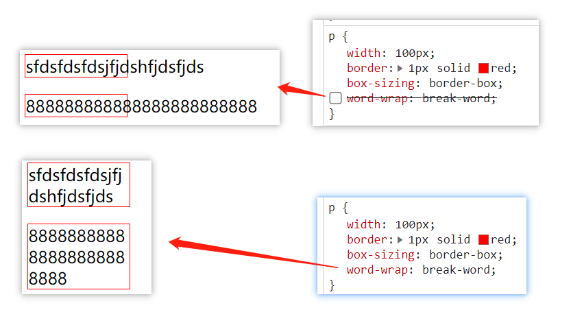

### [word-break](https://www.w3school.com.cn/cssref/pr_word-break.asp)

语法：`word-break: normal|break-all|keep-all;`

- 强制英文单词断行: `word-break: break-all;`(<font color="red">设置 white-space：nowrap 会失效</font>)

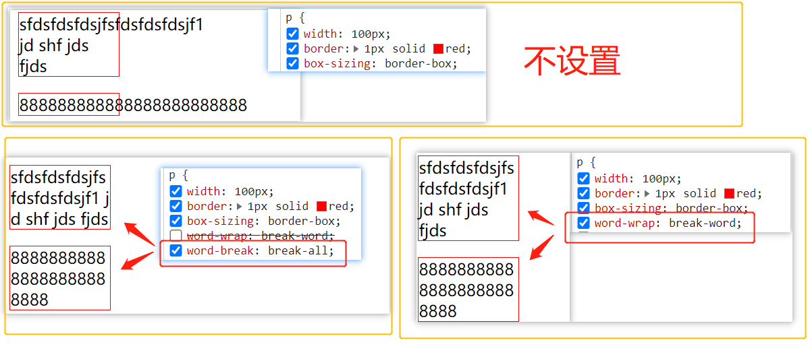

### [white-space](https://www.w3school.com.cn/cssref/pr_text_white-space.asp)

white-space 属性设置如何处理元素内的空白:

- normal 默认。空白会被浏览器忽略。
- nowrap 文本不会换行，文本会在在同一行上继续，直到遇到 \<br\> 标签为止。

### text-overflow

text-overflow 属性规定当文本溢出包含元素时发生的事情。一般配合 `overflow: hidden`， 设置文本溢出`...`显示

- clip 修剪文本。 (默认)
- ellipsis 显示省略符号来代表被修剪的文本。

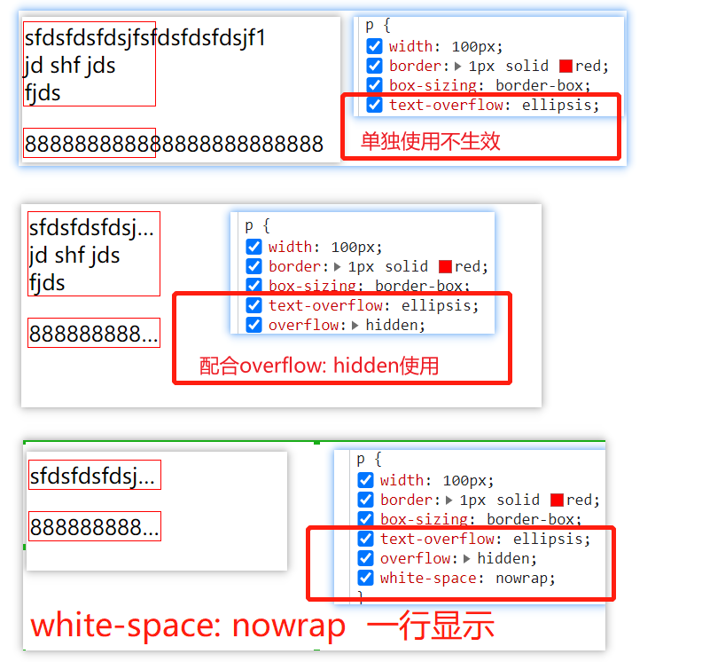

### 文本溢出...

```html
<!-- 非flex布局实现文本溢出...显示 -->
<style>
  .ellipsis {
    width: 60px;
    border: 1px solid;
    overflow: hidden;
    text-overflow: ellipsis;
  }
</style>
<div class="ellipsis">88888888888888888888888888</div>

<!-- flex布局实现文本溢出...显示 -->
<style>
  .p {
    display: flex;
    width: 60px;
  }
  .child {
    flex-grow: 1;
    overflow: hidden;
    text-overflow: ellipsis;
  }
</style>
<div class="p">
  <span class="child">888888888888888888</span>
</div>
```
