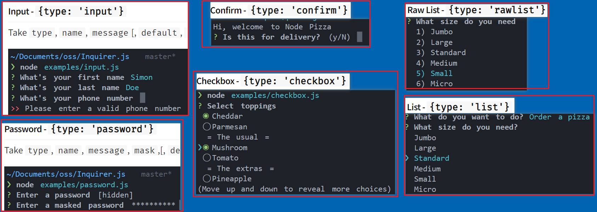

# 工具包

列举一些常见的 nodejs 和浏览器的工具包

npm 官网：<https://www.npmjs.com/>

## nodeJS

### rimraf

nodejs 环境中，删除文件的插件

> <code>npm install rimraf</code>
>
> <https://www.npmjs.com/package/rimraf>

```js
import rimraf from "rimraf";
glob.sync(`dist/**/*`).forEach((path) => rimraf.sync(path));
```

### father-build

编译工具，可以将 ts 代码转化为 js 代码

> <code>npm install father-build</code>
>
> <https://www.npmjs.com/package/father-build>

```js
// .fatherrc.ts
export default [
  {
    target: "node",
    cjs: { type: "babel", lazy: true },
  },
];

// package.json
{
  "scripts": {
    "build": "father-build",
  },
}
```

### commander

> <code>npm install commander</code>
> 完整的 node.js 命令行解决方案
>
> <https://www.npmjs.com/package/commander> >
> <https://github.com/tj/commander.js/blob/HEAD/Readme_zh-CN.md>

```js
const program = require("commander");
// 所有参数指令列表
const mapActions = [
  {
    command: "create",
    alias: "c",
    description: "新建项目",
    examples: ["bb create <project-name>"],
  },
  {
    command: "config",
    alias: "conf",
    description: "配置项目",
    examples: ["bb config set <key> <value>", "bb config get <key>"],
  },
  {
    command: "*",
    description: "command not find",
    examples: [],
  },
];

mapActions.forEach((options) => {
  program
    .command(options.command) // 用户输入
    .alias(options.alias) // 别名
    .description(options.description) // 描述
    .action(() => {
      // 监听输入后的回调函数
      if (options.command === "*") return console.log(options.description);
      // __dirname：当前目录
      const actionPath = path.resolve(__dirname, options.command);
      let action = require(actionPath);
      action(process.argv.slice(3));
    });
});

// 监听help命令
program.on("--help", () => {
  console.log("例子: ");
  mapActions.forEach((options) => {
    if (options.command === "*") return;
    console.log(`  ${options.description}:`);
    options.examples.forEach((example) => console.log(`    ${example}`));
  });
});

// 版本
program.version(version).parse(process.argv);
```

### consolidate

> <code>npm install consolidate</code>
> 集成大部分模板引擎，提供统一的 api
>
> <https://www.npmjs.com/package/consolidate>

```js
const { render } = require("consolidate").handlebars;
content = await render(`{ "name": "{{name}}", age: "11" }`, { age: 11 });
```

### download-git-repo

> <code>npm install download-git-repo</code>
> 用于下载 git 上仓库的代码
>
> <https://www.npmjs.com/package/download-git-repo>

```js
const { promisify } = require("util");
const downloadGitRepo = promisify(require("download-git-repo"));

await downloadGitRepo("github:ImCccc/text-cli", "放置目录");

// 分支
downloadGitRepo(
  "github:ImCccc#my-branch",
  "test/tmp",
  { clone: true },
  function (err) {}
);

// 设置 tonken
downloadGitRepo(
  "gitlab:ImCccc#my-branch",
  "test/tmp",
  { headers: { "PRIVATE-TOKEN": "1234" } },
  function (err) {}
);

// 自定义源代码和协议
download(
  "https://mygitlab.com:flippidippi/download-git-repo-fixture#my-branch",
  "test/tmp",
  { clone: true },
  function (err) {}
);
```

### handlebars

> <code>npm i handlebars</code>
> 这是一个模板引擎
>
> <https://www.npmjs.com/package/handlebars>

### inquirer

> <code>npm i inquirer</code>
> 通用交互式命令行用户界面的集合, 例如创建 package.json 会要求用户输入项目名称，邮箱这写
>
> <https://www.npmjs.com/package/inquirer>

用户选择：

```ts
let { temp } = await inquirer.prompt([
  {
    type: "list",
    name: "temp",
    message: "选择模板:",
    choices: ["后台模板1:lic-test", "后台模板2:lic-test1"],
  },
]);
```

用户输入：

```ts
let answer = await inquirer.prompt([
  {
    type: "input",
    name: "name",
    message: "输入你的名称:",
    default: "默认值",
  },
  {
    type: "input",
    name: "age",
    message: "输入你的年纪:",
    default: "19",
  },
]);
// answer = { name: 'xxx', age: 'xxx' }
```

- **type:** (String) input, number, confirm, list, rawlist, expand, checkbox, password, editor

- **name** :(String) 获取用户输入答案的 key

- **message** :(String|Function)问题描述

- **default** :(String|Number|Boolean|Array|Function)默认值

- **choices** :(Array|Function) 选项列表。如果定义为函数，则第一个参数将是当前查询器会话答案

例子：


### metalsmith

> <code>npm i metalsmith</code>
> 可以获取某个文件夹下面的所有文件的 clone 版本，通过遍历，可以对文件删除，修改，然后复制到某一个目录里
>
> <https://www.npmjs.com/package/metalsmith>

```js
const metalsmith = require("metalsmith");
metalsmith(__dirname)
  .source(downloadAddress) // 源文件目录
  .destination(path.resolve(projectName)) // 处理后的目录
  .use(async (files, metal, done) => {
    const meta = metal.metadata();
    // 传递参数给下一个 use
    Object.assign(meta, { name: 123 });
    done();
  })
  .use((files, metal, done) => {
    // 获取上一个 use 参数
    const data = metal.metadata();

    // 删除文件ask.js
    delete files["ask.js"];

    Reflect.ownKeys(files).forEach(async (file) => {
      // 2进制 toString
      let content = files[file].contents.toString();

      // string to Binary
      files[file].contents = Buffer.from(content);
    });
    done();
  })
  .build((err) => {
    if (err) console.log(err);
  });
```

### ncp

> <code>npm i ncp</code>
> 文件复制插件，可快速将某一个文件夹下所有文件，复制到另一个文件夹下
>
> <https://www.npmjs.com/package/ncp>

```js
// Promise使用
const { promisify } = require("util");
const ncp = promisify(require("ncp"));
await npc("将这里的文件夹下面的所有文件", "拷贝到这里");

// 一般使用
const ncp = require("ncp");
ncp(source, destination, function (err) {});
```

### ora

> <code>npm i ora</code>
> 在命令行显示加载提示
>
> <https://www.npmjs.com/package/ora>

```js
const waitLoading =
  (fn, text) =>
  async (...args) => {
    const spinner = ora(text || "loading...").start();
    try {
      await fn(...args);
      spinner.succeed();
    } catch (error) {
      spinner.fail();
    }
  };
```

### glob

> <code>npm i glob</code>
> 该插件是通过正则匹配获取某一个文件夹下面的所有文件名称,返回数组
>
> <https://www.npmjs.com/package/glob>

```js
var glob = require("glob");
glob("**/*.js", options, function (er, files) {
  // files 数组形式，返回文件名称
});
```

## vue

### element-plus

官网: <https://element-plus.org/zh-CN/#/zh-CN>

### element-ui

文档：<https://element.eleme.cn/#/zh-CN/component/installation>

### vueuse

文档：<https://vueuse.org/functions.html#category=Watch>

git: <https://github.com/vueuse/vueuse>

## react

### umijs

文档: <https://umijs.org/zh-CN/docs>

### ahooks

文档: <https://ahooks.js.org/zh-CN/>

### Antd Design

文档: <https://ant.design/docs/react/getting-started-cn>

### Antd Design Pro

文档: <https://pro.ant.design/zh-CN/docs/overview>
