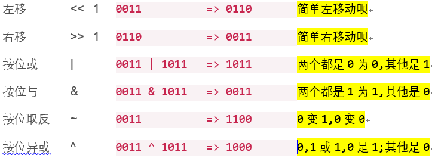
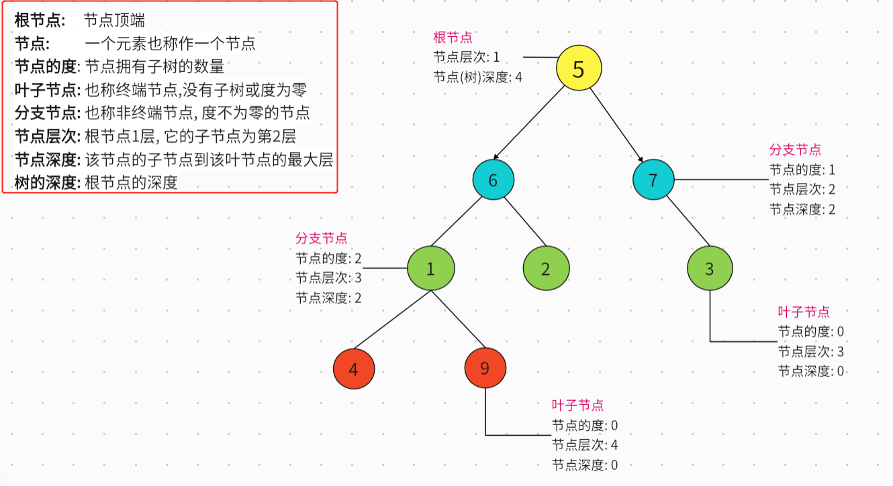
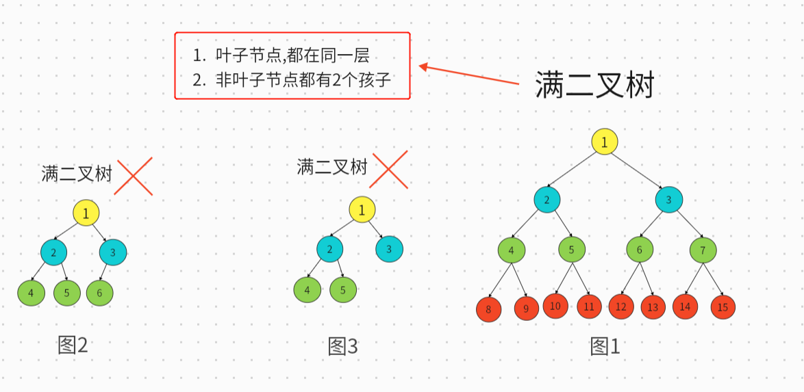
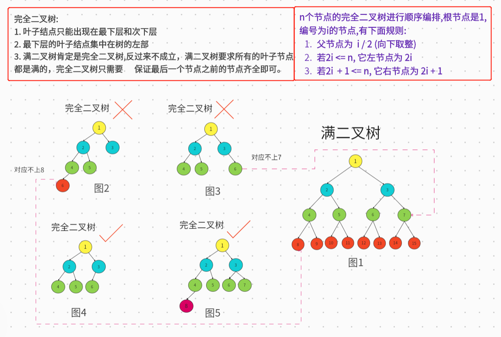
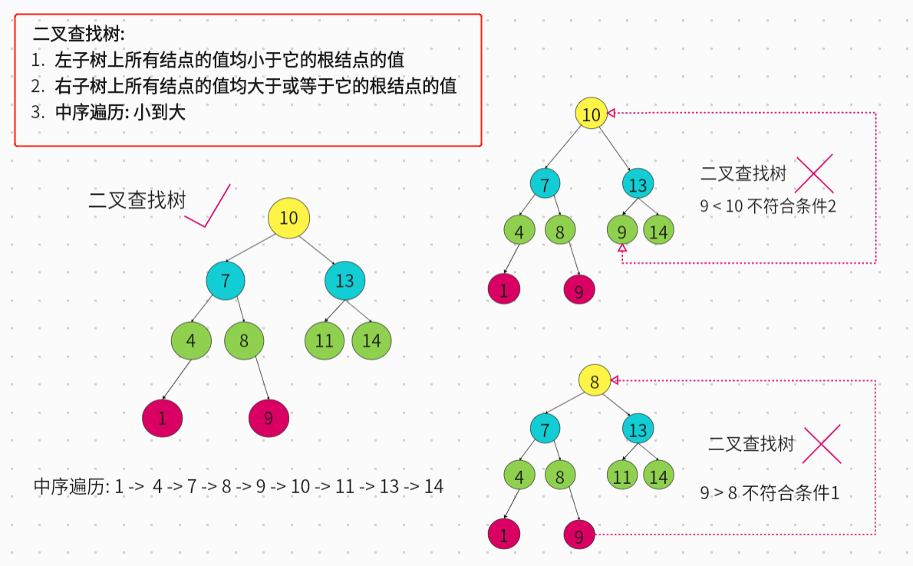
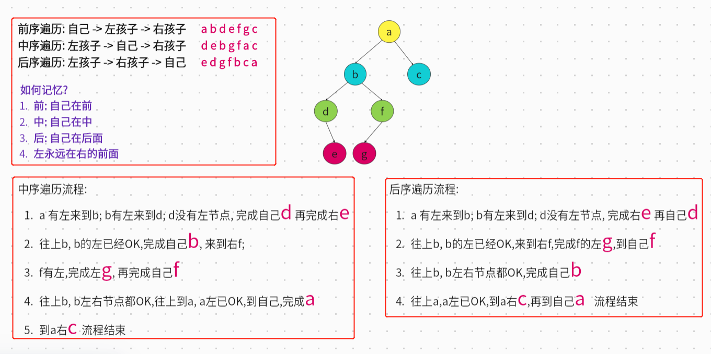
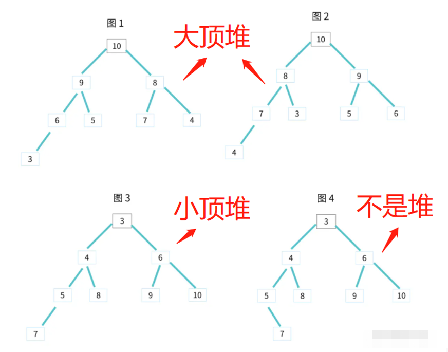

# 算法

一些算法相关的基础知识

## 按位运算

常见的运算规则：



1. 对半向下取整:

```
Math.floor(num / 2) => num >> 1
```

2. 奇偶判断:

```
num % 2 => num & 1
```

3. 交换 2 个数

```js
var a = 10;
var b = 20;

// 按位:
a = a ^ b;
b = a ^ b;
a = a ^ b;

// 解构:
[a, b] = [b, a];
```

## 排序

### 选择排序

原理：

1. 第一次循环, 在最后开始遍历 i = arr.length – 1; 等于 1 结束
2. 第二次循环, 在 0 下标开始, j \<= i – 1 结束, 和 i 元素比较, 如果 j 下标的元素大于 i 下标元素,交换;
   > 第 1 次内循环,最大放最后
   >
   > 第 2 次第 2 大放倒数第 2
   >
   > 第 3 次第 3 大放倒数第 3
   >
   > 第 4...

```js
function selectionSort(arr) {
  for (let i = arr.length - 1; i > 0; i--) {
    for (let j = 0; j <= i - 1; j++) {
      if (arr[j] > arr[i]) [arr[i], arr[j]] = [arr[j], arr[i]];
    }
  }
  return arr;
}
```

::: tip

稳定性：<font color="red">不稳定</font>;
时间复杂度：<font color="red">O(n^2)</font>;
空间复杂度：<font color="red">O(1)</font>;

:::

### 插入排序

原理：

1. 将一个元素插入到已有序的数组中，在初始时未知是否存在有序的数据，因此将元素第一个元素看成是有序的
2. 第 2 个元素开始，与有序的数组进行比较，比它大则直接放入，比它小则移动数组元素的位置，找到个合适的位置插入

```js
function insertSort(array) {
  for (let i = 0; i < array.length - 1; i++) {
    for (let j = i + 1; j > 0 && array[j - 1] > array[j]; j--) {
      [array[j], array[j - 1]] = [array[j - 1], array[j]];
    }
  }
}
```

::: tip

稳定性：<font color="red">稳定</font>;
时间复杂度：<font color="red">O(n^2)</font>;
空间复杂度：<font color="red">O(1)</font>;

:::

### 冒泡排序

原理：

1. 俩俩交换，大的放在后面，第一次排序后最大值已在数组末尾
2. 两个 for 循环，外层循环控制排序的趟数，内层循环控制比较的次数; 每趟过后，比较的次数都应该要减 1

```js
function bubbleSort(arr) {
  for (let i = 0; i < arr.length - 1; i++) {
    for (let j = 0; j < arr.length - i - 1; j++) {
      if (arr[j] > arr[j + 1]) [arr[j + 1], arr[j]] = [arr[j], arr[j + 1]];
    }
  }
  return arr;
}
```

::: tip

稳定性：<font color="red">稳定</font>;
时间复杂度：<font color="red">O(n^2)</font>;
空间复杂度：<font color="red">O(1)</font>;

:::

### 希尔排序

原理：
原理就是分组实现插入排序; 第 1 次: length / 2 组; 第 2 次: length / 2 / 2 组 ...

```js
function shellSort(array) {
  let n = array.length;
  for (let gap = n >> 1; gap > 0; gap >>= 1) {
    for (let i = gap; i < n; i++) {
      for (let j = i; j - gap >= 0 && array[j - gap] > array[j]; j -= gap) {
        [array[j], array[j - gap]] = [array[j - gap], array[j]];
      }
    }
  }
  return array;
}
```

::: tip
n >> 1 意思 n/2 向下取整; gap >>= 1 意思 gap = gap >> 1; 装 B 写法

稳定性：<font color="red">不稳定</font>;
时间复杂度：<font color="red">O(n^（1.3—2）)</font>;
空间复杂度：<font color="red">O(1)</font>;

:::

### 归并排序

原理：排序一个数组，我们先把数组从中间分成前后两部分，然后对前后两部分分别排序，再将排好序的两部分合并在一起，这样整个数组就都有序了

```js
function mergeSort(arr, leftIndex, rightIndex) {
  // 首次调用， 需要计算 leftIndex 和 rightIndex
  if (leftIndex === undefined) {
    leftIndex = 0;
    rightIndex = arr.length - 1;
  }

  // 递归结束条件
  if (leftIndex === rightIndex) return;

  let middleIndex = Math.ceil(leftIndex + ((rightIndex - leftIndex) >> 1));

  mergeSort(arr, leftIndex, middleIndex);
  mergeSort(arr, middleIndex + 1, rightIndex);
  _merge(arr, leftIndex, middleIndex, rightIndex);
}

function _merge(array, lidx, midx, ridx) {
  let help = [];
  let i1 = lidx;
  let i2 = midx + 1;

  while (i1 <= midx && i2 <= ridx) {
    if (array[i1] === array[i2]) {
      help.push(array[i1++]);
      help.push(array[i2++]);
    } else {
      help.push(array[i1] > array[i2] ? array[i2++] : array[i1++]);
    }
  }

  while (i1 <= midx) help.push(array[i1++]);
  while (i2 <= ridx) help.push(array[i2++]);

  for (let i = 0; i < help.length; i++) {
    array[lidx + i] = help[i];
  }
}
```

::: tip

稳定性：<font color="red">稳定</font>;
时间复杂度：<font color="red">O(n \* logn)</font>;
空间复杂度：<font color="red">O(n)</font>;

:::

### 快速排序

原理：

1. 随机选取下标, 假设基数下标是 3,那么值是 6
2. 循环数组,比 6 大放 right,等于放 center,小于放 left;
   例如此时: left = [3, 2, 3, 4]; center = [6, 6]; right = [10, 50];
3. 此时，center 已经是排序好的
4. left 重复 1,2 操作; right 重复 1,2 操作; 当数组长度等于 1 停止;

```js
function kuaiSort(array, lidx, ridx) {
  if (array.length === 1) return;

  if (lidx === undefined) {
    lidx = 0;
    ridx = array.length - 1;
  }

  let cIndex = lidx + Math.floor(Math.random() * (ridx - lidx + 1));
  _swap(array, cIndex, ridx);

  let indexs = _partition(array, lidx, ridx);
  let leftIndex = indexs[0];
  let rightIndex = indexs[1];

  if (rightIndex < ridx) kuaiSort(array, rightIndex, ridx);
  if (leftIndex > lidx) kuaiSort(array, lidx, leftIndex);
}

function _swap(arr, i, j) {
  const temp = arr[j];
  arr[j] = arr[i];
  arr[i] = temp;
}

function _partition(arr, sIndex, eIndex) {
  if (sIndex >= eIndex) return arr;
  let n = arr[eIndex];
  let s = sIndex - 1;
  let e = eIndex;
  let i = sIndex;
  while (i < e) {
    let v = arr[i];
    if (n > v) {
      _swap(arr, i, ++s);
      i++;
    } else if (n < v) {
      _swap(arr, i, e - 1);
      e--;
    } else {
      i++;
    }
  }
  _swap(arr, eIndex, e);
  const rs = [s, e + 1];
  return rs;
}
```

::: tip

稳定性：<font color="red">不稳定</font>;
时间复杂度：<font color="red">O(n \* logn)</font>;
空间复杂度：<font color="red">O(logN)</font>;

:::

### 堆排序

1. 将初始待排序关键字序列 (R1, R2 .... Rn) 构建成大顶堆
2. 将大顶堆的首位和最后一位交换,然后首位保存下来, 首位就是当前的最大值;
3. 交换后,形成新的堆,不过这时不是大顶堆,那么进行 heapfiy 变为大顶堆;
4. 重复 2 , 3 操作,直到堆只有一个节点

```js
// 获取父亲下标
const getParentIndex = (i) => {
  const pIndex = (i - 1) >> 1;
  return pIndex === -1 ? false : pIndex;
};
// 获取右小孩的下标
const getRightIndex = (i, heapSize) => {
  const index = i * 2 + 2;
  return index > heapSize ? false : index;
};
// 获取左小孩的下标
const getLeftIndex = (i, heapSize) => {
  const index = i * 2 + 1;
  return index > heapSize ? false : index;
};
// 方法作用: 从大顶堆的数组push数据，让原数组保持大顶堆
// 方法原理: 数据从数组末端, 和爸爸PK, 输了停止; 赢了和爸爸交换位置, 继续PK上面的爸爸;
const heapinsert = (arr, index) => {
  if (index === 0) return;
  // 父亲的index
  let parentIndex = getParentIndex(index);
  // 有父亲, 并且子比父亲大, 进入循环
  while (parentIndex !== false && arr[index] > arr[parentIndex]) {
    // 交换父亲和子
    [arr[parentIndex], arr[index]] = [arr[index], arr[parentIndex]];
    // 交换后, 需要继续向上比较, 直到到达跟节点, 或者比不过父亲为止
    index = parentIndex;
    parentIndex = getParentIndex(index);
  }
};
// 方法作用: 从大顶堆数组的顶部出入数据，让原数组保持大顶堆
// 方法原理: 找出2个儿子哪个最大, 和最大的PK, 赢了停止, 输了交换位置, 继续PK
const heapfiy = (arr, index, heapSize) => {
  if (heapSize < 1) return;
  let lastIndex;
  let leftIndex = getLeftIndex(index, heapSize);
  let rightIndex = getRightIndex(index, heapSize);
  // 有左小孩，循环
  while (leftIndex !== false) {
    // 获取左右小孩，最大值那个下标
    lastIndex =
      rightIndex === false
        ? leftIndex
        : arr[leftIndex] > arr[rightIndex]
        ? leftIndex
        : rightIndex;
    // 孩子大于父亲
    if (arr[lastIndex] > arr[index]) {
      [arr[lastIndex], arr[index]] = [arr[index], arr[lastIndex]];
      index = lastIndex;
      leftIndex = getLeftIndex(index, heapSize);
      rightIndex = getRightIndex(index, heapSize);
    } else {
      break;
    }
  }
};
const heapSort = (arr) => {
  arr.forEach((_, index) => heapinsert(arr, index));
  let heapSize = arr.length - 1;
  while (heapSize > 0) {
    [arr[heapSize], arr[0]] = [arr[0], arr[heapSize]];
    heapfiy(arr, 0, --heapSize);
  }
};
```

::: tip

稳定性：<font color="red">不稳定</font>;
时间复杂度：<font color="red">O(n \* logn)</font>;
空间复杂度：<font color="red">O(1)</font>;

:::

## 数据结构

### 二叉树

#### 树与二叉树

首先理解什么叫树？树是一种非线性结构，有几个特点：

1. 只有一个跟节点；
2. 除了根节点，每一个节点只有一个父节点；
3. 节点之间不能闭环；

二叉树就是父节点最多只能有 2 个孩子的数，下面是基于二叉树的基本描述：



#### 二叉树的性质

1. 每个节点最多有两个孩子节点的树
2. 二叉树的第 i 层上至多有 2i - 1（i≥1）个节点
3. 深度为 h 的二叉树中至多含有 2h-1 个节点
4. 在一棵二叉树中，有 n0 个叶子节点，有 n2 个度为 2 的节点，必有 n0=n2+1

### 满二叉树

1. 所有的非叶子节点都存在左右两个孩子
2. 所有叶子节点都在同一层级上
3. 有 n 个节点的满二叉树深为 log2n+1



### 完全二叉树

一个有 n 个节点的二叉树，按照层级顺序来编号，节点的编号为从 1 到 n；如果树的所有节点和同样深度的满二叉树的编号为 1 到 n 的节点位置相同，则这个二叉树为完全二叉树



### 二叉查找树 (二叉排序树)

下面是二叉查找树:


### 平衡二叉树 (AVL 树)

平衡二叉树的提出就是为了保证树不至于太倾斜，尽量保证两边平衡。定义如下：

1. 保证左右子树的高度之差不大于 1
2. 子树也必须是一颗平衡二叉树

### 二叉树遍历

分前序，中序，后序遍历


辅助代码：

```js
// 二叉树结构
function Node(id, left, right) {
  this.id = id;
  this.left = left;
  this.right = right;
}
// 获取二叉树的左孩子index
function getLeftIndex(index, size) {
  const childindex = 2 * index + 1;
  return childindex <= size ? childindex : -1;
}
// 获取二叉树右孩子index
function getRightIndex(index, size) {
  const childindex = 2 * index + 2;
  return childindex <= size ? childindex : -1;
}
// 数组按顺序生成二叉树
function createNodeByArray(array) {
  array = array.map((id) => {
    return new Node(id, null, null);
  });
  const len = array.length;
  array.forEach((node, index) => {
    const leftIndex = getLeftIndex(index, len);
    if (leftIndex > -1) {
      node.left = array[leftIndex];
    }
    const rightIndex = getRightIndex(index, len);
    if (rightIndex > -1) {
      node.right = array[rightIndex];
    }
  });
  return array[0];
}
const nodes = createNodeByArray([1, 2, 3, 4, 5, 6, 7]);
```

前序遍历:

```js
// 二叉树前缀遍历-递归方式
function qianloop(node, callback) {
  if (!node) return;
  callback && callback(node);
  qianloop(node.left, callback);
  qianloop(node.right, callback);
}

// 二叉树前缀遍历-非递归方式
function qianloop2(node, callback) {
  let stack = [node];
  while (stack[0]) {
    let curNode = stack.pop();
    callback && callback(curNode);
    if (curNode.right) stack.push(curNode.right);
    if (curNode.left) stack.push(curNode.left);
  }
}
```

中序遍历：

```js
// 二叉树中缀遍历-递归方式
function zhongloop(node, callback) {
  if (!node) return;
  zhongloop(node.left, callback);
  callback && callback(node);
  zhongloop(node.right, callback);
}
// 二叉树中缀遍历-非递归方式
function zhongloop2(node, callback) {
  const stack = [];
  let curNode = node;
  while (stack[0] || curNode) {
    if (curNode) {
      stack.push(curNode);
      curNode = curNode.left;
    } else {
      curNode = stack.pop();
      callback && callback(curNode);
      curNode = curNode.right;
    }
  }
}
```

后序遍历：

```js
// 二叉树后缀遍历-递归方式
function houloop(node, callback) {
  if (!node) return;
  houloop(node.left, callback);
  houloop(node.right, callback);
  callback && callback(node);
}
// 二叉树后缀遍历-非递归方式
function houloop2(node, callback) {
  let stack = [node];
  let stack2 = [];
  while (stack[0]) {
    let curNode = stack.pop();
    stack2.push(curNode);
    if (curNode.left) stack.push(curNode.left);
    if (curNode.right) stack.push(curNode.right);
  }
  while (stack2[0]) {
    callback && callback(stack2.pop());
  }
}
```

宽度遍历：

```js
// 二叉树宽度遍历-非递归方式
function kuanloop(node, callback) {
  let stack = [node];
  while (stack[0]) {
    let curNode = stack.shift();
    callback && callback(curNode);
    if (curNode.left) stack.push(curNode.left);
    if (curNode.right) stack.push(curNode.right);
  }
}
```

求二叉树宽度:

```js
function kuanTotalloop(node) {
  let stack = [node];
  const map = { 1: 1 };
  const mapNode = new Map();
  mapNode.set(node, 1);
  while (stack[0]) {
    let curNode = stack.shift();
    let curleve = mapNode.get(curNode);
    if (curNode.left) {
      stack.push(curNode.left);
      mapNode.set(curNode.left, curleve + 1);
      map[curleve + 1] = (map[curleve + 1] || 0) + 1;
    }
    if (curNode.right) {
      stack.push(curNode.right);
      mapNode.set(curNode.right, curleve + 1);
      map[curleve + 1] = (map[curleve + 1] || 0) + 1;
    }
  }
  return Math.max(...Object.values(map));
}
```

动态规划：判断是否搜索二叉树；左树的最大值 \< 本身; 右树最小值 > 本身

```js
function isBST(nodes) {
  const process = (node) => {
    if (!node) return null;

    let min = node.id;
    let max = node.id;
    let isBST = true;

    const leftData = process(node.left);
    const rightData = process(node.right);

    if (rightData) {
      max = Math.max(rightData.max, max);
      min = Math.min(rightData.min, min);
    }
    if (leftData) {
      max = Math.max(leftData.max, max);
      min = Math.min(leftData.min, min);
    }
    // 如果有左树 && 左树最大值 >= 本身值 或者 左树不是BST, 那么 isBST = false
    if (leftData && (!leftData.isBST || leftData.max >= node.id)) {
      isBST = false;
    }

    // 如果有右树 && 右树最小值 <= 本身值 或者 右树不是BST, 那么 isBST = false
    if (rightData && (!rightData.isBST || rightData.min <= node.id)) {
      isBST = false;
    }
    return { min, max, isBST };
  };
  return process(nodes);
}
```

### 堆

堆其实是一种特殊的树。只要满足这两点，它就是一个堆

1. 堆是一个完全二叉树。 完全二叉树：除了最后一层，其他层的节点个数都是满的，最后一层的节点都靠左排列
2. 堆中每一个节点的值都必须大于等于（或小于等于）其子树中每个节点的值。

> 对于每个节点的值都大于等于子树中每个节点值的堆，叫作大顶堆。
>
> 对于每个节点的值都小于等于子树中每个节点值的堆，叫作小顶堆。


