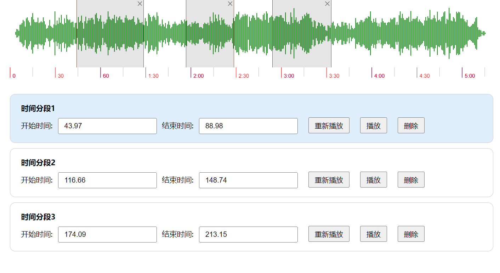

# 音频可视化

使用 wavesurfer.js 可以波形显示音频, 它还提供很多插件, 例如音频分段, 鼠标移动实时显示时间, 时间轴等等, 本案例使用 react + ts 构建音频分段 demo.

- 相关资料:

github 源码: <https://github.com/ImCccc/wavesurfer>

wavesurfer.js 官网: <https://wavesurfer-js.org/>

wavesurfer.js 文档: <https://wavesurfer-js.org/docs/>

wavesurfer.js 插件: <https://wavesurfer-js.org/plugins/>
