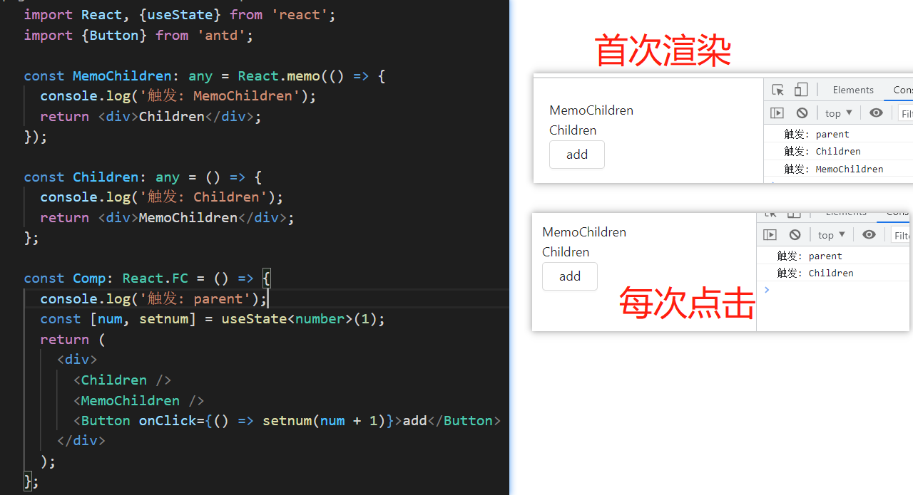

# React

<https://zh-hans.reactjs.org/>

## Context

Context 提供一个无需为每层组件手动添加 props，就能在组件树间进行数据传递的方法。下面是例子:

```tsx
// 祖先组件: 将 “dark” 作为当前的值传递下去
export const ThemeContext = React.createContext("light"); // “light” 为默认值

class App extends React.Component {
  render() {
    return (
      <ThemeContext.Provider value="dark">
        <Toolbar />
      </ThemeContext.Provider>
    );
  }
}

// 中间组件
function Toolbar() {
  return (
    <div>
      <ThemedButton />
    </div>
  );
}

// 子组件: 指定 contextType 读取当前的 theme context。React 会往上找到最近的 Provider
import { ThemeContext } from "祖先组件";
class ThemedButton extends React.Component {
  static contextType = ThemeContext; // 也可以这样写: ThemedButton.contextType = ThemeContext;

  render() {
    return <Button theme={this.context} />;
  }
}
```

### React.createContext

创建一个 `Context` 对象。当 React 渲染一个订阅了这个 `Context` 对象的组件，这个组件会从组件树中离自身最近的那个匹配的 `Provider` 中读取到当前的 `Context` 值。

### Context.Provider

每个 Context 对象都会返回一个 Provider React 组件(上例: `<ThemeContext.Provider value="dark">`) ，它允许消费组件订阅 context 的变化。

当 `Provider` 的 `value` 值发生变化时，它内部的所有消费组件都会重新渲染。从 `Provider` 到其内部 `consumer` 组件（包括 `.contextType` 和 `useContext` ）的传播不受制于 `shouldComponentUpdate` 函数，因此当 `consumer` <font color="red">组件在其祖先组件跳过更新的情况下也能更新。</font>

### Class.contextType

```tsx
class MyClass extends React.Component {
  componentDidUpdate() {
    let value = this.context;
  }
  render() {
    let value = this.context;
  }
}
MyClass.contextType = MyContext;
```

### Context.Consumer

```tsx
<MyContext.Consumer>
  {value => /* 基于 context 值进行渲染*/}
</MyContext.Consumer>
```

### 动态 Context

::: details 查看例子

theme-context.js

```tsx
export const themes = {
  light: {
    foreground: "#000000",
    background: "#eeeeee",
  },
  dark: {
    foreground: "#ffffff",
    background: "#222222",
  },
};

export const ThemeContext = React.createContext(themes.dark);
```

themed-button.js

```tsx
import { ThemeContext } from "./theme-context";
class ThemedButton extends React.Component {
  render() {
    let props = this.props;
    let theme = this.context;
    return <button {...props} style={{ backgroundColor: theme.background }} />;
  }
}
ThemedButton.contextType = ThemeContext;
export default ThemedButton;
```

app.js

```tsx
import { ThemeContext, themes } from "./theme-context";
import ThemedButton from "./themed-button";

function Toolbar(props) {
  return <ThemedButton onClick={props.changeTheme}>Change Theme</ThemedButton>;
}

class App extends React.Component {
  constructor(props) {
    super(props);
    this.state = { theme: themes.light };

    this.toggleTheme = () => {
      this.setState((state) => ({
        theme: state.theme === themes.dark ? themes.light : themes.dark,
      }));
    };
  }

  render() {
    return (
      <ThemeContext.Provider value={this.state.theme}>
        <Toolbar changeTheme={this.toggleTheme} />
      </ThemeContext.Provider>
    );
  }
}

const root = ReactDOM.createRoot(document.getElementById("root"));
root.render(<App />);
```

:::

### 在嵌套组件中更新 Context

::: details 查看例子

theme-context.js:

```tsx
// 确保传递给 createContext 的默认值数据结构是调用的组件（consumers）所能匹配的！
export const ThemeContext = React.createContext({
  toggleTheme: () => {},
  theme: { foreground: "#ffffff", background: "#222222" },
});
```

子组件: theme-toggler-button.js

```tsx
import { ThemeContext } from "./theme-context";

function ThemeTogglerButton() {
  return (
    <ThemeContext.Consumer>
      {({ theme, toggleTheme }) => (
        <button onClick={toggleTheme}>Toggle Theme</button>
      )}
    </ThemeContext.Consumer>
  );
}

export default ThemeTogglerButton;
```

app.js

```tsx
import { ThemeContext, themes } from "./theme-context";
import ThemeTogglerButton from "./theme-toggler-button";

// 中间组件
function Content() {
  return (
    <div>
      <ThemeTogglerButton />
    </div>
  );
}

class App extends React.Component {
  constructor(props) {
    super(props);

    this.toggleTheme = () => {
      this.setState((state) => ({
        theme: state.theme === themes.dark ? themes.light : themes.dark,
      }));
    };

    // State 也包含了更新函数，因此它会被传递进 context provider。
    this.state = {
      theme: themes.light,
      toggleTheme: this.toggleTheme,
    };
  }

  render() {
    // 整个 state 都被传递进 provider
    return (
      <ThemeContext.Provider value={this.state}>
        <Content />
      </ThemeContext.Provider>
    );
  }
}
```

:::

## createRef (类组件)

当 ref 被传递给 render 中的元素时，对该节点的引用可以在 ref 的 current 属性中被访问。ref 的值根据节点的类型而有所不同：

- 当 `ref` 属性用于 `HTML` 元素时，构造函数中使用 `React.createRef()` 创建的 `ref` 接收底层 `DOM` 元素作为其 current 属性。
- 当 `ref` 属性用于自定义 `class` 组件时， `ref` 对象接收组件的挂载实例作为其 `current` 属性。

以下代码使用 ref 去存储 DOM 节点的引用：

```tsx
class CustomTextInput extends React.Component {
  constructor(props) {
    super(props);
    this.textInput = React.createRef();
    this.focusTextInput = this.focusTextInput.bind(this);
  }

  focusTextInput() {
    this.textInput.current.focus();
  }

  render() {
    return (
      <>
        <input type="text" ref={this.textInput} />
        <button onClick={this.focusTextInput}>click</button>
      </>
    );
  }
}
```

## forwardRef

Ref 转发是一个可选特性，其允许某些组件接收 ref，并将其向下传递（换句话说，“转发”它）给子组件。

在下面的示例中， `FancyButton` 使用 `React.forwardRef` 来获取传递给它的 `ref` ，然后转发到它渲染的 `button`

```tsx
// 子组件
const FancyButton = React.forwardRef((props, ref) => (
  <button ref={ref}>{props.children}</button>
));

// 父组件: 可以直接获取 DOM button 的 ref, ref.current 将指向 <button> DOM 节点。
const ref = React.createRef();
<FancyButton ref={ref}>Click me!</FancyButton>;
```

## 父组件调用子组件的方法

下面是父组件（函数组件）调用子组件（函数组件）的方法的例子：

子组件 components/Comp.tsx：

```js
import { useImperativeHandle, forwardRef } from "react";
const Comp: React.FC<any> = forwardRef((props, ref) => {
  // 暴露给父组件调用的方法
  useImperativeHandle(ref, () => ({
    showModal: () => {},
    hideModal: () => {},
  }));
  return <div>test</div>;
});
export default Comp;
```

父组件：

```tsx
import Comp from "@/components/Comp";
import { useRef } from "react";

const Comp: React.FC = () => {
  const modalFormRef = useRef<{
    showModal: () => void;
  }>(null);
  return (
    <>
      <button onClick={() => modalFormRef.current?.showModal()}>调用</button>
      <Comp ref={modalFormRef} />
    </>
  );
};
```

## React.memo

`React.memo()`是一个高阶函数，它与 `React.PureComponent` 类似，但是一个函数组件而非一个类。
可接受 2 个参数，第一个参数为纯函数的组件，第二个参数用于对比 `props` 控制是否刷新，与 `shouldComponentUpdate()`功能类似。

<font color="red">一般配合 useCallback 使用,防止使用 onClick={ () => {} }导致子组件每次渲染</font>



## react 16

### 新的组件生命周期钩子

删除了（17 版本中将真的删除）:

- componentWillMount()
- componentWillReceiveProps(nextProps, nextState)
- componentWillUpdate()

新增了:

- static getDerivedStateFromProps(nextProps, prevState)
- getSnapshotBeforeUpdate(prevProps, prevState)
- componentDidCatch(error, info)

### render 可以返回值变化

React 15: 只可以返回单一组件，也就是说即使你返回的是一个 string，也需要用 div 包住

React 16: 支持返回这五类：React elements, 数组和 Fragments，Portal，String/numbers，boolean/null。

```tsx
return [<div key="1">first element</div>, <div key="2">second element</div>];
```

### Error boundary（错误边界）

React 15：渲染过程中有出错，直接 crash 整个页面，并且错误信息不明确，可读性差

React 16：用于捕获子组件树的 JS 异常（即错误边界只可以捕获组件在树中比他低的组件错误。），记录错误并展示一个回退的 UI。

### react portal

Portals 提供了一种很好的将子节点渲染到父组件以外的 DOM 节点的方式。

### 自定义 DOM 属性

React 15：忽略未标准化的 html 和 svg 属性

React 16：去掉了这个限制

### Fiber

由于 Fiber 不是新的 API，是 react 对于对比更新的一种新算法，它影响着生命周期函数的变化跟异步渲染。

### Fragement

React 15：render 函数只能接受一个组件，所以一定要外层包一层\<div\>。

React16：可以通过 Fragement 直接返回多个组件。

```tsx
return (
  <>
    <ChildA />
    <ChildB />
  </>
);
```

### memo

React 15：如果想阻止组件的重复渲染，在 class component 里可以使用 PureComponent, shouldComponentUpdate 来优化。但是 function component，没有这个功能， 只能每次都重新渲染。

React 16：memo 来帮助 function component 实现这个阻止重复渲染的功能。

### lazy、suspense

lazy 需要跟 Suspence 配合使用。
lazy 实际上是帮助我们实现代码分割的功能。

### hooks (react 16.8)

<https://zh-hans.reactjs.org/docs/hooks-intro.html#gatsby-focus-wrapper>

hooks 可以让你在不编写类的情况下使用 state 和 React 的其他功能。你还可以构建自己的 hooks，在组件之间共享可重用的有状态逻辑。

## react 17

[17.0.0 (发布时间:2020-10-20)](https://zh-hans.reactjs.org/blog/2020/08/10/react-v17-rc.html)

该版本的最大特性是 “无新特性”。React 官方对 v17 的定位是一版技术改造，主要目标是降低后续版本的升级成本。

v15 到 v16，React 团队花了两年时间将源码架构中的 Stack Reconciler 重构为 Fiber Reconciler。

### 渐进式升级

在 v17 之前，不同版本的 React 无法混用（事件系统会出问题），所以，开发者要么沿用旧版本，要么花大力气整个升级到新版本。

而 React 17 提供了一个新的选项——渐进式升级，允许 React 多版本并存，对大型前端应用十分友好，比如弹窗组件、部分路由下的长尾页面可以先不升级，一块一块地平滑过渡到新版本

### 事件委托的变更

之前多版本并存的主要问题在于 `React` 事件系统默认的委托机制，出于性能考虑， `React` 只会给 `document` 挂上事件监听，DOM 事件触发后冒泡到 `document，React` 找到对应的组件，造一个 React 事件出来，并按组件树模拟一遍事件冒泡。因此，不同版本的 `React` 组件嵌套使用时，`e.stopPropagation()` 无法正常工作

<font color="red">React 17 不再往 document 上挂事件委托，而是挂到 DOM 容器上：</font>

### 全新的 JSX 转换

React 17 提供了一个全新的，重构过的 JSX 转换的版本。但升级它会为你带来一些好处：

- 使用全新的转换，你可以单独使用 JSX 而无需引入 React。
- 根据你的配置，JSX 的编译输出可能会略微改善 bundle 的大小。
- 它将减少你需要学习 React 概念的数量，以备未来之需。

更新之前:

```tsx
// 源代码
import React from "react";
function App() {
  return <h1>Hello World</h1>;
}

// JSX 转换会将上述代码变成普通的 JavaScript 代码：
import React from "react";
function App() {
  return React.createElement("h1", null, "Hello world");
}
```

更新之后:

```tsx
// 源代码
function App() {
  return <h1>Hello World</h1>;
}

// 由编译器引入（禁止自己引入！）
import { jsx as _jsx } from "react/jsx-runtime";
function App() {
  return _jsx("h1", { children: "Hello world" });
}
```

### DOM 事件池被废弃

之前出于性能考虑，为了复用 SyntheticEvent，维护了一个事件池，导致 React 事件只在传播过程中可用，之后会立即被回收释放，例如：

```tsx
<button
  onClick={(e) => {
    console.log(e.target.nodeName); // 输出 BUTTON
    setTimeout(() => {
      // 报错 Uncaught TypeError: Cannot read property 'nodeName' of null
      console.log(e.target.nodeName);
    });
  }}
>
  Click Me!
</button>
```

<font color="red">React 17 去掉了事件复用机制</font>

### Effect Hook 清理操作改为异步执行

之前 useEffect 本身是异步执行的，但其 <font color="red">清理工作却是同步执行的 </font>。React 17 改为异步执行清理工作

### 报错信息透出组件 “调用栈”

当您在浏览器中引发错误时，浏览器会为您提供带有 JavaScript 函数名称及其位置的堆栈跟踪。但是，JavaScript 堆栈通常不足以诊断问题，因为 React 树的层次结构可能同样重要。您不仅要知道 Button 引发了错误，还想知道在 React 树中的哪个位置 Button。

在 React 16 的组件堆栈， 很多缺点 （在控制台中不可单击，生产中几乎毫无用处）

在 React 17 中，使用不同的机制生成组件堆栈，该机制将它们与常规的本机 JavaScript 堆栈缝合在一起。这使您可以在生产环境中获得完全符号化的 React 组件堆栈跟踪。

### 返回一致的 undefined 错误

在 React 16 及更早版本中，返回 undefined 始终是一个错误：

```tsx
function Button() {
  return; // Error: Nothing was returned from render
}
```

以前，React 只对 class 和函数组件执行此操作，但并不会检查 forwardRef 和 memo 组件的返回值。这是由于编码错误导致。

**在 React 17 中，forwardRef 和 memo 组件的行为会与常规函数组件和 class 组件保持一致。在返回 undefined 时会报错**

### 部分暴露出来的私有 API 被删除

React 17 删除了一些私有 API，大多是当初暴露给 React Native for Web 使用的，目前 React Native for Web 新版本已经不再依赖这些 API

另外，修改事件系统时还顺手删除了 ReactTestUtils.SimulateNative 工具方法，因为其行为与语义不符，建议换用 React Testing Library

## react 18

<https://secstep.com/react-18-is-now-available-on-npm/>

### 新的 Root API

`createRoot` 创建要渲染或卸载的根的新方法。使用它来代替 `ReactDOM.render`。没有它，React 18 中的新功能就无法工作。

更新之前:

```tsx
ReactDOM.render(<APP />, document.getElementById(root));
```

更新之后:

```tsx
import { StrictMode } from "react";
import ReactDOM from "react-dom";
import App from "./App";
ReactDOM.createRoot(document.getElementById("root")).render(
  <StrictMode>
    <App />
  </StrictMode>
);
```

### 新的严格模式行为 StrictMode

为了实现类似于 vue 缓存组件 keep-alive 的功能, React 18 为严格模式引入了一个新的<font color="red"> 仅限开发的检查 </font>, 每当第一次安装组件时，此新检查将自动卸载并重新安装每个组件，并在第二次安装时恢复先前的状态。表现的效果,最直接的就是 <font color="red"> useEffects 执行 2 次</font>

### 节点自动批量重渲染

#### React 17

Promise、setTimeout、native event 或任何其他事件内部的更新不会在 React 中批处理。例如 setState 在这些场景是同步的。

#### react 18

如果使用 createRoot 则所有状态更新都将在发生时自动批量重渲染。

不想被自动更新可以使用 ReactDOM.flushSync() 退出操作

```tsx
import { flushSync } from "react-dom";
function handleClick() {
  flushSync(() => setCounter((c) => c + 1));
  // React has updated the DOM by now
  flushSync(() => setFlag((f) => !f));
  // React has updated the DOM by now
}
```

### 新的 Suspense 组件

之前的 Suspense, 支持的用例是使用 React.lazy 进行代码拆分，并且在服务器上渲染时根本不支持。**在 React 18 中，我们在服务器上添加了对 Suspense 的支持，并使用并发渲染特性扩展了它的功能。**

React 18 中的 Suspense 与 transition API 结合使用时效果最佳。如果你在过渡期间挂起，React 将防止已经可见的内容被替换为后备内容。相反，React 会延迟渲染，直到加载了足够的数据以防止出现错误的加载状态。

### SuspenseList

Suspense List 作为 Suspense 的容器组件通过编排这些组件向用户显示的顺序，帮助协调许多可以挂起的组件。

### startTransition

这是 V18 引入的新 API，这有助于保持当前的网页响应，并且能够同时进行计算量大复杂度高的的非阻塞 UI 更新。
以前可能会加防抖这样的操作去人为的延迟过滤数据的计算和渲染。新的 startTransition API 可以让我们把响应数据标记成 transitions 状态延迟处理。两个应用场景:

> 1. 慢速渲染：React 需要执行大量计算，以便过渡 UI 来显示结果。(如搜索引擎的关键词联想)
> 2. 慢速网络：React 正在等待来自网络的某些数据。这种用例与 Suspense 紧密集成。(懒加载)

```tsx
import { useState, startTransition } from "react";

export default function App() {
  let [value, setValue] = useState(0);

  return (
    <div>
      <input
        value={value}
        onChange={(e) => startTransition(() => setValue(event.target.value))}
      />
      <div>{value}</div>
    </div>
  );
}
```

所有在 startTransition 回调中的更新都会被认为是非紧急处理，如果出现更紧急的更新（比如用户又输入了新的值），则上面的更新都会被中断，直到没有其他紧急操作之后才会去继续执行更新。

### useTransition

`useTransition` 和 `startTransition` 让您将一些状态更新标记为不紧急。默认情况下，其他状态被更新为是紧急的。 React 将允许紧急状态更新（例如，更新文本输入）以中断非紧急状态更新（例如，呈现搜索结果列表）。

```tsx
function App() {
  const [isPending, startTransition] = useTransition();
  const [count, setCount] = useState(0);

  function handleClick() {
    startTransition(() => setCount((c) => c + 1));
  }

  return (
    <div>
      {isPending && <Spinner />}
      <button onClick={handleClick}>{count}</button>
    </div>
  );
}
```

### useDeferredValue

`useDeferredValue` 允许您推迟重新渲染树的非紧急部分。它类似于去抖动，但与之相比有一些优点。没有固定的时间延迟，因此 React 将在第一次渲染反映在屏幕上后立即尝试延迟渲染。延迟渲染是可中断的，不会阻塞用户输入。

```tsx
function Typeahead() {
  let [value, setValue] = useState(0);
  const deferredQuery = useDeferredValue(value);

  const suggestions = useMemo(
    () => <SearchSuggestions query={deferredQuery} />,
    [deferredQuery]
  );

  return (
    <>
      <input value={value} onChange={(e) => setValue(e.target.value)} />
      <Suspense fallback="Loading results...">{suggestions}</Suspense>
    </>
  );
}
```
