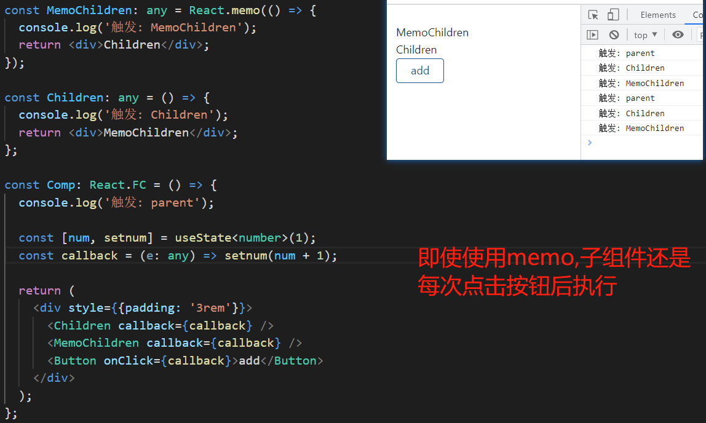

# hooks api

<https://zh-hans.reactjs.org/docs/hooks-reference.html>

## useContext

- 父组件 `Parent.tsx`

```tsx
import { createContext } from "react";
export const FlowContext = createContext<any>(null);

const Parent: React.FC = () => (
  <FlowContext.Provider value={{ name: "lcr" }}>
    {children}
  </FlowContext.Provider>
);

export default Parent;
```

- 子组件

```tsx
import { useContext } from "react";
import { FlowContext } from "@/pages/Parent";

const Child: React.FC = () => {
  const data = useContext(FlowContext);
  return <div>{data.name}</div>;
};

export default Child;
```

## useCallback

配合 `React.memo` , 优化组件, 例如如下:



解决: 那就是使用 useCallback 包裹函数:

```tsx
const callback = useCallback((e: any) => setnum(Math.random()), []);
```

<font color="red">问题: useCallback 第二个参数,是依赖项, 如果依赖项变化, 那么函数还是会频繁创建, 导致 React.meno 包裹的组件重新渲染. 有什么方法可以保证函数地址一值不变?</font>

官方临时提议,使用 `ref`, 变量重新缓存 `useCallback` 需要访问的值,`ahooks` 中的 `usePersistFn`(3.x 是 `useMemoizedFn` ) 就是这种思路实现不需要传递依赖项的, 下面是源码:

```tsx
type noop = (this: any, ...args: any[]) => any;

type PickFunction<T extends noop> = (
  this: ThisParameterType<T>,
  ...args: Parameters<T>
) => ReturnType<T>;

function useMemoizedFn<T extends noop>(fn: T) {
  const fnRef = useRef<T>(fn);
  fnRef.current = useMemo(() => fn, [fn]);
  const memoizedFn = useRef<PickFunction<T>>();
  if (!memoizedFn.current) {
    memoizedFn.current = function (this, ...args) {
      return fnRef.current.apply(this, args);
    };
  }
  return memoizedFn.current;
}
```

## useRef

<https://zh-hans.reactjs.org/docs/hooks-reference.html#useref>

useRef 返回一个可变的 ref 对象，其 .current 属性被初始化为传入的参数（initialValue）。返回的 ref 对象在组件的整个生命周期内持续存在。

一个常见的用例便是命令式地访问子组件, 无论该节点如何改变，React 都会将 ref 对象的 .current 属性设置为相应的 DOM 节点。

```tsx
import { useRef } from "react";

const ref = useRef<HTMLInputElement>(null);
console.log(ref.current?.value);

<input ref={ref} type="text" />;
```

请记住，当 ref 对象内容发生变化时，useRef 并不会通知你。变更 .current 属性不会引发组件重新渲染

## useImperativeHandle

- 使用场景: 父组件访问子组件(函数组件)的某些方法

- 使用语法: `useImperativeHandle(ref, createHandle, [deps]);`

- <a href="/react/#父组件调用子组件的方法">具体用法传送门</a>
