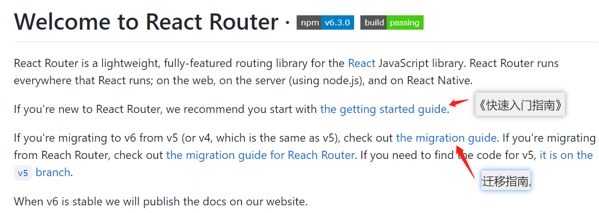

# react-router-dom 6

文档: <https://github.com/remix-run/react-router>



本章节会介绍 react-router-dom6 的使用方法

1. 安装

```
yarn add react-router-dom
```

## 路由懒加载配置

```tsx
// App.tsx
import { Suspense } from "react";
import { HashRouter, Route, RouteObject, Routes } from "react-router-dom";
import routes from "@/config/routes";

const getRoute = (routes: RouteObject[]) => {
  return routes.map((options) => (
    <Route
      key={options.path}
      path={options.path}
      element={
        <Suspense fallback={<div>loading....</div>}>{options.element}</Suspense>
      }
    >
      {options.children && getRoute(options.children)}
    </Route>
  ));
};

function App() {
  return (
    <HashRouter>
      <Routes>{getRoute(routes)}</Routes>
    </HashRouter>
  );
}

export default App;
```

```tsx
// config/routes.tsx
import { lazy } from "react";
import { RouteObject } from "react-router-dom";

const Main = lazy(() => import("@/pages/Main"));
const Login = lazy(() => import("@/pages/Login"));
const NotFound = lazy(() => import("@/pages/404"));
const Layout = lazy(() => import("@/pages/Layout"));
const Application = lazy(() => import("@/pages/Application"));

const routes: RouteObject[] = [
  {
    path: "/login",
    element: <Login />,
  },
  {
    path: "/",
    element: <Main />,
  },
  {
    path: "/main/:id",
    element: <Layout />,
    children: [
      {
        path: "application",
        element: <Application />,
      },
      {
        path: "*",
        element: <NotFound />,
      },
    ],
  },
  {
    path: "*",
    element: <NotFound />,
  },
];

export default routes;
```

## 子路由与跳页面

```tsx
import { Outlet, useNavigate } from "react-router-dom";
<div>
  <Button onClick={() => navigate("/flow")}>跳页面</Button>
  <Outlet /> // 子路由
</div>;
```

## 获取 params 参数

```js
import { useParams } from "react-router-dom";
const Comp: React.FC = () => {
  const params = useParams();
  return <div className="commom-page">参数: {params.id}</div>;
};
```

## 获取浏览器 ? 后面的参数

```tsx
import { useSearchParams } from "react-router-dom";

const App: React.FC = () => {
  const [searchParams, setSearchParams] = useSearchParams();
  // 获取?id=123 的 123
  const defaultVal = searchParams.get("id") || "";

  const onSelect = (selectedKeys: React.Key[]) => {
    // 设置 ?id=456 ,会同步到浏览器链接上
    setSearchParams(`id=456`);
  };

  return <div>test</div>;
};

export default App;
```
