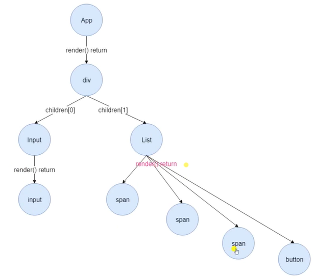
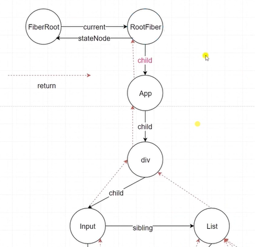

# 源码解读

当前版本: react-16.7.0-alpha.1

## jsx

babel 官网: <https://www.babeljs.cn/>

jsx 通过 babel 处理后, 生成 js 代码, 下面是例子 (最新版本 \_jsx 代替 createElement)

```javascript
/*
  const Name= () => {
    return <h1 style={{color: 'red'}}>function span</h1>
  }

  class Abc extends Components {
    render() {
      return <span>class span</span>
    }
  }

  <h1 className="name" key="key-1">
    <Name></Name>
    <Abc></Abc>
    <span>h1 span</span>
  </h1>
*/

// 编译后
import { jsx as _jsx } from "react/jsx-runtime";
import { jsxs as _jsxs } from "react/jsx-runtime";

const Name = () => {
  return _jsx("h1", {
    style: { color: "red" },
    children: "function span",
  });
};

class Abc extends Components {
  render() {
    return _jsx("span", { children: "class span" });
  }
}

_jsxs(
  "h1",
  {
    className: "name",
    children: [
      _jsx(Name, {}),
      _jsx(Abc, {}),
      _jsx("span", { children: "h1 span" }),
    ],
  },
  "key-1"
);
```

## createElement

路径： `\packages\react\src\ReactElement.js`

```javascript
/*
  type: 
        原生组件,还是 react class 组件, 还是 react function 组件, 还是其他的例如 Fragment, Suspense 等等
        如果是普通的html标签, 那么就是标签名称
        如果是react组件, 那么就是react类,或者函数

  config: 
        属性配置

  children: 
        子节点
*/

const RESERVED_PROPS = {
  key: true,
  ref: true,
  __self: true,
  __source: true,
};

export function createElement(type, config, ...children) {
  let propName;

  const props = {};

  let key = null;
  let ref = null;
  let self = null;
  let source = null;

  if (config != null) {
    if (config.ref !== undefined) ref = config.ref;
    if (config.key !== undefined) key = `${config.key}`;
    self = config.__self === undefined ? null : config.__self;
    source = config.__source === undefined ? null : config.__source;

    for (propName in config) {
      if (
        // hasOwnProperty() 方法返回一个布尔值，表示对象自有属性（而不是继承来的属性）
        Object.prototype.hasOwnProperty.call(config, propName) &&
        // RESERVED_PROPS 中的属性, 不会赋值给 props
        !RESERVED_PROPS.hasOwnProperty(propName)
      ) {
        props[propName] = config[propName];
      }
    }
  }

  // 处理 children, 一个节点和多个节点的区别
  if (children.length === 1) {
    props.children = children;
  } else if (children.length > 1) {
    props.children = children;
  }

  // 处理默认值, 针对类组件
  if (type && type.defaultProps) {
    const defaultProps = type.defaultProps;
    for (propName in defaultProps) {
      if (props[propName] === undefined) {
        props[propName] = defaultProps[propName];
      }
    }
  }

  return {
    $$typeof: Symbol.for("react.element"),
    type,
    key,
    ref,
    props,
    _owner: ReactCurrentOwner.current, // todo ... 初始化应该是 null
  };
}
```

## Component

路径： `packages\react\src\ReactBaseClasses.js`

```js
import invariant from "shared/invariant";
import ReactNoopUpdateQueue from "./ReactNoopUpdateQueue";

const emptyObject = {};

function Component(props, context, updater) {
  this.props = props;
  this.context = context;
  this.refs = emptyObject;
  this.updater = updater || ReactNoopUpdateQueue; // todo...
}

// 用于判断是 class 组件还是 function 组件
Component.prototype.isReactComponent = {};

Component.prototype.setState = function (partialState, callback) {
  // todo...
  this.updater.enqueueSetState(this, partialState, callback, "setState");
};
Component.prototype.forceUpdate = function (callback) {
  // todo...
  this.updater.enqueueForceUpdate(this, callback, "forceUpdate");
};

function ComponentDummy() {}
ComponentDummy.prototype = Component.prototype;

function PureComponent(props, context, updater) {
  this.props = props;
  this.context = context;
  this.refs = emptyObject;
  this.updater = updater || ReactNoopUpdateQueue;
}

const pureComponentPrototype = (PureComponent.prototype = new ComponentDummy());
pureComponentPrototype.constructor = PureComponent;
Object.assign(pureComponentPrototype, Component.prototype);

// PureComponent 只是多了一个标识 isPureReactComponent = true
pureComponentPrototype.isPureReactComponent = true;

export { Component, PureComponent };
```

## crateRef

```javascript
export function createRef() {
  const refObject = { current: null };
  return refObject;
}
```

## forwardRef

```javascript
// 使用
const TargetComponents = React.forwardRef((props, ref) => {
  return <input ref={ref} />;
});

/*
  源码: packages\react\src\forwardRef.js
  注意： 
    这里的 $$typeof， 和 createElement 方法返回的 $$typeof 是不一样的，
    forwardRef 创建的组件，还是会通过 createElement 生产虚拟dom，
    它的 $$typeof 还是等于 Symbol.for("react.element")
    不过它的 type 就是 forwardRef 返回的对象
*/
export default function forwardRef(render) {
  return {
    $$typeof: Symbol.for("react.forward_ref"),
    render,
  };
}
```

## Context

跨组件通讯

```javascript
const { Consumer, Provider } = React.createContext("licr");

const Child = () => {
  return <Consumer>{(value) => <div>{value}</div>}</Consumer>;
};

const Parent = () => (
  <Provider value="lichirong">
    <Child />
  </Provider>
);
```

```js
// 源码: packages\react\src\ReactContext.js
function createContext(defaultValue, calculateChangedBits) {
  if (calculateChangedBits === undefined) {
    calculateChangedBits = null;
  }

  const context = {
    $$typeof: Symbol.for("react.context"),
    _calculateChangedBits: calculateChangedBits,
    _currentValue: defaultValue,
    _currentValue2: defaultValue,
    _threadCount: 0,
    Provider: null,
    Consumer: null,
  };

  context.Provider = {
    $$typeof: Symbol.for("react.provider"),
    _context: context,
  };

  context.Consumer = context;

  return context;
}
```

## lazy Suspense

```javascript
// 源码：packages\react\src\ReactLazy.js
export function lazy(ctor) {
  return {
    $$typeof: Symbol.for("react.lazy"),
    _ctor: ctor,
    _status: -1, // 记录当前状态
    _result: null, // 记录结果
  };
}

// packages\react\src\React.js , Suspense 源码就是一个常量
const React = {
  Fragment: REACT_FRAGMENT_TYPE,
  StrictMode: REACT_STRICT_MODE_TYPE,
  Suspense: Symbol.for("react.suspense"),
  // ...
};
export default React;
```

## memo

函数组件实现类使用 PureComponent 的功能

```javascript
// 使用
function List(props) {
  const [count, setCount] = useState(value1);
  return (
    <Button type="primary" onClick={() => setCount(count + 1)}>
      点击 {count} {props.value}
    </Button>
  );
}
export default React.memo(Card, (oldProps, newProps) => {
  if (prevProps?.value === nextProps?.value) {
    return true;
  }
  return false;
});
```

```javascript
// 源码 packages\react\src\memo.js
export const REACT_MEMO_TYPE = Symbol.for("react.memo");
export default function memo(
  type,
  compare?: (oldProps: Props, newProps: Props) => boolean
) {
  return {
    $$typeof: REACT_MEMO_TYPE,
    type,
    compare: compare === undefined ? null : compare,
  };
}
```

## React.render

`ReactDOM.render(<App/>, document.getElementById('root'))`



1. 创建 ReactRoot
2. 创建 FiberRoot 和 RootFiber
3. 创建更新

```js
// packages\react-dom\src\client\ReactDOM.js
const ReactDOM: Object = {
  render(element, container, callback) {
    return legacyRenderSubtreeIntoContainer(
      null,
      element,
      container,
      false,
      callback
    );
  },
};

function legacyRenderSubtreeIntoContainer(
  parentComponent, // null
  children,
  container,
  forceHydrate, // false
  callback
) {
  let root;

  // 创建 FiberRoot
  root = container._reactRootContainer = legacyCreateRootFromDOMContainer(
    container,
    forceHydrate // false
  );

  if (typeof callback === "function") {
    const originalCallback = callback;
    callback = function () {
      const instance = DOMRenderer.getPublicRootInstance(root._internalRoot);
      originalCallback.call(instance);
    };
  }

  // 批量更新相关 todo...
  DOMRenderer.unbatchedUpdates(() => {
    /*  
      源码:
      if (parentComponent != null) {
        root.legacy_renderSubtreeIntoContainer(
          parentComponent,
          children,
          callback
        );
      } else {
        root.render(children, callback);
      }
    */
    // 实际到这里
    root.render(children, callback);
  });

  return DOMRenderer.getPublicRootInstance(root._internalRoot);
}

function legacyCreateRootFromDOMContainer(container, forceHydrate) {
  // shouldHydrate = forceHydrate || shouldHydrateDueToLegacyHeuristic(container)
  const shouldHydrate = false;
  if (!shouldHydrate) {
    let warned = false;
    let rootSibling;
    // 将所有的子节点删除
    while ((rootSibling = container.lastChild)) {
      container.removeChild(rootSibling);
    }
  }

  // 创建 ReactRoot
  return new ReactRoot(container, false, shouldHydrate);
}

function ReactRoot(container, isConcurrent, hydrate) {
  // 创建了一个 FiberRoot
  const root = DOMRenderer.createContainer(
    container,
    isConcurrent, // false
    hydrate // false
  );
  this._internalRoot = root;
}

ReactRoot.prototype.render = function (children, callback) {
  const root = this._internalRoot;
  const work = new ReactWork();
  callback = callback === undefined ? null : callback;
  if (callback !== null) work.then(callback);

  // 关注这里 todo ...
  DOMRenderer.updateContainer(children, root, null, work._onCommit);
  return work;
};
```

## FiberRoot

源码目录: `packages\react-reconciler\src\ReactFiberReconciler.js`

```javascript
// 对应上面的 `DOMRenderer.createContainer`
export function createFiberRoot(
  containerInfo: any,
  isConcurrent: boolean,
  hydrate: boolean
): FiberRoot {
  const uninitializedFiber = createHostRootFiber(isConcurrent);

  let root = {
    // 当前的 Fiber 对象, 是上文所说的 RootFiber
    current: uninitializedFiber,
    // dom 节点, render 接受的第二个参数
    containerInfo: containerInfo,
    pendingChildren: null,
    earliestPendingTime: 0,
    latestPendingTime: 0,
    earliestSuspendedTime: 0,
    latestSuspendedTime: 0,
    latestPingedTime: 0,
    // 渲染过程是否有错误
    didError: false,
    pendingCommitExpirationTime: 0,
    finishedWork: null,
    timeoutHandle: noTimeout,
    context: null,
    pendingContext: null,
    hydrate,
    nextExpirationTimeToWorkOn: 0,
    // 当前更新的过期时间
    expirationTime: 0,
    firstBatch: null,
    // 多个 root 的串联用到
    nextScheduledRoot: null,
  };
  uninitializedFiber.stateNode = root;
  return ((root: any): FiberRoot);
}
```

## Fiber



每一个 ReactElement 对应一个 Fiber; 记录节点中的状态, 串联整个应用, 形成数结构
