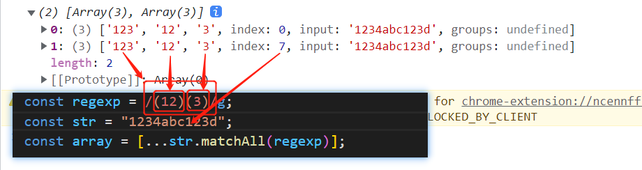

# [正则](https://developer.mozilla.org/zh-CN/docs/Web/JavaScript/Reference/Global_Objects/RegExp)

下面列出常见的使用方法

## 修饰符

### /i

不区分大小写 将匹配设置为不区分大小写

```js
var str = "Google runoob taobao RUNoob";
var n1 = str.match(/runoob/g); // ['runoob']
var n2 = str.match(/runoob/gi); // ['runoob', 'RUNoob']
```

### /g

全局匹配 查找所有的匹配项

```js
var str = "Google runoob taobao runoob";
var n1 = str.match(/runoob/); // ['runoob']
var n2 = str.match(/runoob/g); // ['runoob', 'runoob']
```

### /m

多行匹配 使边界字符 ^ 和 $ 匹配每一行的开头和结尾，记住是多行不是整个字符串开头和结尾

```js
var str = "runoobgoogle\ntaobao\nrunoobweibo";
var n1 = str.match(/^runoob/g); // ['runoob']
var n2 = str.match(/^runoob/gm); // 多行匹配: ['runoob', 'runoob']
```

### /s

默认 . 是匹配除换行符 \n 之外的任何字符，加 s 后包含换行符 \n。

```js
var str = "google\nrunoob\ntaobao";
var n1 = str.match(/google./); // 无法匹配\n: n1 = null
var n2 = str.match(/runoob./s); // 匹配\n: n2 = ['runoob\n']
```

## 元字符

### 正则\

1. 将字符标记为一个特殊字符: \n \s \d
2. 或一个原义字符: \\\\ 匹配 \\; \\( 则匹配 (
3. 或一个 向后引用、或一个八进制转义符

### 正则.

1. 匹配除换行符（\n、\r）之外的任何单个字符
2. 要匹配包括 \n 在内的任何字符，可以这样 (.|\n)

### 正则 ^ $

#### 匹配开始位置 ^

1. 匹配输入字符串的<font color="red"> 开始位置 </font>
2. 如果设置了 RegExp 对象的 Multiline 属性，^ 也匹配 \n 或 \r 之后的位置

#### 匹配结束位置 $

1. 匹配输入字符串的<font color="red"> 结束位置 </font>
2. 如果设置了 RegExp 对象的 Multiline 属性，$ 也匹配 \n 或 \r 之前的位置

### 正则 \* + ？

#### 零次或多次 \*

1. 匹配前面的子表达式<font color="red"> 零次或多次 </font>,等价于{0,}
2. zo\* 能匹配 z 以及 zoo

#### 一次或多次 +

1. 匹配前面的子表达式<font color="red"> 一次或多次 </font>,等价于 {1,}
2. zo+ 能匹配 zo 以及 zoo，但不能匹配 z

#### 零次或一次 ?

1. 匹配前面的子表达式<font color="red"> 零次或一次 </font>,等价于 {0,1}
2. do(es)? 可以匹配 do 或 does

3. 当该字符紧跟在任何一个其他限制符 (\*, +, ?, {n}, {n,}, {n,m}) 后面时，匹配模式是非贪婪的,
   > 该模式尽可能少的匹配所搜索的字符串，而默认的贪婪模式则尽可能多的匹配所搜索的字符串
   >
   > 例如: 对于字符串 oooo，o+? 将匹配单个 o，而 o+ 将匹配所有 o

### 正则 {n} {n,} {n, m}

#### 匹配 n 次: {n}

1. 匹配确定的 n 次
2. o{2} 不能匹配 Bob 中的 o，但是能匹配 food 中的两个 o

#### 至少匹配 n 次: {n,}

1. 至少匹配 n 次
2. o{2,} 不能匹配 Bob 中的 o，但能匹配 foooood 中的所有 o
3. o{1,} 等价于 o+
4. o{0,} 则等价于 o\*

#### 匹配 n ~ m 次: {n,m}

1. 最少匹配 n 次且最多匹配 m 次
2. o{1,3} 将匹配 fooooood 中的前三个 o ; o{0,1} 等价于 o?
3. 请注意在逗号和两个数之间不能有空格

### 正则 x|y [xyz] [^xyz] [a-z]

#### 正则 x|y

匹配 x 或 y

> z|food 能匹配 z 或 food。(z|f)ood 则匹配 zood 或 food

#### 正则 [xyz] [^xyz]

[xyz]：匹配所包含的任意一个字符

> [abc] 可以匹配 plain 中的 a

[^xyz]：匹配未包含的任意字符

> [^abc] 可以匹配 "plain" 中的'p'、'l'、'i'、'n'

#### 正则 [a-z]

[a-z]：可以匹配 'a' 到 'z' 范围内的任意小写字母字符

[^a-z]：可以匹配不在 'a' 到 'z' 范围内的任意字符

### 正则 \d, \D, \s, \S, \w, \W

- \d: 匹配一个数字字符。等价于 [0-9]
- \D: 匹配一个非数字字符。等价于 [^0-9]

- \w: 匹配字母、数字、下划线。等价于'[A-Za-z0-9_]'
- \W: 匹配非字母、数字、下划线。等价于 '[^a-za-z0-9_]'

- \s: 匹配任何空白字符，包括空格、制表符、换页符等等。等价于 [ \f\n\r\t\v]
- \S: 匹配任何非空白字符。等价于 [^ \f\n\r\t\v]

### 正则 \n, \f, \r, \t, \v, \b, \B

- \b: 匹配一个单词边界，也就是指单词和空格间的位置
  > 'er\b' 可以匹配"never" 中的 'er'，但不能匹配 "verb" 中的 'er'
- \B: 匹配非单词边界
  > 'er\B' 能匹配 "verb" 中的 'er'，但不能匹配 "never" 中的 'er
- \r: 匹配一个回车符
- \f: 匹配一个换页符
- \t: 匹配一个制表符
- \v: 匹配一个垂直制表符

## 优先级

最高到最低说明了各种正则表达式运算符的优先级顺序：

1. 转义符\
2. (), (?：), (?=), [] 圆括号和方括号
3. \*, +, ?, {n}, {n,}, {n,m} 限定符
4. ^, $, \任何元字符、任何字符
5. | 替换，"或"操作
   > 字符具有高于替换运算符的优先级，使得"m|food"匹配"m"或"food"
   >
   > 若要匹配"mood"或"food"，请使用括号创建子表达式，从而产生"(m|f)ood"

## 前端的正则 RegExp

有两种方法可以创建一个 RegExp 对象：一种是字面量，另一种是构造函数。

```js
/abc/i; //字面量形式

new RegExp("abc", "i"); // 首个参数为字符串模式的构造函数

new RegExp(/abc/, "i"); // 首个参数为常规字面量的构造函数
```

例子：

```js
// 以下是等价的
var re = new RegExp("\\w+");
var re = /\w+/;
```

### RegExp.prototype.sticky

只读，反映了搜索是否具有粘性（ 仅从正则表达式的 lastIndex 属性表示的索引处搜索 ）

例子 1：

```js
let str1 = "football";
let regex1 = new RegExp("foo", "y");
console.log(regex1.sticky); // true

console.log(regex1.test(str1)); // true
console.log(regex1.lastIndex); // 3

console.log(regex1.test(str1)); // false
console.log(regex1.lastIndex); // 0

console.log(regex1.test(str1)); // true
console.log(regex1.lastIndex); // 3
```

例子 2：

```js
let str1 = "123football";

/*-----------------------使用全局匹配g-------------------------*/
let regex1 = /foo/g;
console.log(regex1.sticky); // false

console.log(regex1.test(str1)); // true
console.log(regex1.lastIndex); // 6

console.log(regex1.test(str1)); // false
console.log(regex1.lastIndex); // 0

console.log(regex1.test(str1)); // true
console.log(regex1.lastIndex); // 6

/*------------------------------------------------------------*/
regex1 = /foo/;
console.log(regex1.sticky); // false

console.log(regex1.test(str1)); // true
console.log(regex1.lastIndex); // 0

console.log(regex1.test(str1)); // true
console.log(regex1.lastIndex); // 0

console.log(regex1.test(str1)); // true
console.log(regex1.lastIndex); // 0
```

### RegExp.prototype.ignoreCase

匹配文本的时候是否忽略大小写。

### RegExp.prototype.multiline

只读，是否进行多行搜索。 `multiline` 是一个布尔对象，如果使用了 "m" 标志，则返回 true；否则，返回 false。"m" 标志意味着一个多行输入字符串被看作多行。例如，使用 `"m"，"^" 和 "$"` 将会从只匹配正则字符串的开头或结尾，变为匹配字符串中任一行的开头或结尾。

### RegExp.prototype.exec()

- 在一个指定字符串中执行一个搜索匹配。返回一个结果数组或 null。

- 在设置了 `global` 或 `sticky` 标志位的情况下（如 `/foo/g` or `/foo/y`）， RegExp 对象是有状态的，他们会将上次成功匹配后的位置记录在 `lastIndex` 属性中，使用此特性，`exec()` 可用来对单个字符串中的多次匹配结果进行逐条的遍历，String.prototype.match() 只会返回匹配到的结果。

```js
const regex1 = RegExp("foo*", "g");
const str1 = "table football, foosball";
let arr;
while ((arr = regex1.exec(str1)) !== null) {
  // 打印：arr[0] = foo lastIndex = 9
  // 打印：arr[0] = foo lastIndex = 19
  console.log(`arr[0] = ${arr[0]}`, `lastIndex = ${regex1.lastIndex}`);
}
```

### RegExp.prototype.test()

用来查看正则表达式与指定的字符串是否匹配。返回 true 或 false。

### String.prototype.replace()

**语法: `str.replace(regexp|substr, newSubStr|function)`**

#### `regexp`

一个 RegExp 对象或者其字面量。该正则所匹配的内容会被第二个参数的返回值替换掉

```js
var newstr = "aa aa aa".replace(/a/, "b");
console.log(newstr); // ba aa aa

var newstr = "aa aa aa".replace(/a/g, "b");
console.log(newstr); // bb bb bb
```

#### `substr`

一个将被 `newSubStr` 替换的字符串。仅第一个匹配项会被替换。

```js
var newstr = "aa aa aa".replace("a", "b");
console.log(newstr); // ba aa aa
```

#### `newSubStr`

用于替换掉第一个参数在原字符串中的匹配部分的字符串。

```js
var re = /(\w+)\s(\w+)/;
var str = "John Smith $$$";
var newstr = str.replace(re, "$2 - $1");
console.log(newstr); // Smith - John $$$
```

#### `function (match, p1,p2, ..., offset, string) { }`

一个用来创建新子字符串的函数，该函数的返回值将替换掉第一个参数匹配到的结果。

```js
/*
  +: 1次或多次
  *: 0次或多次
  \w: 匹配字母、数字、下划线。等价于'[A-Za-z0-9_]
*/
var newString = "999abc12345#$*%666".replace(
  /([a-z]+)(\d*)([^\w]*)/,
  (match, p1, p2, p3, offset, string) => {
    console.log("match:", match); // match: abc12345#$*%
    console.log("p1:", p1); // p1: abc
    console.log("p2:", p2); // p2: 12345
    console.log("p3:", p3); // p3: #$*%
    console.log("offset:", offset); // offset: 3
    console.log("string:", string); // string: 999abc12345#$*%666
    return [p1, p2, p3].join(" - ");
  }
);
console.log("newString:", newString); // newString: 999abc - 12345 - #$*%666
```

- `match`: 匹配的子串，上例子 `abc12345#$*%`

- `p1,p2, ...` 假如 replace() 方法的第一个参数是一个 `RegExp` 对象，则代表第 `n` 个括号匹配的字符串。例如，如果是用 `/(\a+)(\b+)/` 这个来匹配，`p1` 就是匹配的 `\a+`，`p2` 就是匹配的 `\b+`。

- `offset` 匹配到的子字符串在原字符串中的偏移量。原字符串是 abcd，匹配是 bc，那么 offset = 1

- `string` 被匹配的原字符串

### String.prototype.replaceAll()

与 `replace()` 基本一样，唯一的区别就是 `replaceAll() `方法返回一个新字符串，新字符串所有满足 `pattern` 的部分都已被 replacement 替换。

### String.prototype.search()

- 参数： 一个正则表达式对象。如果传入一个非正则表达式对象 `regexp`，则会使用 `new RegExp(regexp)` 隐式地将其转换为正则表达式对象。

- 返回：如果匹配成功，则 `search()` 返回正则表达式在字符串中首次匹配项的索引; 否则返回 -1。

```js
const paragraph = "xxx dog. xxx?";
const regex = /[^\w\s]/g;
console.log(paragraph.search(regex)); // output: 7
console.log(paragraph[paragraph.search(regex)]); // output: "."
```

### String.prototype.match()

- 语法: `str.match(regexp)`

- 参数: 一个正则表达式对象。如果传入一个非正则表达式对象，则会隐式地使用 new RegExp(obj) 将其转换为一个 RegExp

- 使用`g`标志返回：则将返回与完整正则表达式匹配的所有结果，但不会返回捕获组。

- 没用`g`标志返回：则仅返回第一个完整匹配及其相关的捕获组。这种情况还返回如下属性：
  1. groups: 一个命名捕获组对象，其键是捕获组名称，值是捕获组，未定义则为 undefined。
  2. index: 匹配的结果的开始位置
  3. input: 搜索的字符串。

如果正则表达式不包含 `g` 标志，`str.match()` 将返回与 `RegExp.exec()` 相同的结果。只是需要第一个匹配结果，你也可以使用 `RegExp.exec()`

```js
var str = "ABCDEFGHIJKLMNOPQRSTUVWXYZabcdefghijklmnopqrstuvwxyz";
var regexp = /[A-C]/gi;
var matches = str.match(regexp);
console.log(matches); // ['A', 'B', 'C', 'a', 'b', 'c']

var str = "ABCDEF";
var regexp = /[A-C]/;
var mstr = str.match(regexp);
console.log(mstr); // [0: "A", index: 0, groups: undefined, input: "ABCDEF", length: 1]
```

### String.prototype.matchAll()

matchAll() 方法返回一个包含所有匹配正则表达式的结果及分组捕获组的迭代器。配合 `for...of`, `[...]`, 或者 `Array.from()` 可以更方便实现遍历：

```js
const regexp = /(12)(3)/g;
const str = "1234abc123d";
const array = [...str.matchAll(regexp)];
console.log(array);
```


