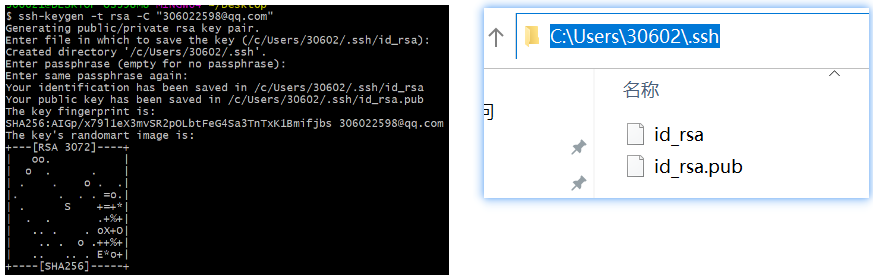
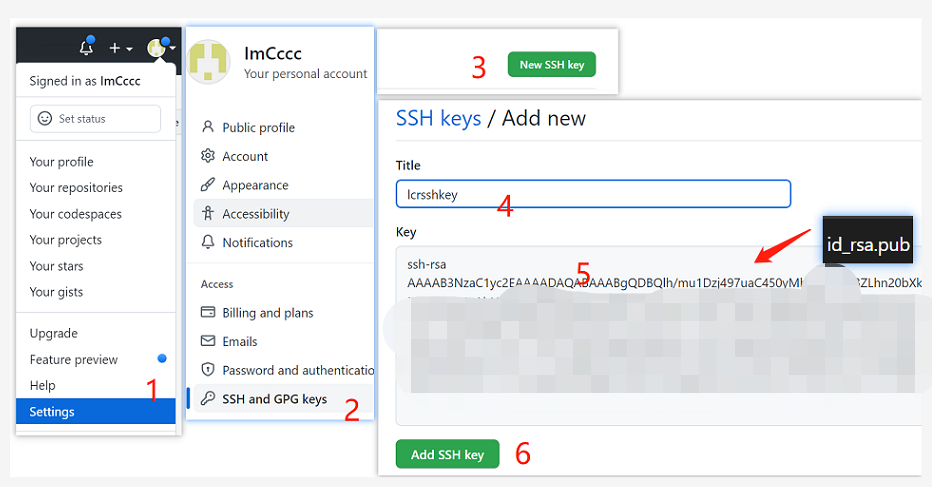

# github

下面是 gibhub 常见教程

github 上，拉代码有 2 和地址：

1. SSH: git@github.com:ImCccc/technology-document.git
2. https: https://github.com/ImCccc/technology-document.git

有什么区别呢？https url 直接有效网址打开，但是用户每次通过 git 提交的时候都要输入用户名和密码，有没有简单的一点的办法，一次配置，永久使用呢？当然，所以有了第二种地址，也就是 SSH URL，那如何配置就是本文要分享的内容。

## 配置 SSH

GitHub 配置 SSH Key 的目的是为了帮助我们在通过 git 提交代码是，不需要繁琐的验证过程，简化操作流程。

### 设置 git 的 user name 和 email

```
git config --global user.name "ImCccc"
git config --global user.email "306022598@qq.com"
```

### 生成 ssh key 命令

```
ssh-keygen -t rsa -C "306022598@qq.com"
```

成功截图（C:\Users\登录用户名\.ssh 目录，里面有两个文件：id_rsa 和 id_rsa.pub）：



### 配置 github


