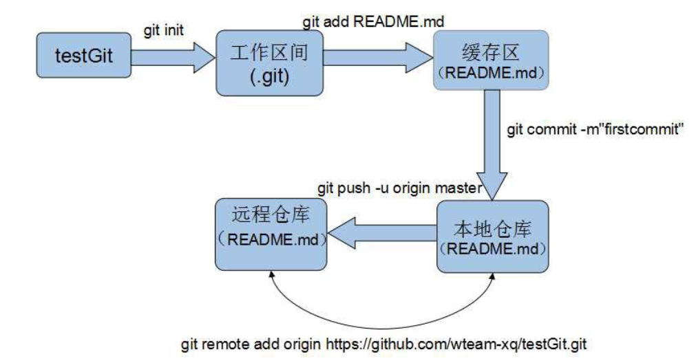

# github

下面是 gibhub 常见教程

github 上，拉代码有 2 和地址：

1. SSH: git@github.com:ImCccc/technology-document.git
2. https: https://github.com/ImCccc/technology-document.git

有什么区别呢？https url 直接有效网址打开，但是用户每次通过 git 提交的时候都要输入用户名和密码，有没有简单的一点的办法，一次配置，永久使用呢？当然，所以有了第二种地址，也就是 SSH URL，那如何配置就是本文要分享的内容。

## 配置 SSH

GitHub 配置 SSH Key 的目的是为了帮助我们在通过 git 提交代码是，不需要繁琐的验证过程，简化操作流程。

### 设置 git 的 user name 和 email

```
git config --global user.name "ImCccc"
git config --global user.email "306022598@qq.com"
```

### 生成 ssh key 命令

```
ssh-keygen -t rsa -C "306022598@qq.com"
```

成功截图（C:\Users\登录用户名\.ssh 目录，里面有两个文件：id_rsa 和 id_rsa.pub）：


### 配置 github


### 使用 git 命令行提交代码

```
git init
git add -A
git commit -m '提交注释'
git remote add origin git@github.com:ImCccc/technology-document.git
git push -u origin master
```

- `git init` 表示在当前的项目目录中生成本地的 git 管理

- `git add -A` 使用-A:将新增、删除、修改的文件改动全保存至缓存区

- `git commit -m "first commit"` 将代码从缓存区保存至本地仓库，实际开发中一般使用`git commit -am "说明的文字"`，使用 -a：如果没文件更改操作（增、删、改名）就可以省略 git add 指令；

- `git remote add origin ssh地址` 将本地仓库与指定的远程仓库创建 联系；

`push -u origin master` 将本地仓库代码推送至远程仓库，实际开发中该指令后需要输入 github 账号以及密码。（首次提交注意别遗漏`-u`指定默认主机）

以上指令正常执行后， 本地仓库的代码就提交到远程仓库了：



## git 分支命令

新建分支：

```
git branch dev
```

切换分支：

```
git checkout dev
```

新建分支 + 切换分支：

```
git checkout -b dev
```

分支提交到远程仓库:

```
git push origin -u dev
```

查看分支：

```
git branch
```

删除分支：

```
git branch -r -d origin/dev
git push origin :dev
```

master 分支合并到当前分支:

```
合并:           git merge master
提交至远程仓库:  git push origin
```

## git 提交拉去代码
