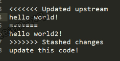

# github

个人 github 地址(账号：ImCccc 密码: 常见的密码后面-=):
<https://github.com/ImCccc?tab=repositories>

下面是 gibhub 常见教程：
<https://www.cnblogs.com/vs1435/p/11775861.html>

github 上，拉代码有 2 和地址：

1. SSH: git@github.com:ImCccc/technology-document.git
2. https: https://github.com/ImCccc/technology-document.git

有什么区别呢？https url 直接有效网址打开，但是用户每次通过 git 提交的时候都要输入用户名和密码，有没有简单的一点的办法，一次配置，永久使用呢？当然，所以有了第二种地址，也就是 SSH URL，如何配置下面有说明。

## 配置 SSH

GitHub 配置 SSH Key 的目的是为了帮助我们在通过 git 提交代码是，不需要繁琐的验证过程，简化操作流程。

### 设置 git 的 user name 和 email

```
git config --global user.name "ImCccc"
git config --global user.email "1234567@qq.com"
```

### 生成 ssh key 命令

```
ssh-keygen -t rsa -C "1234567@qq.com"
```

成功截图（C:\Users\登录用户名\.ssh 目录，里面有两个文件：id_rsa 和 id_rsa.pub）：


### 配置 github


设置完成后，直接可以在 vscode 上提交代码了

## git 命令行提交代码

```
git init
git add -A
git commit -m '提交注释'
git remote add origin git@github.com:ImCccc/technology-document.git
git push -u origin master
```

- `git init` 表示在当前的项目目录中生成本地的 git 管理

- `git add -A` 使用-A:将新增、删除、修改的文件改动全保存至缓存区

- `git commit -m "first commit"` 将代码从缓存区保存至本地仓库，实际开发中一般使用`git commit -am "说明的文字"`，使用 -a：如果没文件更改操作（增、删、改名）就可以省略 git add 指令；

- `git remote add origin ssh地址` 将本地仓库与指定的远程仓库创建 联系；

- `git push -u origin master` 将本地仓库代码推送至远程仓库，实际开发中该指令后需要输入 github 账号以及密码。（首次提交注意别遗漏`-u`指定默认主机）

以上指令正常执行后， 本地仓库的代码就提交到远程仓库了：


## git 分支命令

新建分支：

```
git branch dev
```

切换分支：

```
git checkout dev
```

新建分支 + 切换分支：

```
git checkout -b dev
```

分支提交到远程仓库:

```js
git push origin -u dev

// 如果存在分支
git push origin master
```

查看分支：

```
git branch
```

删除分支：

```
git branch -r -d origin/dev
git push origin :dev
```

master 分支合并到当前分支:

```
合并:           git merge master
提交至远程仓库:  git push origin
```

## git 其他命令

添加当前目录的所有代码：

```
git add .
```

提交到本地仓库（远程还没有看到）：

```
git commit -m  '提交留言'
```

提交到远程:

```
git push origin -u dev
```

## 冲突解决

合并分支 merge，或者拉取代码 push, 出现冲突解：


出现以上提示， 说明本次更新代码失败；主要在于本地工作区间跟远程仓库的新代码冲突了

### 放弃本地修改

放弃本地修改意味着将 远程仓库 的代码完全覆盖本地仓库以及本地工作区间

```
git checkout head .
git pull 或者 git merge dev
```

### 解决冲突后提交本地修改

1. 将本地修改放入缓存区(成功后本地工作区间的代码跟本地仓库代码会同步)， 具体指令：

```
git stash
```

2. 从远程仓库获取最新代码，具体指令:

```
git pull 或者 git merge dev
```

3. 取出本地修改的代码，冲突的代码就很清晰的展现在我们面前了， 具体指令:

```
git stash pop
```



4. 手工解决冲突，提交代码：

```
git add README.md
git commit -am '解决冲突'
git push origin master
```

## 版本回退

回退到上一个版本（上一个版本就是 HEAD^，上上一个版本就是 HEAD^^，当然往上 100 个版本写 100 个^比较容易数不过来，所以写成 HEAD~100）：

```
git reset --hard HEAD^
```

### 回调未来版本

Git 提供了一个命令 git reflog 用来记录你的每一次命令：


回到未来：

```
git reset --hard 97e962c
```

## 撤销修改

```
git checkout -- readme.txt
```

`git checkout -- readme.txt` 意思就是把 readme.txt 文件在工作区的修改全部撤销，这里有两种情况：

1. readme.txt 自修改后还没有被放到暂存区，现在，撤销修改就回到和版本库一模一样的状态；

2. readme.txt 已经添加到暂存区后，又作了修改，现在，撤销修改就回到添加到暂存区后的状态。

总之，就是让这个文件回到最近一次 git commit 或 git add 时的状态。

**git checkout -- file 命令中的--很重要，没有--，就变成了“切换到另一个分支”的命令**

## 常见问题

### 只合并分支 A 的某一个 commit

在 A 分支上提交了一个 commit，B 分支也同样需要这个 commit 的代码，但是分支 B 不能合并分支 A, 因为分支 A 有些代码不能直接上线，下面就教你如何只合并分支 A 的某一个 commit

1.  先找到需要合并的 commit 的代号，一般是一个很长的字符串，可以在 gitLab 找到，如下图:


2.  终端执行命令：

```
git cherry-pick ff476ddb3535f6c6af8576c3be98530b584c9b2d
```

### vscode 看不到远程分支

```
git remote update origin --prune
```

## 同时使用 gitHub 和 gitLab

gitLab 配置和之前一样, 下面重点说说 gitHub 配置

1. 打开 git 客户端, 生成 gitHub 的秘钥 (和 gitLab 不一样就是指定名称)

```
ssh-keygen -t rsa -C "306022598@qq.com" -f ~/.ssh/id_rsa_github
```

有提问,按回车即可, 完成后会生成文件, 如下:


2. gitHub 上添加 sshkey (可以添加多个的)


3. `.ssh` 文件夹下面, 添加配置文件 `config` (不需要后缀名)

```
Host github.com
  User git
  HostName github.com
  User github邮箱
  IdentityFile ~/.ssh/id_rsa_github

Host gitlab.com
  User git
  HostName 公司域名
  User gitlab邮箱
  IdentityFile ~/.ssh/id_rsa
```

4. 在 git 客户端直接就可以克隆了<font color="red">(要 ssh 地址, 不要使用 https 地址)</font>

```
git clone git@github.com:ImCccc/technology-document.git
```

5. 克隆后, 直接在 `vscode` 上就可以提交 `gitLab` 和 `gitHub` 代码
