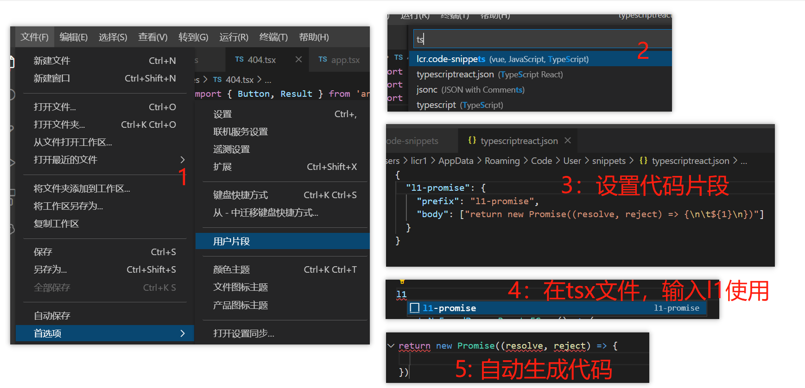

# vscode 常见配置

下面列出 `vscode` 常见问题与配置

## vscode 看不到远程分支

执行：

```
git remote update origin --prune
```

## vscode 不能使用 cnpm

1、打开 vs code（以管理员身份运行）

2、在终端执行：get-ExecutionPolicy，显示 Restricted（表示状态是禁止的）

3、在终端执行：set-ExecutionPolicy RemoteSigned

4、在终端执行：get-ExecutionPolicy，显示 RemoteSigned

## vscode 设置代码片段



## vscode 不能使用 rm-rf 删除文件夹

- 方法 1

全局安装:

```
npm install rimraf –g
```

执行命令:

```
rimraf node_modules
```

- 方法 2

当前安装：

```
npm install rimraf –D
```

package.json 添加：

```
"scripts": {
  "rm": :rimraf node_modules"
}
```

执行命令:

```
npm run rm
```

## vscode 没有文件名提示

vite 创建的 vue 项目中 import 引入文件会有路径提示，不过除了 ts 文件，其他文件都没有文件名的提示，导致手敲，很麻烦：


解决方案：

1. 安装插件 Path Autocomplete


2. 按下 ctrl + shift + p, 输入 setting, 打开配置文件


setting.json:

```json
{
  //导入文件时是否携带文件的拓展名
  "path-autocomplete.extensionOnImport": true,
  //配置@的路径提示
  "path-autocomplete.pathMappings": { "@": "${folder}/src" }
}
```

3. 完成：


## vscode css module 有代码提示

1. 安装

```
yarn add -D typescript-plugin-css-modules
```

2. vs code 的 setting.json 添加：

```json
{
  "typescript.tsserver.pluginPaths": ["typescript-plugin-css-modules"]
}
```

3. 配置 tsconfig.json

```json
{
  "compilerOptions": {
    "plugins": [
      {
        "name": "typescript-plugin-css-modules",
        "options": { "customMatcher": "\\.(c|le|sc)ss" }
      }
    ]
  }
}
```


