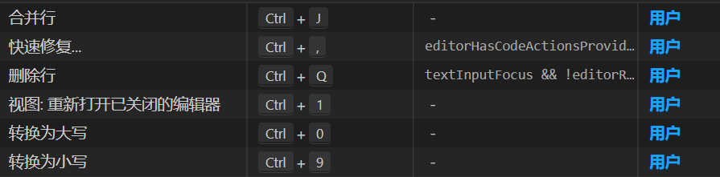

# vscode 配置

下面列出 `vscode` 常见问题与配置

## 常见插件


- 中文: Chinese (Simplified) (简体中文)

- 括号有颜色: [Deprecated] Bracket Pair Colorizer

  <font color="red">有自带的,需要设置下</font>
  

- 开启简单服务器: Live Server

- 右键在浏览器打开 html 文件: open in browser

- 代码格式: Prettier - Code formatter

- vue3 代码格式: Vue Language Features (Volar)

- 代码校验: ESLint

## 看不到远程分支

执行：

```
git remote update origin --prune
```

## 不能使用 cnpm

1、打开 vs code（以管理员身份运行）

2、在终端执行：get-ExecutionPolicy，显示 Restricted（表示状态是禁止的）

3、在终端执行：set-ExecutionPolicy RemoteSigned

4、在终端执行：get-ExecutionPolicy，显示 RemoteSigned

## 设置代码片段


### css | less | scss 代码片段

::: details 点击查看 less.json

```json
{
  "mixins-variables": {
    "prefix": "aaa-import",
    "body": [
      "@import '~@/styles/mixins.less';",
      "@import '~@/styles/variables.less';"
    ]
  },

  "display: flex": {
    "prefix": "aaa-flex",
    "body": ["display: flex;"]
  },

  "flex-grow: 1": {
    "prefix": "aaa-grow1",
    "body": ["flex-grow: 1;"]
  },

  "flex-shrink: 0": {
    "prefix": "aaa-shrink0",
    "body": ["flex-shrink: 0;"]
  },

  "flex-direction: column": {
    "prefix": "aaa-column",
    "body": ["display: flex;", "flex-direction: column;"]
  },

  "flex-column-between": {
    "prefix": "aaa-between-column",
    "body": [
      "display: flex;",
      "flex-direction: column;",
      "justify-content: space-between;"
    ]
  },

  "flex-center": {
    "prefix": "aaa-center",
    "body": [
      "display: flex;",
      "align-items: center;",
      "justify-content: center;"
    ]
  },

  "flex-between": {
    "prefix": "aaa-between",
    "body": [
      "display: flex;",
      "align-items: center;",
      "justify-content: space-between;"
    ]
  },

  "cursor: pointer": {
    "prefix": "aaa-cursor",
    "body": ["cursor: pointer;"]
  },

  "ellipsis": {
    "prefix": "aaa-ellipsis",
    "body": ["width: ${0};", "overflow: hidden;", "text-overflow: ellipsis;"]
  }
}
```

:::

### tsx 代码片段

.tsx 的配置文件对应的是 `typescriptreact.json`

::: details 点击查看 typescriptreact.json

```json
{
  "init-tsx": {
    "prefix": "aaainit",
    "body": [
      "import styles from './index.module.less';\n",
      "const Comp: React.FC = () => {",
      "\treturn <div>test</div>;",
      "};\n",
      "export default Comp;"
    ]
  },

  "import-style": {
    "prefix": "aaastyles",
    "body": ["import styles from './index.module.less';\n"]
  },

  "classNames": {
    "prefix": "aaaclassNames",
    "body": "import classNames from 'classnames';"
  },

  "Modal.confirm": {
    "prefix": "aaaModal",
    "body": [
      "Modal.confirm({",
      "\ttitle: '提示',",
      "\tcontent: '数据未保存，确定要离开吗？',",
      "\tcancelText: '取消',",
      "\tokText: '确定',",
      "\tonOk: () => {",
      "\t},",
      "});"
    ]
  },

  "import-utils": {
    "prefix": "aaautils",
    "body": ["import { ${1:clone} } from '@/utils/util';"]
  },

  "umi-history": {
    "prefix": "aaacomp",
    "body": ["import { $1 } from '@/components$1';"]
  },

  "antd-Button": {
    "prefix": "aaaButton",
    "body": ["import { Button } from 'antd';"]
  },

  "数组promise": {
    "prefix": "aaapromise",
    "body": ["return new Promise((resolve, reject) => {\n\t${1}\n})"]
  },

  "定时器setTimeout": {
    "prefix": "aaasettimeout",
    "body": ["const ${1:timer} = setTimeout(() => {\n\t$3\n}, ${2:60})"]
  },

  "数组reduce": {
    "prefix": "aaareduce",
    "body": ["${1:arr}.reduce((data, cur) => {\n\t${2}\n\treturn data\n}, {})"]
  }
}
```

:::

### markdown 代码片段

`markdown` 文档的代码片段配置文件为 <font color="red">markdown.json </font>

::: details 点击查看 markdown.json 配置

````json
{
  "Print ···javascript": {
    "prefix": "···js",
    "body": ["```javascript", "$1", "$2", "```"],
    "description": "js代码片段"
  },

  "Print ···css": {
    "prefix": "···css",
    "body": ["```css", "$1", "$2", "```"],
    "description": "css代码片段"
  },

  "Print ···html": {
    "prefix": "···html",
    "body": ["```html", "$1", "$2", "```"],
    "description": "html代码片段"
  },

  "Print ···json": {
    "prefix": "···json",
    "body": ["```json", "$1", "$2", "```"],
    "description": "json代码片段"
  },

  "Print ```javascript": {
    "prefix": "```js",
    "body": ["```javascript", "$1", "$2", "```"],
    "description": "js代码片段"
  },

  "Print ```css": {
    "prefix": "```css",
    "body": ["```css", "$1", "$2", "```"],
    "description": "css代码片段"
  },

  "Print ```html": {
    "prefix": "```html",
    "body": ["```html", "$1", "$2", "```"],
    "description": "html代码片段"
  },

  "Print ```json": {
    "prefix": "```json",
    "body": ["```json", "$1", "$2", "```"],
    "description": "json代码片段"
  },

  "Print img": {
    "prefix": "aaaimg",
    "body": [""],
    "description": "img"
  },

  "Print font": {
    "prefix": "aaafont",
    "body": ["<font color=\"${0:red}\">$1</font>"],
    "description": "字体"
  }
}
````

:::

**给 md 文档添加代码片段, 请看下面步骤:**

1. 找到 markdown.json 配置文件:


2. 这时还不行, 需要在配置文件 `setting.json` 添加配置:


```json
{
  "[markdown]": {
    "editor.quickSuggestions": true
  }
}
```

## 使用 rm-rf 删除文件夹

- 方法 1

全局安装:

```
npm install rimraf –g
```

执行命令:

```
rimraf node_modules
```

- 方法 2

当前安装：

```
npm install rimraf –D
```

package.json 添加：

```
"scripts": {
  "rm": "rimraf node_modules"
}
```

执行命令:

```
npm run rm
```

## 没有文件名提示

vite 创建的 vue 项目中 import 引入文件会有路径提示，不过除了 ts 文件，其他文件都没有文件名的提示，导致手敲，很麻烦：


解决方案：

1. 安装插件 Path Autocomplete


2. 按下 ctrl + shift + p, 输入 setting, 打开配置文件


setting.json:

```json
{
  //导入文件时是否携带文件的拓展名
  "path-autocomplete.extensionOnImport": true,
  //配置@的路径提示
  "path-autocomplete.pathMappings": { "@": "${folder}/src" }
}
```

3. 完成：


## css module 代码提示

1. 安装

```
yarn add -D typescript-plugin-css-modules
```

2. vs code 的 setting.json 添加：

```json
{
  "typescript.tsserver.pluginPaths": ["typescript-plugin-css-modules"]
}
```

3. 配置 tsconfig.json

```json
{
  "compilerOptions": {
    "plugins": [
      {
        "name": "typescript-plugin-css-modules",
        "options": { "customMatcher": "\\.(c|le|sc)ss" }
      }
    ]
  }
}
```


::: warning

注意: 使用该插件后, 引入 less 变量, 不能使用别名的方式, 要使用相对路径, 不然 ts 会报错

例子: `@import '../../styles/var.less';`
:::

## less 使用函数/混入报红

原因 vscode 安装了插件 Stylelint, 禁用就行了

## 我的 vscode 快捷键

下面是我本人自定义的快捷键:



## 批量重命名变量和函数

1. 双击变量名
2. 右键 或者 按下 F2
3. 此时会出现输入框,输入新名称,按下回车键即可完成


## 配置 prettier

<https://www.prettier.cn/docs/options.html>

1. 安装插件 `Prettier - Code formatter`


2. 添加配置文件 `.prettierrc.js` ( 和`package.json`同级 )

::: details 我的 .prettierrc.js 配置

```js
module.exports = {
  printWidth: 80,
  tabWidth: 2,

  // 是否使用分号结尾, 默认true
  semi: true,

  // 使用单引号, 默认 false
  singleQuote: true,

  /*
    行尾逗号, 默认 none
    all: {
      name: 'xxx'
    }
    none: {
      name: 'xxx'
    }
  */
  trailingComma: "all",

  /*
    JSX标签闭合位置,默认 false
    false:
      <div
        style={{}}
        className={styles.main}
      >
        test
      </div>
    true:
      <div
        style={{}}
        className={styles.main}>
        test
      </div>
  */
  jsxBracketSameLine: false,

  proseWrap: "never",
  endOfLine: "lf",
  overrides: [
    {
      files: ".prettierrc",
      options: { parser: "json" },
    },
  ],
  importOrder: [
    "^react(.*)$",
    "^ice(.*)$",
    "<THIRD_PARTY_MODULES>",
    "^(?!.*(.css|.less|.sass|.scss|.jpg|.png|.gif|.svg|.jpeg|.bmp|.webp|.tiff|.ico|@/services))(@/.*)",
    "^(?!.*(.css|.less|.sass|.scss|.jpg|.png|.gif|.svg|.jpeg|.bmp|.webp|.tiff|.ico))(@/services.*)",
    "^(?!.*(.css|.less|.sass|.scss|.jpg|.png|.gif|.svg|.jpeg|.bmp|.webp|.tiff|.ico))(..?/.*)",
    "(.jpg|.png|.gif|.svg|.jpeg|.bmp|.webp|.tiff|.ico)$",
    "(.css|.less|.sass|.scss)$",
  ],
  importOrderSeparation: true,
  importOrderSortSpecifiers: true,
  importOrderCaseInsensitive: true,
  importOrderParserPlugins: ["typescript", "jsx", "classProperties"],
};
```

:::

3. 修改 `vscode` 配置 `setting.json`


::: details 我的 setting.json 配置

```json
{
  // 保存时格式化
  "editor.formatOnSave": true,

  "editor.codeActionsOnSave": {
    // 保存自动修复 eslint 报错
    "source.fixAll.eslint": true,
    // 保存时，自动去掉无效的 import
    "source.organizeImports": true
  },

  // tsx 代码格式化, 使用 prettier
  "[typescriptreact]": {
    "editor.defaultFormatter": "esbenp.prettier-vscode"
  },

  // ts 代码格式化, 使用 prettier
  "[typescript]": {
    "editor.defaultFormatter": "esbenp.prettier-vscode"
  },

  // json 代码格式化, 使用 prettier
  "[json]": {
    "editor.defaultFormatter": "esbenp.prettier-vscode"
  },

  // json 代码格式化, 使用 prettier
  "[jsonc]": {
    "editor.defaultFormatter": "esbenp.prettier-vscode"
  },

  // js 代码格式化, 使用 prettier
  "[javascript]": {
    "editor.defaultFormatter": "esbenp.prettier-vscode"
  },

  // html 代码格式化, 使用 prettier
  "[html]": {
    "editor.defaultFormatter": "esbenp.prettier-vscode"
  },

  // 删除文件是否弹出2次确认框
  "explorer.confirmDelete": false,

  "editor.tabSize": 2,

  // git 推送不需要2次确认
  "git.confirmSync": false,

  // git 推送不需要2次确认
  "git.enableSmartCommit": true,

  // md 文档设置代码片段
  "[markdown]": {
    "editor.quickSuggestions": true
  }
}
```

:::

## 配置 eslint

<https://marketplace.visualstudio.com/items?itemName=dbaeumer.vscode-eslint#settings-options>

1. 安装 `vscode` 插件 `ESLint`


2. 添加配置文件 `.eslintrc.js` ( 和`package.json`同级 )

::: details 我的配置(react + ts)

```js
module.exports = {
  root: true,
  env: {
    browser: true,
    es2021: true,
    node: true,
  },
  parser: "@typescript-eslint/parser",
  extends: [
    "plugin:react/recommended",
    "plugin:react-hooks/recommended",
    "plugin:@typescript-eslint/recommended",
  ],
  parserOptions: {
    ecmaFeatures: {
      jsx: true,
    },
    ecmaVersion: 13,
    sourceType: "module",
  },
  plugins: ["react", "react-hooks", "@typescript-eslint"],
  rules: {
    "no-duplicate-imports": [1, { includeExports: true }], // 不能重复import
    "react-hooks/rules-of-hooks": "error",
    "react/react-in-jsx-scope": 0, // 关闭掉 页面必须引入React
    "@typescript-eslint/no-explicit-any": 0, // 关闭 any
    "react/prop-types": 0,
    "react/display-name": 0,
  },
};
```

:::

3. 需要安装一些包

```js
"devDependencies": {
  "typescript": "5.0.4",
  "@types/node": "18.16.3",
  "@types/react": "18.2.2",
  "@types/react-dom": "18.2.3",
  "eslint": "8.39.0",
  "eslint-plugin-react": "^7.30.0",
  "eslint-plugin-react-hooks": "^4.6.0",
  "@typescript-eslint/eslint-plugin": "^5.29.0",
  "@typescript-eslint/parser": "^5.29.0"
}
```

4. 如果需要忽略某些文件, 可以添加 `.eslintignore` 文件忽略

```text
/lambda/
/scripts
/config
public
dist
mock
```

## Tailwind CSS IntelliSense 插件

安装插件:


添加配置

```javascript
"tailwindCSS.experimental.classRegex": [
  "classnames\\(([^)]*)\\)",
  "class:\\s*\"([^\"]*)\""
],
"editor.quickSuggestions": {
  "strings": true
}
```

### 在 vite 项目使用的步骤

```javascript
npm create vite@latest my-project -- --template react
cd my-project

npm install -D tailwindcss postcss autoprefixer
npx tailwindcss init -p
```

tailwind.config.js:

```javascript
/** @type {import('tailwindcss').Config} */
export default {
  content: ["./index.html", "./src/**/*.{js,ts,jsx,tsx}"],
  theme: {
    extend: {},
  },
  plugins: [],
};
```

index.css:

```css
@tailwind base;
@tailwind components;
@tailwind utilities;
```

```javascript
npm run dev
```

## 我的 vscode 配置

`settings.json`

```json
{
  // 保存时格式化
  "editor.formatOnSave": true,

  "editor.codeActionsOnSave": {
    // 保存自动修复 eslint 报错
    "source.fixAll.eslint": true,
    // 保存时，自动去掉无效的 import
    "source.organizeImports": true
  },

  // tsx 代码格式化, 使用 prettier
  "[typescriptreact]": {
    "editor.defaultFormatter": "esbenp.prettier-vscode"
  },

  // ts 代码格式化, 使用 prettier
  "[typescript]": {
    "editor.defaultFormatter": "esbenp.prettier-vscode"
  },

  // json 代码格式化, 使用 prettier
  "[json]": {
    "editor.defaultFormatter": "esbenp.prettier-vscode"
  },

  // json 代码格式化, 使用 prettier
  "[jsonc]": {
    "editor.defaultFormatter": "esbenp.prettier-vscode"
  },

  // js 代码格式化, 使用 prettier
  "[javascript]": {
    "editor.defaultFormatter": "esbenp.prettier-vscode"
  },

  // html 代码格式化, 使用 prettier
  "[html]": {
    "editor.defaultFormatter": "esbenp.prettier-vscode"
  },

  // 删除文件是否弹出2次确认框
  "explorer.confirmDelete": false,

  "editor.tabSize": 2,

  // git 同步更改不需要2次确认
  "git.confirmSync": false,

  // git 推送不需要2次确认
  "git.enableSmartCommit": true,

  // md 文档设置代码片段
  "[markdown]": {
    "editor.quickSuggestions": true
  },

  // tailwindCSS 配置
  "tailwindCSS.experimental.classRegex": [
    "classnames\\(([^)]*)\\)",
    "class:\\s*\"([^\"]*)\""
  ],
  // tailwindCSS 配置
  "editor.quickSuggestions": {
    "strings": true
  }
}
```
