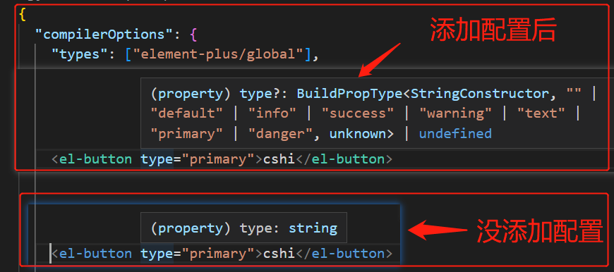

# element-plus

element-plus: <https://element-plus.gitee.io/zh-CN/guide/design.html>

## 按需加载（vite）

1. 安装插件

```
yarn add -D unplugin-vue-components unplugin-auto-import
```

2. 修改配置文件 vite.config.ts

```ts
import AutoImport from "unplugin-auto-import/vite";
import Components from "unplugin-vue-components/vite";
import { ElementPlusResolver } from "unplugin-vue-components/resolvers";
export default defineConfig({
  plugins: [
    AutoImport({ resolvers: [ElementPlusResolver()] }),
    Components({ resolvers: [ElementPlusResolver()] }),
  ],
});
```

3. 使用 (不需要 import)

```html
<template>
  <el-button type="primary">cshi</el-button>
  <el-input placeholder="Please input" />
</template>
```

## Volar 支持

tsconfig.json 中通过 compilerOptions.type 指定全局组件类型。

```ts
{
  "compilerOptions": {
    "types": ["element-plus/global"]
  }
}
```



## 国际化

```html
<!-- App.vue -->
<template>
  <el-config-provider :locale="locale">
    <Layout />
  </el-config-provider>
</template>
<script setup lang="ts">
  import { ElConfigProvider } from "element-plus";
  import zhCn from "element-plus/lib/locale/lang/zh-cn";
  import Layout from "@/components/Layout.vue";
  const locale = zhCn;
</script>
```
