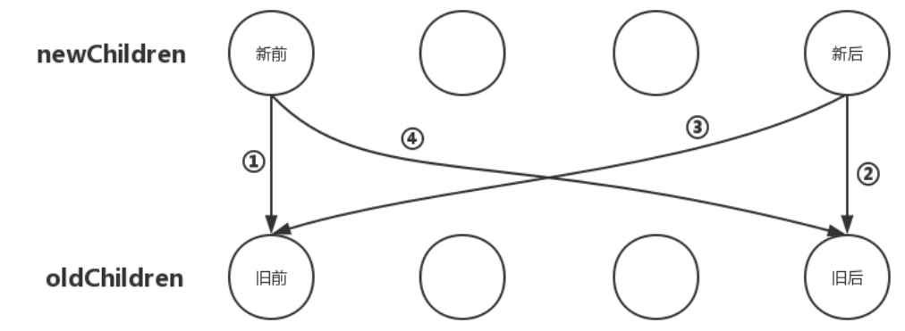
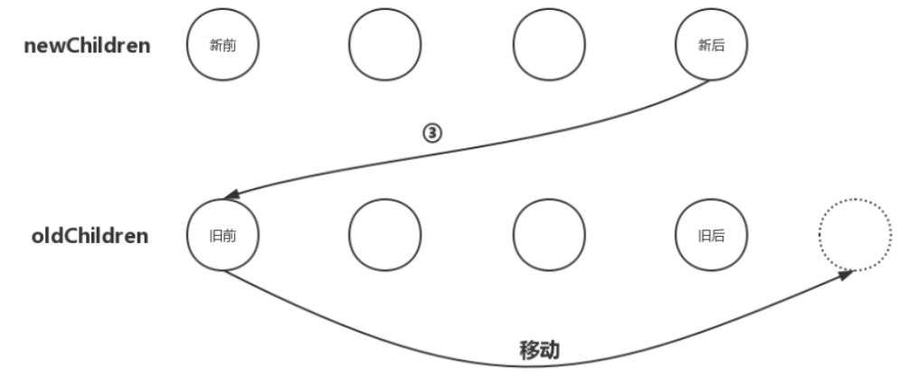
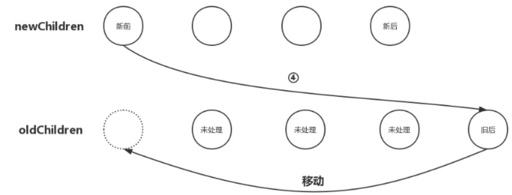
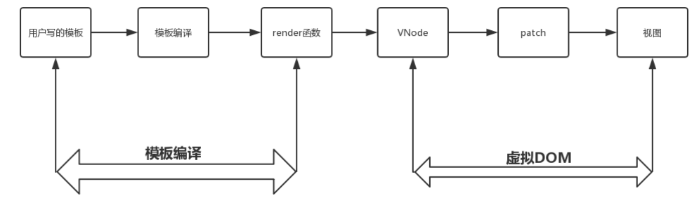
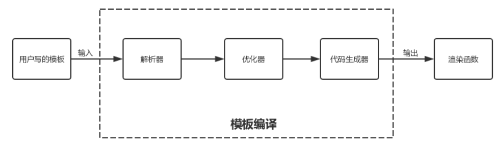

# vue2 源码解读

<https://vue-js.com/learn-vue/reactive/object.html#_4-%E4%BE%9D%E8%B5%96%E5%88%B0%E5%BA%95%E6%98%AF%E8%B0%81>

**v2 存在的问题:**

1. 数据量大后带来的渲染和更新的性能问题
2. 源码自身的维护性
3. 想舍弃但为了兼容而一直保留的鸡肋 api
4. 编程体验差, 逻辑复用差

**v3 做了哪些优化?**

1. 源码优化

   > v3 使用 `monorepo` 管理源码, 让代码更加易于维护和开发
   >
   > 相对于 v2 的源码组织方式, monorepo 将模块拆分到不同的 package 中,每一个 package 都有自己的 API,类型定义和测试, 主要使得模块拆分的更细化,职责划分的更加明确,模块之间的依赖也更加明确,开发人员也更好阅读,更好修改维护;
   >
   > 另外 package 是可以独立于 vue.js 使用的, 这样用户就可以只使用某一个功能,而不需要依赖整个 vue.js, v2 是做不到这一点

2. 使用 `typescript` 开发源码

   > Flow 是 Fackbook 出品的静态类型检查工具, v2 是使用 Flow 做类型检查, 对于一些复杂的场景支持并不好,
   >
   > v3 使用 `typescript`

3. 源码体积优化

   > v3 移除了冷门的 api, 引入 tree-shaking; `tree-shaking` 依赖 es2015 的模块语法, 即 `import` 和 `export`, 通过编辑阶段的静态分析, 找到没有引入的模块并打上标记, 达到减少体积的优化

4. 数据劫持优化

   > v2 使用 `Object.defineProperty` 这个 api 劫持数据的 `getter` `setter`, 但是存在一些问题, 例如不能知道对象的某一个属性被删除和增加, 虽然添加了 `$set` 和 `$delete` 的实例方法, 但是对于用户来说,还是添加了一定的心智负担; 还有对于深层次嵌套的对象, 必须递归将所有属性变为响应式, 会有性能问题;
   >
   > v3 使用 Proxy API 做数据劫持, 它劫持的是整个对象, 对于对象的增加和删除都能监测到,<font color="red">但是 Proxy 不能内部深层次的数据变化,</font> v3 的处理方式是在 getter 中去递归响应式, 这样的好处是真正访问到内部对象, 才会变成响应式,而不是无脑的递归, 提高了性能

5. 编辑优化

   > v2 的数据更新触发重新渲染的粒度是组件级别的, 虽然能保证组件更新的最少化, 但是在更新过程中需要遍历整个 vNode 树, 当组件只有少量的动态节点更新, 很多遍历都是性能的浪费;
   >
   > v3 通过编译阶段对静态模板的分析, 将静态节点标记, vnode 更新由之前的与 “模板大小” 相关提升为与 “动态内容数量” 相关

6. 语法优化
   > v2 使用 Options API 的规范开发, 缺点就是对于复杂的逻辑, 开发过程中需要跳来跳去, 修改起来容易出错;
   >
   > v3 提供了 Composition API, 将某一个逻辑相关的逻辑封装在一个函数中, 当修改一个功能, 就不会出现上述的问题;
   >
   > v2 的逻辑复用是使用 mixins, 会有命名冲突, 数据来源不清晰等问题;
   >
   > v3 的 Composition 就很好解决这样的问题, 而且有更好的类型支持, 对 tree-shaking 也更好的支持

## Object 变得可观测

原理就是递归对象的每一个属性, 通过 Object.defineProperty 方法对对象的每一个属性进行配置, 通过劫持 get 和 set 方法, 可以知道对象什么时候被修改, 什么时候被读取, <font color="red">然后在获取数据时收集依赖，数据变化时通知依赖更新。</font> 具体代码:

```javascript
class Observer {
  constructor(value) {
    this.value = value;
    if (Array.isArray(value)) {
      // value 是数组的逻辑 ......
    } else {
      this.walk(value);
    }
  }

  walk(obj) {
    const keys = Object.keys(obj);
    for (let i = 0; i < keys.length; i++) {
      defineReactive(obj, keys[i]);
    }
  }
}

function defineReactive(obj, key, val) {
  if (arguments.length === 2) {
    val = obj[key];
  }

  if (typeof val === "Object") {
    new Observer(val);
  }

  Object.defineProperty(obj, key, {
    enumerable: true,
    configurable: true,
    get() {
      console.log(`${key}属性被读取了`);
      return val;
    },
    set(newVal) {
      if (newVal === val) return;
      console.log(`${key}属性被修改了`);
      val = newVal;
    },
  });
}

// 那么现在，我们就可以这样定义car, 这样，car的两个属性都变得可观测了。
let car = new Observer({
  brand: "BMW",
  price: 3000,
});
```

### 什么是依赖收集

上一节, 我们就能知道数据什么时候发生了变化，那么当数据发生变化时，我们去通知视图更新就好了。视图里谁用到了这个数据就更新谁;

给每个数据都建一个依赖数组，谁依赖了这个数据就把谁放入这个依赖数组中，那么当这个数据发生变化的时候，就去它对应的依赖数组中，把每个依赖都通知一遍。这个过程就是依赖收集。

在 getter 中收集依赖，在 setter 中通知依赖更新

### 依赖管理器 Dep 类

上述所说的依赖收集和更新, 都在一个依赖管理器中进行, 依赖管理器就是 Dep ，代码如下

```javascript
// 源码位置：src/core/observer/dep.js
import { remove } from "../util/index";
import type Watcher from "./watcher";

let uid = 0;
export default class Dep {
  static target: ?Watcher;
  id: number;
  subs: Array<Watcher>;

  constructor() {
    this.id = uid++;
    this.subs = [];
  }

  addSub(sub: Watcher) {
    this.subs.push(sub);
  }

  removeSub(sub: Watcher) {
    remove(this.subs, sub);
  }

  depend() {
    if (Dep.target) {
      Dep.target.addDep(this);
    }
  }

  notify() {
    const subs = this.subs.slice();
    for (let i = 0, l = subs.length; i < l; i++) {
      subs[i].update();
    }
  }
}

Dep.target = null;
const targetStack = [];

export function pushTarget(target: ?Watcher) {
  targetStack.push(target);
  Dep.target = target;
}

export function popTarget() {
  targetStack.pop();
  Dep.target = targetStack[targetStack.length - 1];
}
```

### 依赖 Watcher 类

Vue 中还实现了一个叫做 Watcher 的类，而 Watcher 类的实例就是我们上面所说的那个依赖。谁用到了数据，谁就是依赖，我们就为谁创建一个 Watcher 实例。在之后数据变化时，我们不直接去通知依赖更新，而是通知 Watch 实例，由 Watcher 实例去通知真正的视图。精简过的源码如下:

```javascript
import { _Set as Set, isObject, parsePath, remove } from "../util/index";
import Dep, { pushTarget } from "./dep";
import { queueWatcher } from "./scheduler";
import type { SimpleSet } from "../util/index";
let uid = 0;

export default class Watcher {
  vm: Component;
  expression: string;
  cb: Function;
  id: number;
  deep: boolean;
  user: boolean;
  lazy: boolean;
  sync: boolean;
  dirty: boolean;
  active: boolean;
  deps: Array<Dep>;
  newDeps: Array<Dep>;
  depIds: SimpleSet;
  newDepIds: SimpleSet;
  before: ?Function;
  getter: Function;
  value: any;

  constructor(
    vm: Component,
    expOrFn: string | Function,
    cb: Function,
    options?: ?Object,
    isRenderWatcher?: boolean
  ) {
    this.vm = vm;
    if (isRenderWatcher) vm._watcher = this;
    vm._watchers.push(this);

    if (options) {
      this.deep = !!options.deep;
      this.user = !!options.user;
      this.lazy = !!options.lazy;
      this.sync = !!options.sync;
      this.before = options.before;
    } else {
      this.deep = this.user = this.lazy = this.sync = false;
    }
    this.cb = cb;
    this.id = ++uid;
    this.active = true;
    this.dirty = this.lazy;
    this.deps = [];
    this.newDeps = [];
    this.depIds = new Set();
    this.newDepIds = new Set();
    this.expression = "";

    /*
     * data = { a: { b: { c: 2 } } }
     * parsePath('a.b.c')(data)  // 2
     */
    this.getter = parsePath(expOrFn);
    this.value = this.get();
  }

  /**
   * 重新收集依赖关系
   */
  get() {
    /*
      Dep.target = null;
      const targetStack = [];
      function pushTarget(target) {
        targetStack.push(target);
        Dep.target = target;
      }
    */
    pushTarget(this);
    const vm = this.vm;
    // 因为之前已经将数据变得可监测, 所以可以在获取数据的时候, 收集当前的依赖
    return this.getter.call(vm, vm);
  }

  addDep(dep: Dep) {
    const id = dep.id;
    if (!this.newDepIds.has(id)) {
      this.newDepIds.add(id);
      this.newDeps.push(dep);
      if (!this.depIds.has(id)) {
        dep.addSub(this);
      }
    }
  }

  cleanupDeps() {
    let i = this.deps.length;
    while (i--) {
      const dep = this.deps[i];
      if (!this.newDepIds.has(dep.id)) {
        dep.removeSub(this);
      }
    }
    let tmp = this.depIds;
    this.depIds = this.newDepIds;
    this.newDepIds = tmp;
    this.newDepIds.clear();
    tmp = this.deps;
    this.deps = this.newDeps;
    this.newDeps = tmp;
    this.newDeps.length = 0;
  }

  update() {
    if (this.lazy) {
      this.dirty = true;
    } else if (this.sync) {
      this.run();
    } else {
      queueWatcher(this);
    }
  }

  run() {
    const value = this.get();
    const oldValue = this.value;
    this.value = value;
    this.cb.call(this.vm, value, oldValue);
  }

  evaluate() {
    this.value = this.get();
    this.dirty = false;
  }

  depend() {
    let i = this.deps.length;
    while (i--) {
      this.deps[i].depend();
    }
  }

  teardown() {
    if (this.active) {
      if (!this.vm._isBeingDestroyed) {
        remove(this.vm._watchers, this);
      }
      let i = this.deps.length;
      while (i--) {
        this.deps[i].removeSub(this);
      }
      this.active = false;
    }
  }
}
```

Watcher 类的代码实现逻辑：

1. 当实例化 Watcher 类时，会先执行其构造函数
2. 在构造函数中调用了 `this.get()`实例方法；
3. `get()`方法调用 `pushTarget` 将实例付给 `Dep.target`；通过 `this.getter.call(vm, vm)` 获取一下被依赖的数据，获取被依赖数据的目的是触发该数据上面的 `getter`, 在 `getter` 里会调用 `dep.depend()`收集依赖。
4. 当数据变化时，会触发数据的 `setter` ，在 `setter` 中调用了`dep.notify()`方法，在`dep.notify()`方法中，遍历所有 `watcher` 实例，执行依赖的`update()`方法，在`update()`方法中调用数据变化的更新回调函数，从而更新视图

### 不足之处

`Object.defineProperty` 只能观测到 object 数据的取值及设置值，当我们向 `object` 数据里添加一对新的 `key/value` 或删除一对已有的 `key/value` 时，它是无法观测到的，导致对 `object` 数据添加或删除值时，无法通知依赖，无法驱动视图进行响应式更新。

为了解决这一问题，Vue 增加了两个全局 API: `Vue.set ` `Vue.delete`

## Array 变得可观测

`Object.defineProperty` 是对象原型上的, Array 无法使用, 需要对 Array 型数据设计一套另外的变化侦测机制。
<font color="red">原理还是在获取数据时收集依赖，数据变化时通知依赖更新。</font>

- 收集依赖

  > arr 这个数据始终都存在于一个 object 数据对象中，要用到 arr 这个数据，得先从 object 数据对象中获取一下 arr 数据，而从 object 数据对象中获取 arr 数据自然就会触发 arr 的 getter，所以我们就可以在 getter 中收集依赖。

- 通知更新

  > 通过拦截能让数组发生变化的方法 : `push` `pop` `shift` `unshift` `splice` `sort` `reverse`, 实现数据更新通知视图更新

- 源码

```javascript
const arrayProto = Array.prototype;
const arrayMethods = Object.create(arrayProto);

function def(obj: Object, key: string, val: any, enumerable?: boolean) {
  Object.defineProperty(obj, key, {
    value: val,
    enumerable: !!enumerable,
    writable: true,
    configurable: true,
  });
}

const methodsToPatch = [
  "push",
  "pop",
  "shift",
  "unshift",
  "splice",
  "sort",
  "reverse",
];

methodsToPatch.forEach(function (method) {
  const original = arrayProto[method];
  def(arrayMethods, method, function mutator(...args) {
    const result = original.apply(this, args);
    const ob = this.__ob__;
    let inserted;
    switch (method) {
      case "push":
      case "unshift":
        inserted = args;
        break;
      case "splice":
        inserted = args.slice(2);
        break;
    }
    if (inserted) ob.observeArray(inserted);
    // notify change
    ob.dep.notify();
    return result;
  });
});
```

```javascript
export class Observer {
  value: any;
  dep: Dep;
  constructor(value: any) {
    if (Array.isArray(value)) {
      value.__proto__ = arrayMethods;
      this.observeArray(value);
    } else {
      //...
    }
  }
  observeArray(items: Array<any>) {
    // ...
  }
}
```

## 虚拟节点 VNode

```javascript
export default class VNode {
  tag: string | void;
  data: VNodeData | void;
  children: ?Array<VNode>;
  text: string | void;
  elm: Node | void;
  ns: string | void;
  context: Component | void; // rendered in this component's scope
  key: string | number | void;
  componentOptions: VNodeComponentOptions | void;
  componentInstance: Component | void; // component instance
  parent: VNode | void; // component placeholder node

  // strictly internal
  raw: boolean; // contains raw HTML? (server only)
  isStatic: boolean; // hoisted static node
  isRootInsert: boolean; // necessary for enter transition check
  isComment: boolean; // empty comment placeholder?
  isCloned: boolean; // is a cloned node?
  isOnce: boolean; // is a v-once node?
  asyncFactory: Function | void; // async component factory function
  asyncMeta: Object | void;
  isAsyncPlaceholder: boolean;
  ssrContext: Object | void;
  fnContext: Component | void; // real context vm for functional nodes
  fnOptions: ?ComponentOptions; // for SSR caching
  devtoolsMeta: ?Object; // used to store functional render context for devtools
  fnScopeId: ?string; // functional scope id support

  constructor(
    tag?: string,
    data?: VNodeData,
    children?: ?Array<VNode>,
    text?: string,
    elm?: Node,
    context?: Component,
    componentOptions?: VNodeComponentOptions,
    asyncFactory?: Function
  ) {
    /*当前节点的标签名*/
    this.tag = tag;

    /*当前节点对应的对象，包含了具体的一些数据信息，是一个VNodeData类型，可以参考VNodeData类型中的数据信息*/
    this.data = data;

    /*当前节点的子节点，是一个数组*/
    this.children = children;

    /*当前节点的文本*/
    this.text = text;

    /*当前虚拟节点对应的真实dom节点*/
    this.elm = elm;

    this.ns = undefined;

    /*当前组件节点对应的Vue实例*/
    this.context = context;

    /*函数式组件对应的Vue实例*/
    this.fnContext = undefined;
    // 函数式组件的option选项
    this.fnOptions = undefined;
    this.fnScopeId = undefined;

    this.key = data && data.key;

    /*组件的option选项*/
    this.componentOptions = componentOptions;
    /*当前节点对应的组件的实例*/
    this.componentInstance = undefined;

    /*当前节点的父节点*/
    this.parent = undefined;

    /*简而言之就是是否为原生HTML或只是普通文本，innerHTML的时候为true，textContent的时候为false*/
    this.raw = false;

    /*静态节点标志*/
    this.isStatic = false;

    /*是否作为跟节点插入*/
    this.isRootInsert = true;

    /*是否为注释节点*/
    this.isComment = false;

    /*是否为克隆节点*/
    this.isCloned = false;

    this.isOnce = false;
    this.asyncFactory = asyncFactory;
    this.asyncMeta = undefined;
    this.isAsyncPlaceholder = false;
  }

  get child(): Component | void {
    return this.componentInstance;
  }
}
```

**VNode 的类型**

    - 注释节点
    - 文本节点
    - 元素节点
    - 组件节点
    - 函数式组件节点
    - 克隆节点

1. 注释节点

   ```javascript
   export const createEmptyVNode = (text: string = "") => {
     const node = new VNode();
     node.text = text;
     node.isComment = true;
     return node;
   };
   ```

   注释节点只需两个属性，分别是：text 和 isComment。其中 text 属性表示具体的注释信息，isComment 是一个标志，用来标识一个节点是否是注释节点。

2. 文本节点

   ```javascript
   export function createTextVNode(val: string | number) {
     return new VNode(undefined, undefined, undefined, String(val));
   }
   ```

   文本节点只需要一个 text 属性用来表示具体的文本信息

3. 克隆节点

   ```javascript
   export function cloneVNode(vnode: VNode): VNode {
     const cloned = new VNode(
       vnode.tag,
       vnode.data,
       vnode.children && vnode.children.slice(),
       vnode.text,
       vnode.elm,
       vnode.context,
       vnode.componentOptions,
       vnode.asyncFactory
     );
     cloned.ns = vnode.ns;
     cloned.isStatic = vnode.isStatic;
     cloned.key = vnode.key;
     cloned.isComment = vnode.isComment;
     cloned.fnContext = vnode.fnContext;
     cloned.fnOptions = vnode.fnOptions;
     cloned.fnScopeId = vnode.fnScopeId;
     cloned.asyncMeta = vnode.asyncMeta;
     cloned.isCloned = true;
     return cloned;
   }
   ```

   克隆节点就是把已有节点的属性全部复制到新节点中，而现有节点和新克隆得到的节点之间唯一的不同就是克隆得到的节点 isCloned 为 true

4. 元素节点

   元素节点有描述节点标签名词的 tag 属性，描述节点属性如 class、attributes 等的 data 属性，有描述包含的子节点信息的 children 属性等。举个简单例子说明一下：

   ```jsx
   // 真实DOM节点
   <div id='a'>
     <span>难凉热血</span>
   </div>

   // VNode节点
   {
     tag:'div',
     data:{},
     children:[
       {
         tag:'span',
         text:'难凉热血'
       }
     ]
   }
   ```

5. 组件节点

   组件节点除了有元素节点具有的属性之外，它还有两个特有的属性：

   componentOptions: 组件的 option 选项，如组件的 props 等

   componentInstance: 当前组件节点对应的 Vue 实例

6. 函数式组件节点

   函数式组件节点相较于组件节点，它又有两个特有的属性：

   fnContext:函数式组件对应的 Vue 实例

   fnOptions: 组件的 option 选项

**VNode 的作用**

我们在视图渲染之前，把写好的 template 模板先编译成 VNode 并缓存下来，等到数据发生变化页面需要重新渲染的时候，我们把数据发生变化后生成的 VNode 与前一次缓存下来的 VNode 进行对比，找出差异，然后有差异的 VNode 对应的真实 DOM 节点就是需要重新渲染的节点，最后根据有差异的 VNode 创建出真实的 DOM 节点再插入到视图中，最终完成一次视图更新。

**总结**

VNode 以 JS 的计算性能来换取操作真实 DOM 所消耗的性能。Vue 中是通过 VNode 类来实例化出不同类型的虚拟 DOM 节点，不同类型节点生成的属性的不同，所谓不同类型的节点其本质还是一样的，都是 VNode 类的实例，只是在实例化时传入的属性参数不同罢了。最后探究了 VNode 的作用，有了数据变化前后的 VNode，我们才能进行后续的 DOM-Diff 找出差异，最终做到只更新有差异的视图，从而达到尽可能少的操作真实 DOM 的目的，以节省性能。

## patch

在 `Vue` 中，把 `DOM-Diff` 过程叫做 `patch` 过程, 本质是对比新旧两份 VNode 的过程; 所谓旧的 `VNode` 就是数据变化之前视图所对应的虚拟 `DOM` 节点，而新的 VNode 是数据变化之后对应的虚拟 `DOM` 节点, 以生成的新的 `VNode` 为基准，对比旧的 `oldVNode，如果新的` `VNode` 上有的节点而旧的 `oldVNode` 上没有，那么就在旧的 `oldVNode` 上加上去；如果新的 `VNode` 上没有的节点而旧的 `oldVNode` 上有，那么就在旧的 `oldVNode` 上去掉；如果某些节点在新的 `VNode` 和旧的 `oldVNode` 上都有，那么就以新的 `VNode` 为准，更新旧的 `oldVNode`，从而让新旧 `VNode` 相同。

- 创建节点：新的 VNode 中有而旧的 oldVNode 中没有，就在旧的 oldVNode 中创建。
- 删除节点：新的 VNode 中没有而旧的 oldVNode 中有，就从旧的 oldVNode 中删除。
- 更新节点：新的 VNode 和旧的 oldVNode 中都有，就以新的 VNode 为准，更新旧的 oldVNode。

### 更新子节点

当新的 VNode 与旧的 oldVNode 都是元素节点并且都包含子节点时，那么这两个节点的 VNode 实例上的 children 属性就是所包含的子节点数组。

我们把新的 VNode 上的子节点数组记为 newChildren，把旧的 oldVNode 上的子节点数组记为 oldChildren

把 newChildren 里面的元素与 oldChildren 里的元素一一进行对比，对比两个子节点数组肯定是要通过循环，外层循环 newChildren 数组，内层循环 oldChildren 数组，每循环外层 newChildren 数组里的一个子节点，就去内层 oldChildren 数组里找看有没有与之相同的子节点，伪代码如下：

```javascript
for (let i = 0; i < newChildren.length; i++) {
  const newChild = newChildren[i];
  for (let j = 0; j < oldChildren.length; j++) {
    const oldChild = oldChildren[j];
    if (newChild === oldChild) {
      // ...
    }
  }
}
```

那么以上这个过程将会存在以下四种情况：

1. 创建子节点

   > 如果 newChildren 里面的某个子节点在 oldChildren 里找不到与之相同的子节点，那么就创建子节点。
   >
   > 在 oldChildren 创建子节点, 位置是在 <font color="red">所有未处理节点之前</font> ，而并非所有已处理节点之后

2. 删除子节点

   > newChildren 里面的每一个子节点都循环完毕后，发现在 oldChildren 还有未处理的子节点，就将这些节点删除。

3. 移动子节点

   > newChildren 里面的某个子节点在 oldChildren 里找到了与之相同的子节点，但是位置不同，就以 newChildren 里子节点的位置为基准，调整 oldChildren 里该节点的位置，使之与在 newChildren 里的位置相同。
   >
   > 在 oldChildren 移动节点, 位置是在 <font color="red">所有未处理节点之前</font>

4. 更新节点
   > newChildren 里面的某个子节点在 oldChildren 里找到了与之相同的子节点，位置也相同，那么就更新 oldChildren 里该节点，使之与 newChildren 里的该节点相同。

### 更新子节点-算法优化

上述方法虽然能够解决问题，但是还存在可优化的地方。比如当包含的子节点数量很多时，这样循环算法的时间复杂度就会变的很大，不利于性能提升。 Vue 是如何做的?

1. 把 `newChildren 未处理子节点的第一个子节点`和 `oldChildren 未处理子节点的第一个子节点` 做比对，如果相同，那就直接进入更新节点的操作；

2. 如果不同，再把 `newChildren 未处理子节点的最后一个子节点` 和 `oldChildren 未处理子节点的最后一个子节点` 做比对，如果相同，那就直接进入更新节点的操作；

3. 如果不同，再把 `newChildren 未处理子节点的最后一个子节点` 和 `oldChildren 未处理子节点的第一个子节点` 做比对，如果相同，那就直接进入更新节点的操作，更新完后再将 oldChildren 数组里的该节点移动到与 newChildren 数组里节点相同的位置；

4. 如果不同，再把 `newChildren 未处理子节点的第一个子节点` 和 `oldChildren 未处理子节点的最后一个子节点` 做比对，如果相同，那就直接进入更新节点的操作，更新完后再将 oldChildren 数组里的该节点移动到与 newChildren 数组里节点相同的位置；

5. 最后四种情况都试完如果还不同，那就按照之前循环的方式来查找节点。



在上图中，我们把：

- newChildren 数组里的所有未处理子节点的第一个子节点称为： `新前`
- newChildren 数组里的所有未处理子节点的最后一个子节点称为： `新后`
- oldChildren 数组里的所有未处理子节点的第一个子节点称为： `旧前`
- oldChildren 数组里的所有未处理子节点的最后一个子节点称为： `旧后`

#### 新前与旧前

相同? 进入更新节点的操作, 无需进行节点移动操作；

不同? 尝试其他情况。

#### 新后与旧后

相同? 进入更新节点的操作, 无需进行节点移动操作；

不同? 尝试其他情况。

#### 新后与旧前

相同? 进入更新节点的操作, 更新完后再将 oldChildren 数组里的该节点移动到与 newChildren 数组里节点相同的位置: <font color="red">oldChildren 数组里把第一个子节点移动到数组中所有未处理节点之后</font>



不同? 尝试其他情况。

#### 新前与旧后

相同? 进入更新节点的操作, 更新完后再将 oldChildren 数组里的该节点移动到与 newChildren 数组里节点相同的位置: <font color="red">oldChildren 数组里把最后一个子节点移动到数组中所有未处理节点之前</font>



不同? 普通循环

#### 回归源码

前面所说的优化策略中，节点有可能是从前面对比，也有可能是从后面对比，对比成功就会进行更新处理，也就是说我们有可能处理第一个，也有可能处理最后一个，那么我们在循环的时候就不能简单从前往后循环，而是要从 <font color="red">两边向中间循环</font>

```javascript
function updateChildren(
  parentElm,
  oldCh,
  newCh,
  insertedVnodeQueue,
  removeOnly
) {
  let oldStartIdx = 0;
  let newStartIdx = 0;
  let oldEndIdx = oldCh.length - 1;
  let oldStartVnode = oldCh[0];
  let oldEndVnode = oldCh[oldEndIdx];
  let newEndIdx = newCh.length - 1;
  let newStartVnode = newCh[0];
  let newEndVnode = newCh[newEndIdx];
  let oldKeyToIdx, idxInOld, vnodeToMove, refElm;

  // 新节点和旧节点, 都没有遍历结束
  while (oldStartIdx <= oldEndIdx && newStartIdx <= newEndIdx) {
    // oldStartVnode 不存在，则直接跳过，将oldStartIdx 加1，比对下一个
    if (isUndef(oldStartVnode)) {
      oldStartVnode = oldCh[++oldStartIdx];
    }
    // oldEndVnode 不存在，则直接跳过，将oldEndIdx减1，比对前一个
    else if (isUndef(oldEndVnode)) {
      oldEndVnode = oldCh[--oldEndIdx];
    }
    // 新前与旧前相同, 进行 patch 更新，同时oldStartIdx 和 newStartIdx都加 1
    else if (sameVnode(oldStartVnode, newStartVnode)) {
      patchVnode(/* patch 更新 */);
      oldStartVnode = oldCh[++oldStartIdx];
      newStartVnode = newCh[++newStartIdx];
    }
    // 新后与旧后相同，进行 patch 更新，同时 oldEndIdx 和 newEndIdx 都减 1
    else if (sameVnode(oldEndVnode, newEndVnode)) {
      patchVnode(/* patch 更新 */);
      oldEndVnode = oldCh[--oldEndIdx];
      newEndVnode = newCh[--newEndIdx];
    }
    // 新后与旧前相同，先把两个节点进行 patch 更新
    // 然后旧前节点移动到 oldChilren 中所有未处理节点之后，
    // 最后把 oldStartIdx 加 1，newEndIdx 减 1
    else if (sameVnode(oldStartVnode, newEndVnode)) {
      patchVnode(/* patch 更新 */);
      nodeOps.insertBefore(/* 移动节点 */);
      oldStartVnode = oldCh[++oldStartIdx];
      newEndVnode = newCh[--newEndIdx];
    }
    // 新前与旧后相同, 先把两个节点进行 patch 更新
    // 把旧后节点移动到 oldChilren 中所有未处理节点之前
    // 把 newStartIdx 加 1，后移一个位置，oldEndIdx 减 1
    else if (sameVnode(oldEndVnode, newStartVnode)) {
      patchVnode(/* patch 更新 */);
      nodeOps.insertBefore(/* 移动节点 */);
      oldEndVnode = oldCh[--oldEndIdx];
      newStartVnode = newCh[++newStartIdx];
    }
    // 常规的循环比对
    else {
      /*
        oldKeyToIdx: 是map对象, 以旧节点的key为键, 数组下标为值: { [key]: index }
      */
      if (isUndef(oldKeyToIdx)) {
        oldKeyToIdx = createKeyToOldIdx(oldCh, oldStartIdx, oldEndIdx);
      }

      /*
        idxInOld: 
        新节点是有 key ? 看看是否在就节点列表中已存在相同的key, 并且返回对应下标位置
        没有 key ? 旧的节点数组中能否找到一样的node, 找到则返回对应下标位置
      */
      idxInOld = isDef(newStartVnode.key)
        ? oldKeyToIdx[newStartVnode.key]
        : findIdxInOld(newStartVnode, oldCh, oldStartIdx, oldEndIdx);

      if (isUndef(idxInOld)) {
        createElm(/* 新建元素 */);
      } else {
        vnodeToMove = oldCh[idxInOld];
        if (sameVnode(vnodeToMove, newStartVnode)) {
          patchVnode(/* patch 更新 */);
          oldCh[idxInOld] = undefined;
          nodeOps.insertBefore(/* 移动节点 */);
        } else {
          // 相同的键但不同的元素。视为新元素
          createElm(/* 新建元素 */);
        }
      }

      newStartVnode = newCh[++newStartIdx];
    }
  }

  if (oldStartIdx > oldEndIdx) {
    // 表示 oldChildren 比 newChildren先循环完毕，
    // 那么 newChildren 里面剩余的节点都是需要新增的节点，
    // 把 [newStartIdx, newEndIdx] 之间的所有节点都插入到 DOM 中
    refElm = isUndef(newCh[newEndIdx + 1]) ? null : newCh[newEndIdx + 1].elm;
    addVnodes(
      parentElm,
      refElm,
      newCh,
      newStartIdx,
      newEndIdx,
      insertedVnodeQueue
    );
  } else if (newStartIdx > newEndIdx) {
    // 表示 newChildren 比 oldChildren 先循环完毕，
    // 那么 oldChildren里面剩余的节点都是需要删除的节点，
    // 把[oldStartIdx, oldEndIdx]之间的所有节点都删除
    removeVnodes(oldCh, oldStartIdx, oldEndIdx);
  }
}
```

#### 总结

Vue 为了避免双重循环数据量大时间复杂度升高带来的性能问题，而选择了从子节点数组中的 4 个特殊位置互相比对，分别是：新前与旧前，新后与旧后，新后与旧前，新前与旧后。

## 模板编译

Vue 会把 `<template></template>` 标签中写的类似于原生 HTML 的内容进行编译，把原生 HTML 的内容找出来，再把非原生 HTML 找出来，经过一系列的逻辑处理生成渲染函数，也就是 `render` 函数，而 `render` 函数会将模板内容生成对应的 `VNode` ，而 `VNode` 经过 `patch` 过程从而得到将要渲染的视图中的 `VNode` ，最后根据 VNode 创建真实的 DOM 节点并插入到视图中， 最终完成视图的渲染更新。而生成渲染函数，也就是 `render` 函数的这一段过程称之为模板编译过程。具体流程如下:



**模板编译过程就是把用户写的模板经过一系列处理最终生成 render 函数的过程。**

### 抽象语法树 AST

<https://astexplorer.net/>

`<div class="na222me" style="font-size: 13px">9999</div>` 转换之后的结果:

```json
{
  "type": "Program",
  "start": 0,
  "end": 55,
  "body": [
    {
      "type": "ExpressionStatement",
      "start": 0,
      "end": 55,
      "expression": {
        "type": "JSXElement",
        "start": 0,
        "end": 55,
        "openingElement": {
          "type": "JSXOpeningElement",
          "start": 0,
          "end": 45,
          "attributes": [
            {
              "type": "JSXAttribute",
              "start": 5,
              "end": 20,
              "name": {
                "type": "JSXIdentifier",
                "start": 5,
                "end": 10,
                "name": "class"
              },
              "value": {
                "type": "Literal",
                "start": 11,
                "end": 20,
                "value": "na222me"
              }
            },
            {
              "type": "JSXAttribute",
              "start": 21,
              "end": 44,
              "name": {
                "type": "JSXIdentifier",
                "start": 21,
                "end": 26,
                "name": "style"
              },
              "value": {
                "type": "Literal",
                "start": 27,
                "end": 44,
                "value": "font-size: 13px"
              }
            }
          ],
          "name": {
            "type": "JSXIdentifier",
            "start": 1,
            "end": 4,
            "name": "div"
          },
          "selfClosing": false
        },
        "closingElement": {
          "type": "JSXClosingElement",
          "start": 49,
          "end": 55,
          "name": {
            "type": "JSXIdentifier",
            "start": 51,
            "end": 54,
            "name": "div"
          }
        },
        "children": [
          {
            "type": "JSXText",
            "start": 45,
            "end": 49,
            "value": "9999",
            "raw": "9999"
          }
        ]
      }
    }
  ],
  "sourceType": "module"
}
```

### 具体流程

一堆字符串模板解析成抽象语法树 AST 后，我们就可以对其进行各种操作处理了，处理完后用处理后的 AST 来生成 render 函数。其具体流程可大致分为三个阶段：

1. 模板解析阶段：将一堆模板字符串用正则等方式解析成抽象语法树 AST；
2. 优化阶段：遍历 AST，找出其中的静态节点，并打上标记；
3. 代码生成阶段：将 AST 转换成渲染函数；

这三个阶段在源码中分别对应三个模块，下面给出三个模块的源代码在源码中的路径：

- 模板解析阶段 (解析器) 源码路径：`src/compiler/parser/index.js`
- 优化阶段 (优化器) 源码路径：`src/compiler/optimizer.js`
- 代码生成阶段 (代码生成器) 源码路径：`src/compiler/codegen/index.js`

```javascript
// 源码位置: /src/complier/index.js
export const createCompiler = createCompilerCreator(function baseCompile(
  template: string,
  options: CompilerOptions
): CompiledResult {
  // 模板解析阶段：用正则等方式解析 template 模板中的指令、class、style等数据，形成AST
  const ast = parse(template.trim(), options);

  if (options.optimize !== false) {
    // 优化阶段：遍历AST，找出其中的静态节点，并打上标记；
    optimize(ast, options);
  }

  // 代码生成阶段：将AST转换成渲染函数；
  const code = generate(ast, options);

  return {
    ast,
    render: code.render, // render 函数字符串
    staticRenderFns: code.staticRenderFns,
  };
});
```



## 生命周期

```javascript
import { initMixin } from "./init";
import { stateMixin } from "./state";
import { renderMixin } from "./render";
import { eventsMixin } from "./events";
import { lifecycleMixin } from "./lifecycle";

function Vue(options) {
  this._init(options);
}

initMixin(Vue);
stateMixin(Vue);
eventsMixin(Vue);
lifecycleMixin(Vue);
renderMixin(Vue);
```

### initMixin

```javascript
export function initMixin(Vue: Class<Component>) {
  Vue.prototype._init = function (options = {}) {
    const vm: Component = this;

    vm._isVue = true;
    if (options && options._isComponent) {
      initInternalComponent(vm, options);
    } else {
      // 属性合并
      vm.$options = mergeOptions(
        resolveConstructorOptions(vm.constructor),
        options,
        vm
      );
    }

    vm._renderProxy = vm;
    vm._self = vm;

    initLifecycle(vm); // 初始化生命周期
    initEvents(vm); // 初始化事件
    initRender(vm); // 初始化渲染

    // vue 触发钩子函数
    callHook(vm, "beforeCreate");

    initInjections(vm); //初始化 injections
    initState(vm); // 初始化 props, methods, data, computed, watch
    initProvide(vm); // 初始化 provide

    // vue 触发钩子函数
    callHook(vm, "created");

    // 如果传入el则调用$mount函数进入模板编译与挂载阶段
    // 没有传入el选项，则不进入下一个生命周期阶段，需要用户手动执行 vm.$mount 方法才进入下一个生命周期阶段
    if (vm.$options.el) {
      vm.$mount(vm.$options.el);
    }
  };
}
```
